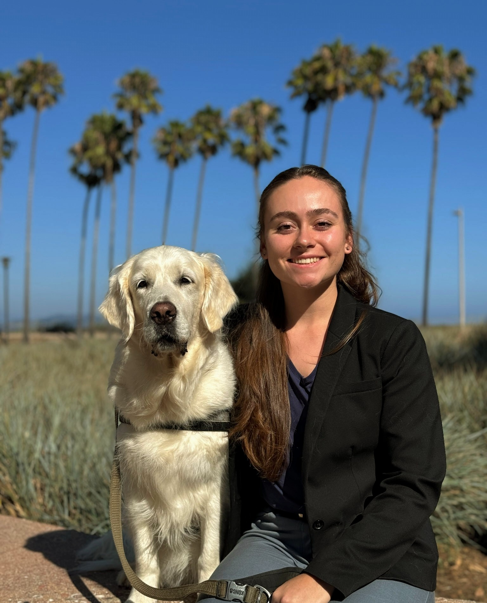

*If you're looking for the official version, the [research page](research.qmd) and [resume](cv.qmd) do that better. This page is on the kookier side.*

## The Real Stuff

I have a hard time sitting still. If something is broken and there is even a *slim* chance I can fix it, I will probably try. I will weld, solder, sew, paint, or open seventeen tabs and teach myself whatever the problem requires. Debugging code feels more like a puzzle than a chore.

I grew up between Concord, Massachusetts, and California's Central Valley, but my heart belongs to [Great Diamond Island](https://en.wikipedia.org/wiki/Great_Diamond_Island) off the coast of Portland, Maine. There’s something about that place. I usually come at problems a little sideways. At this point I have stopped trying to right myself.

## What I Actually Do With My Time

I garden. I bake. I paint. I photograph things. I listen to audiobooks obsessively. I rewatch TV shows. I weld things. I sew things. I play piano badly. I write poetry about satellite imagery. Lately I have been down a deep learning and web scraping rabbit hole. I am curious about too many things at once, which is both useful and exhausting.

I tend to go deep, get competent, and then wander on to the next curiosity. I used to think that meant I lacked focus. Now I think it is just how I learn. Most of it loops back into the same bigger interests anyway: the work and the wild.

## Why I Do Anything

The wild is the real north star. Everything else orbits that. Conservation, restoration, and understanding how humans and ecosystems affect each other are the through-lines.

I do not think creativity and precision are opposites. Most of the work I care about needs both. Good science needs imagination. Good art needs structure. Good debugging usually needs snacks.

## Random Facts

-   My default setting is "I can probably figure that out," which is how I end up learning inconvenient skills.
-   I am dyslexic, so I read everything at least twice.
-   I did a lot of jazz singing. A lot.
-   My service dog is still one of the best decisions I have made.

## Outside This Page

Most of my formal work lives in remote sensing, machine learning, and environmental data systems. If you want the more official version, the [research page](research.qmd) and [resume](cv.qmd) do that better than this one.

## Let's Connect

I like talking about weird intersections of things: how data can tell stories, why nature keeps outsmarting us, and whether foaming hand soap is a triumph of convenience or a mildly perfumed scam. If you want to talk about any of that, reach out.

[Email Me](mailto:ermiller@ucsb.edu) \| [LinkedIn](https://www.linkedin.com/in/rellimylime/) \| [GitHub](https://github.com/rellimylime)
