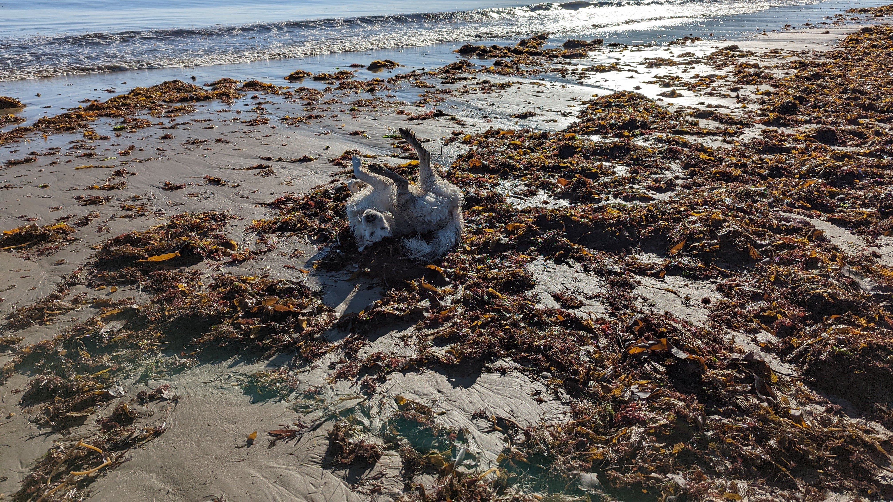
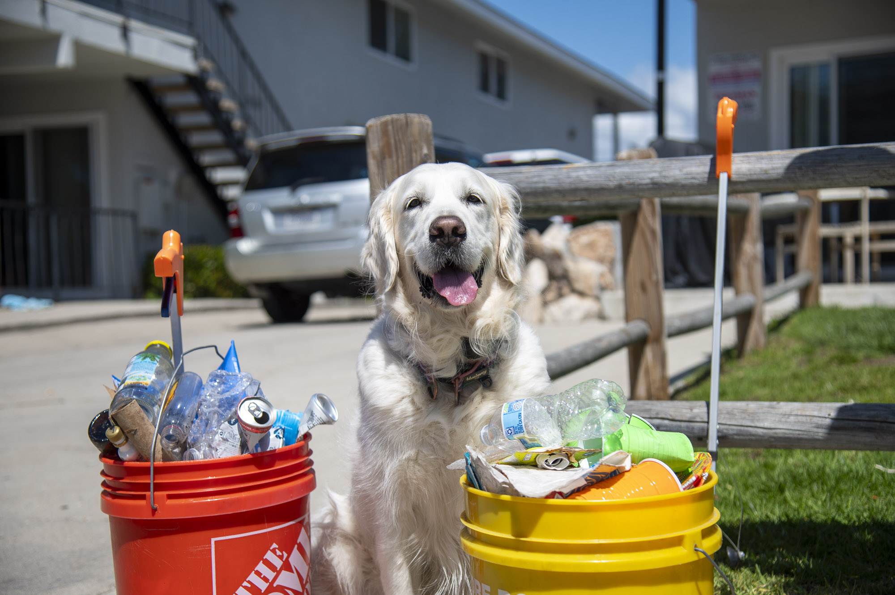
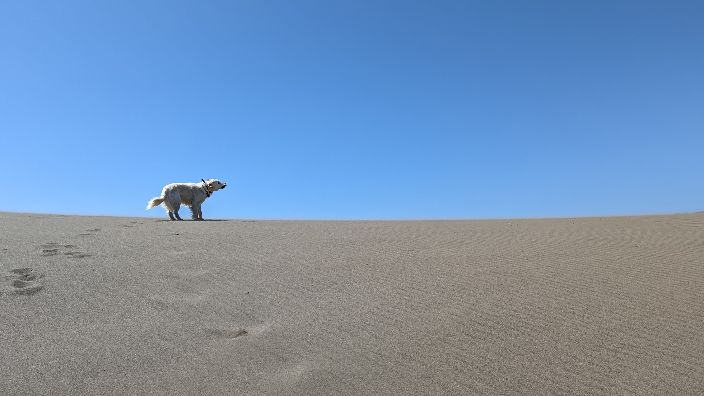
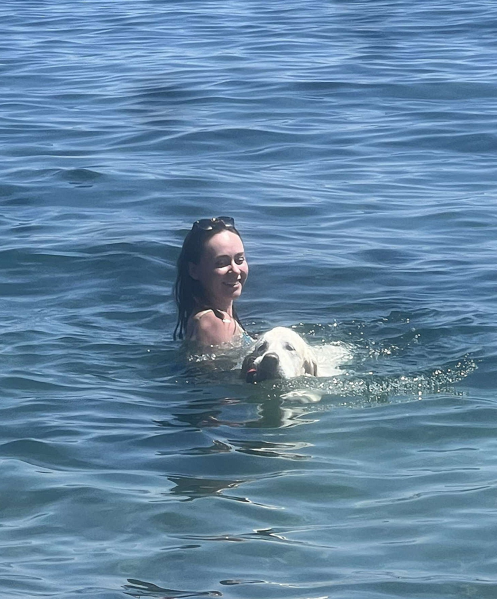
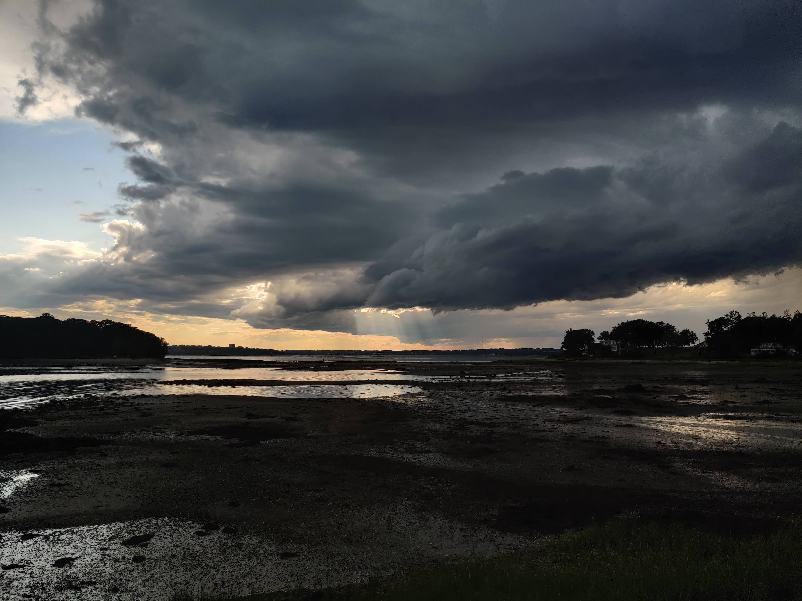
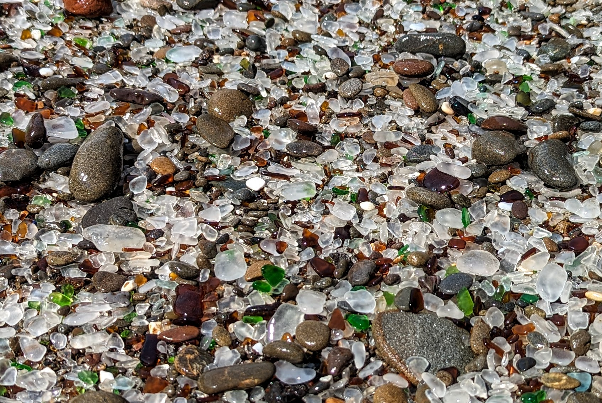

```{=html}
<section class="evolution-stage" aria-labelledby="evolution-title">
  <div class="evolution-dialog-stage">
    <div class="evolution-dialog">
      <p class="evolution-dialog-title" data-text="What?">What?</p>
      <h1 id="evolution-title" class="evolution-dialog-title" data-text="THIS PAGE is evolving!">
        THIS PAGE is evolving!
      </h1>
      <span class="evolution-cursor" aria-hidden="true"></span>
    </div>
  </div>

  <div class="evolution-footer">
    <p class="evolution-links"><a href="art.html">Art &amp; Poetry</a> <span>/</span> <a href="research.html">Research</a> <span>/</span> <a href="cv.html">Resume</a></p>
  </div>
</section>

<script>
  (() => {
    const dialog = document.querySelector(".evolution-dialog");
    if (!dialog) return;

    const prompt = dialog.querySelector(".evolution-dialog-prompt");
    const line = dialog.querySelector(".evolution-dialog-title");
    const prefersReducedMotion = window.matchMedia("(prefers-reduced-motion: reduce)").matches;

    async function typeInto(node, delay) {
      const text = node.dataset.text || node.textContent;
      node.textContent = "";
      for (const char of text) {
        node.textContent += char;
        await new Promise((resolve) => window.setTimeout(resolve, delay));
      }
    }

    async function runTypewriter() {
      dialog.classList.remove("is-complete");

      if (prefersReducedMotion) {
        prompt.textContent = prompt.dataset.text;
        line.textContent = line.dataset.text;
        dialog.classList.add("is-complete");
        return;
      }

      await typeInto(prompt, 70);
      await new Promise((resolve) => window.setTimeout(resolve, 180));
      await typeInto(line, 45);
      dialog.classList.add("is-complete");
    }

    runTypewriter();
  })();
</script>

```

````{=html}
<!--
Original draft content preserved below for later reuse.

::: {.page-intro}
The places, routines, and off-hours evidence that keep the rest of the work honest.
:::

::: {.page-shell}

```{=html}
<details class="page-foldout">
  <summary>Why this page exists</summary>
  <div class="page-foldout-body">
    <p>The work does not come from nowhere. It comes from places, people, rituals, coastlines, dogs, cleanup buckets, and whatever reminds me that data still belongs to an actual world.</p>
  </div>
</details>
```

This page is for the parts of my life that shape the work without belonging in a CV. The beach, my dog, community cleanup, and the specific sort of quiet that only shows up once I am outside and paying attention.

It updates slowly on purpose. I would rather keep a few sharp notes than turn the page into a running feed of my whereabouts.

:::::: aside-rotator-grid
:::: {.aside-rotator data-rotator=""}
::: aside-label
Reset
:::

-   {.rotator-item .is-active} Salt water, walking, and enough room for the noise in my head to reorganize itself.
-   {.rotator-item hidden="hidden"} A beach cleanup when I need to stop pretending care is abstract.
-   {.rotator-item hidden="hidden"} The kind of long walk where the useful thought arrives twenty minutes after I stop trying to force it.

```{=html}
<button type="button" class="rotator-next">Another note</button>
```
::::

:::: {.aside-rotator data-rotator=""}
::: aside-label
Companion
:::

-   {.rotator-item .is-active} My dog, who remains committed to seaweed, supervision, and morale.
-   {.rotator-item hidden="hidden"} The four-legged reminder that enthusiasm is a legitimate operating system.
-   {.rotator-item hidden="hidden"} A research assistant with terrible data instincts and excellent emotional range.

```{=html}
<button type="button" class="rotator-next">Another note</button>
```
::::

:::: {.aside-rotator data-rotator=""}
::: aside-label
Field note
:::

-   {.rotator-item .is-active} Stewardship works better when it is regular enough to become a habit rather than an identity performance.
-   {.rotator-item hidden="hidden"} Some of my clearest thinking still happens with sand in my shoes.
-   {.rotator-item hidden="hidden"} Not everything worth documenting is impressive. Some of it is just what keeps a person calibrated.

```{=html}
<button type="button" class="rotator-next">Another note</button>
```
::::
::::::

## Snapshots

```{=html}
<div class="snapshot-grid">
  <article class="snapshot-card">
    
    <div class="snapshot-copy">
      <p class="snapshot-label">Seaweed specialist</p>
      <p class="snapshot-meta">Beach day | 2024</p>
      <p class="snapshot-text">She finds the worst-smelling kelp available and commits to it completely. I respect the clarity of purpose.</p>
    </div>
  </article>

  <article class="snapshot-card">
    
    <div class="snapshot-copy">
      <p class="snapshot-label">Cleanup crew</p>
      <p class="snapshot-meta">Community cleanup | 2024</p>
      <p class="snapshot-text">The beach is not scenery to me. It is a place I feel responsible to, which is a better relationship than admiration alone.</p>
    </div>
  </article>

  <article class="snapshot-card">
    
    <div class="snapshot-copy">
      <p class="snapshot-label">Lab supervision</p>
      <p class="snapshot-meta">UCSB research lab | 2024</p>
      <p class="snapshot-text">Very little interest in the data. Extremely strong opinions about whether anyone has taken enough breaks.</p>
    </div>
  </article>

  <article class="snapshot-card">
    
    <div class="snapshot-copy">
      <p class="snapshot-label">Community care</p>
      <p class="snapshot-meta">Beach cleanup | 2024</p>
      <p class="snapshot-text">The most grounding kind of environmental work is often small, local, repeated, and done alongside other people who showed up on purpose.</p>
    </div>
  </article>

  <article class="snapshot-card">
    
    <div class="snapshot-copy">
      <p class="snapshot-label">Evening calibration</p>
      <p class="snapshot-meta">Beach walk | 2024</p>
      <p class="snapshot-text">Some of the best conversations I have ever had happened with the sky changing color faster than either person could finish a thought.</p>
    </div>
  </article>

  <article class="snapshot-card">
    
    <div class="snapshot-copy">
      <p class="snapshot-label">Low tide drawing</p>
      <p class="snapshot-meta">Low tide | 2024</p>
      <p class="snapshot-text">Not everything worth making needs a studio. Sometimes the right tool is just time, sand, and the willingness to play without trying to keep it.</p>
    </div>
  </article>
</div>
```

## Say Hello

If you want to talk about coastlines, cleanup work, dogs, or the off-hours parts of life that keep the serious work from becoming sterile, reach out.

[Email Me](mailto:ermiller@ucsb.edu?subject=Outside%20the%20Lab)

:::
-->
````
