::: {.page-intro}
Poems, drawings, paintings, and other evidence.
:::

```{=html}

```

::: {.page-shell}

<!--
```{=html}
<p class="word-links">
  <a href="research.html">Research</a>
  <a href="cv.html">Resume</a>
</p>
```

:::::: aside-rotator-grid
:::: {.aside-rotator data-rotator=""}
::: aside-label
Currently making
:::

```{=html}
<ul>
  <li class="rotator-item is-active">Poems that begin in observation and end somewhere less tidy.</li>
  <li class="rotator-item" hidden>Small visual pieces that care as much about rhythm as they do about information.</li>
  <li class="rotator-item" hidden>A creative practice that does not apologize for living next to research.</li>
</ul>
<button type="button" class="rotator-next">Another note</button>
```
::::

:::: {.aside-rotator data-rotator=""}
::: aside-label
Currently reading
:::

```{=html}
<ul>
  <li class="rotator-item is-active">Books with strong sentences and no patience for decorative thinking.</li>
  <li class="rotator-item" hidden>The sort of essay that makes me want to rebuild an entire page around one paragraph.</li>
  <li class="rotator-item" hidden>Anything that treats design as an ethics question rather than a styling exercise.</li>
</ul>
<button type="button" class="rotator-next">Another note</button>
```
::::

:::: {.aside-rotator data-rotator=""}
::: aside-label
Currently noticing
:::

```{=html}
<ul>
  <li class="rotator-item is-active">How often a poem and a good figure fail for the same reason: they never quite decide what matters.</li>
  <li class="rotator-item" hidden>The objects people carry until they either fix them or admit they never will.</li>
  <li class="rotator-item" hidden>The way place sneaks into almost everything I make.</li>
</ul>
<button type="button" class="rotator-next">Another note</button>
```
::::
::::::
-->

## Poetry & Prose


```{=html}
<div class="poetry-stack">
  <details class="poem-entry poem-entry--what-makes-me">
    <summary class="poem-summary">
      <span class="poem-summary-title">What makes me</span>
      <span class="poem-summary-meta">prose / perspective / self-sculpture</span>
    </summary>
    <div class="poem-entry-body">
      <div class="poem-body prose-body" data-poem-title="What makes me">
        <div class="poem-stanza">
          <div class="poem-line"><span class="poem-line-text">I have a way of stepping back from what is and walking around it like a sculpture in a museum,</span><button type="button" class="line-heart" data-line-id="what-makes-me-01" aria-pressed="false">&#9825;</button></div>
          <div class="poem-line"><span class="poem-line-text">looking from different angles,</span><button type="button" class="line-heart" data-line-id="what-makes-me-02" aria-pressed="false">&#9825;</button></div>
          <div class="poem-line"><span class="poem-line-text">feeling the impact,</span><button type="button" class="line-heart" data-line-id="what-makes-me-03" aria-pressed="false">&#9825;</button></div>
          <div class="poem-line"><span class="poem-line-text">revering the way stone can be made to look so soft at the hands of the right artist,</span><button type="button" class="line-heart" data-line-id="what-makes-me-04" aria-pressed="false">&#9825;</button></div>
          <div class="poem-line"><span class="poem-line-text">and I learn from this artist,</span><button type="button" class="line-heart" data-line-id="what-makes-me-05" aria-pressed="false">&#9825;</button></div>
          <div class="poem-line"><span class="poem-line-text">and I take it home to my own studio and use it to sculpt myself and my creations.</span><button type="button" class="line-heart" data-line-id="what-makes-me-06" aria-pressed="false">&#9825;</button></div>
        </div>
      </div>
    </div>
  </details>

  <details class="poem-entry poem-entry--bad-design">
    <summary class="poem-summary">
      <span class="poem-summary-title">A Bad Design</span>
      <span class="poem-summary-meta">poem / objects / engineering with feelings</span>
    </summary>
    <div class="poem-entry-body">
      <div class="poem-body" data-poem-title="A Bad Design">
        <div class="poem-stanza">
          <div class="poem-line"><span class="poem-line-text">My heels leak,</span><button type="button" class="line-heart" data-line-id="bad-design-01" aria-pressed="false">&#9825;</button></div>
          <div class="poem-line"><span class="poem-line-text">With each step, grating, chafing,</span><button type="button" class="line-heart" data-line-id="bad-design-02" aria-pressed="false">&#9825;</button></div>
          <div class="poem-line"><span class="poem-line-text">Could this be by design?</span><button type="button" class="line-heart" data-line-id="bad-design-03" aria-pressed="false">&#9825;</button></div>
          <div class="poem-line"><span class="poem-line-text">We've only been together a few days,</span><button type="button" class="line-heart" data-line-id="bad-design-04" aria-pressed="false">&#9825;</button></div>
          <div class="poem-line"><span class="poem-line-text">Perhaps it is my fault,</span><button type="button" class="line-heart" data-line-id="bad-design-05" aria-pressed="false">&#9825;</button></div>
          <div class="poem-line"><span class="poem-line-text">Not taking the time to offer support,</span><button type="button" class="line-heart" data-line-id="bad-design-06" aria-pressed="false">&#9825;</button></div>
          <div class="poem-line"><span class="poem-line-text">Before slamming, stomping into you.</span><button type="button" class="line-heart" data-line-id="bad-design-07" aria-pressed="false">&#9825;</button></div>
        </div>
        <div class="poem-stanza">
          <div class="poem-line"><span class="poem-line-text">Who would design such a thing?</span><button type="button" class="line-heart" data-line-id="bad-design-08" aria-pressed="false">&#9825;</button></div>
          <div class="poem-line"><span class="poem-line-text">No one else would want you in this state,</span><button type="button" class="line-heart" data-line-id="bad-design-09" aria-pressed="false">&#9825;</button></div>
          <div class="poem-line"><span class="poem-line-text">To suggest so feels like a setup, a hoax.</span><button type="button" class="line-heart" data-line-id="bad-design-10" aria-pressed="false">&#9825;</button></div>
          <div class="poem-line"><span class="poem-line-text">Perhaps a hairdryer and a rigid form,</span><button type="button" class="line-heart" data-line-id="bad-design-11" aria-pressed="false">&#9825;</button></div>
          <div class="poem-line"><span class="poem-line-text">Maybe some duct tape,</span><button type="button" class="line-heart" data-line-id="bad-design-12" aria-pressed="false">&#9825;</button></div>
          <div class="poem-line"><span class="poem-line-text">A pair of pliers, some wire cutters,</span><button type="button" class="line-heart" data-line-id="bad-design-13" aria-pressed="false">&#9825;</button></div>
          <div class="poem-line"><span class="poem-line-text">To surgically remove the parts of you that rub me the wrong way.</span><button type="button" class="line-heart" data-line-id="bad-design-14" aria-pressed="false">&#9825;</button></div>
        </div>
        <div class="poem-stanza">
          <div class="poem-line"><span class="poem-line-text">To no avail, and now my foolish faith in you has brought me far from home.</span><button type="button" class="line-heart" data-line-id="bad-design-15" aria-pressed="false">&#9825;</button></div>
          <div class="poem-line"><span class="poem-line-text">Far, and I think I might be bleeding-</span><button type="button" class="line-heart" data-line-id="bad-design-16" aria-pressed="false">&#9825;</button></div>
          <div class="poem-line"><span class="poem-line-text">I will carry you the rest of the way.</span><button type="button" class="line-heart" data-line-id="bad-design-17" aria-pressed="false">&#9825;</button></div>
        </div>
        <div class="poem-stanza">
          <div class="poem-line"><span class="poem-line-text">Soon the limp of uneven stilts,</span><button type="button" class="line-heart" data-line-id="bad-design-18" aria-pressed="false">&#9825;</button></div>
          <div class="poem-line"><span class="poem-line-text">Will send a pang through my hips, a warning.</span><button type="button" class="line-heart" data-line-id="bad-design-19" aria-pressed="false">&#9825;</button></div>
          <div class="poem-line"><span class="poem-line-text">Socks on searing sidewalks,</span><button type="button" class="line-heart" data-line-id="bad-design-20" aria-pressed="false">&#9825;</button></div>
          <div class="poem-line"><span class="poem-line-text">Catching on stale gum,</span><button type="button" class="line-heart" data-line-id="bad-design-21" aria-pressed="false">&#9825;</button></div>
          <div class="poem-line"><span class="poem-line-text">Collecting stories laid by treads,</span><button type="button" class="line-heart" data-line-id="bad-design-22" aria-pressed="false">&#9825;</button></div>
          <div class="poem-line"><span class="poem-line-text">Left by soles not soaked in scarlet,</span><button type="button" class="line-heart" data-line-id="bad-design-23" aria-pressed="false">&#9825;</button></div>
          <div class="poem-line"><span class="poem-line-text">The better of your ilk.</span><button type="button" class="line-heart" data-line-id="bad-design-24" aria-pressed="false">&#9825;</button></div>
        </div>
        <div class="poem-stanza">
          <div class="poem-line"><span class="poem-line-text">For you, I've sacrificed my heels,</span><button type="button" class="line-heart" data-line-id="bad-design-25" aria-pressed="false">&#9825;</button></div>
          <div class="poem-line"><span class="poem-line-text">My toes harbor liquid cushions,</span><button type="button" class="line-heart" data-line-id="bad-design-26" aria-pressed="false">&#9825;</button></div>
          <div class="poem-line"><span class="poem-line-text">Feet gone flat,</span><button type="button" class="line-heart" data-line-id="bad-design-27" aria-pressed="false">&#9825;</button></div>
          <div class="poem-line"><span class="poem-line-text">My balls slowly scorched.</span><button type="button" class="line-heart" data-line-id="bad-design-28" aria-pressed="false">&#9825;</button></div>
        </div>
        <div class="poem-stanza">
          <div class="poem-line"><span class="poem-line-text">But I still feel for you;</span><button type="button" class="line-heart" data-line-id="bad-design-29" aria-pressed="false">&#9825;</button></div>
          <div class="poem-line"><span class="poem-line-text">Betrayer.</span><button type="button" class="line-heart" data-line-id="bad-design-30" aria-pressed="false">&#9825;</button></div>
        </div>
        <div class="poem-stanza">
          <div class="poem-line"><span class="poem-line-text">I know, if it were up to you, you would not have picked this.</span><button type="button" class="line-heart" data-line-id="bad-design-31" aria-pressed="false">&#9825;</button></div>
          <div class="poem-line"><span class="poem-line-text">You remind me of me.</span><button type="button" class="line-heart" data-line-id="bad-design-32" aria-pressed="false">&#9825;</button></div>
          <div class="poem-line"><span class="poem-line-text">Brandishing your name as bait,</span><button type="button" class="line-heart" data-line-id="bad-design-33" aria-pressed="false">&#9825;</button></div>
          <div class="poem-line"><span class="poem-line-text">Luring investments in naive idolatry.</span><button type="button" class="line-heart" data-line-id="bad-design-34" aria-pressed="false">&#9825;</button></div>
          <div class="poem-line"><span class="poem-line-text">Aspiring beyond clearance rack compromises,</span><button type="button" class="line-heart" data-line-id="bad-design-35" aria-pressed="false">&#9825;</button></div>
          <div class="poem-line"><span class="poem-line-text">Seduced by a gilded construction,</span><button type="button" class="line-heart" data-line-id="bad-design-36" aria-pressed="false">&#9825;</button></div>
          <div class="poem-line"><span class="poem-line-text">I championed your promise.</span><button type="button" class="line-heart" data-line-id="bad-design-37" aria-pressed="false">&#9825;</button></div>
        </div>
        <div class="poem-stanza">
          <div class="poem-line"><span class="poem-line-text">To discard you now</span><button type="button" class="line-heart" data-line-id="bad-design-38" aria-pressed="false">&#9825;</button></div>
          <div class="poem-line"><span class="poem-line-text">Would be to admit defeat,</span><button type="button" class="line-heart" data-line-id="bad-design-39" aria-pressed="false">&#9825;</button></div>
          <div class="poem-line"><span class="poem-line-text">To waste not only money,</span><button type="button" class="line-heart" data-line-id="bad-design-40" aria-pressed="false">&#9825;</button></div>
          <div class="poem-line"><span class="poem-line-text">But value of conviction.</span><button type="button" class="line-heart" data-line-id="bad-design-41" aria-pressed="false">&#9825;</button></div>
        </div>
        <div class="poem-stanza">
          <div class="poem-line"><span class="poem-line-text">So you'll live in my closet,</span><button type="button" class="line-heart" data-line-id="bad-design-42" aria-pressed="false">&#9825;</button></div>
          <div class="poem-line"><span class="poem-line-text">Next to the others,</span><button type="button" class="line-heart" data-line-id="bad-design-43" aria-pressed="false">&#9825;</button></div>
          <div class="poem-line"><span class="poem-line-text">Until I come up with a way to fix you-</span><button type="button" class="line-heart" data-line-id="bad-design-44" aria-pressed="false">&#9825;</button></div>
          <div class="poem-line"><span class="poem-line-text">Trading band aids for false hope once again-</span><button type="button" class="line-heart" data-line-id="bad-design-45" aria-pressed="false">&#9825;</button></div>
          <div class="poem-line"><span class="poem-line-text">Or I find the heart to throw you out.</span><button type="button" class="line-heart" data-line-id="bad-design-46" aria-pressed="false">&#9825;</button></div>
        </div>
      </div>
      <p class="poem-insight"><strong>Resolution:</strong> Kept the laces for my MacGyver kit, but threw the shoes. I no longer buy Nikes.</p>
    </div>
  </details>

  <details class="poem-entry poem-entry--ocean">
    <summary class="poem-summary">
      <span class="poem-summary-title">The Ocean Listened</span>
      <span class="poem-summary-meta">poem / coast / indifference as comfort</span>
    </summary>
    <div class="poem-entry-body">
      <div class="poem-body" data-poem-title="The Ocean Listened">
        <div class="poem-stanza">
          <div class="poem-line"><span class="poem-line-text">I cried to the ocean today</span><button type="button" class="line-heart" data-line-id="ocean-listened-01" aria-pressed="false">&#9825;</button></div>
          <div class="poem-line"><span class="poem-line-text">She listened deeper than I spoke,</span><button type="button" class="line-heart" data-line-id="ocean-listened-02" aria-pressed="false">&#9825;</button></div>
          <div class="poem-line"><span class="poem-line-text">and she told me she did not care.</span><button type="button" class="line-heart" data-line-id="ocean-listened-03" aria-pressed="false">&#9825;</button></div>
        </div>
        <div class="poem-stanza">
          <div class="poem-line"><span class="poem-line-text">So I asked the birds,</span><button type="button" class="line-heart" data-line-id="ocean-listened-04" aria-pressed="false">&#9825;</button></div>
          <div class="poem-line"><span class="poem-line-text">but they were too busy</span><button type="button" class="line-heart" data-line-id="ocean-listened-05" aria-pressed="false">&#9825;</button></div>
          <div class="poem-line"><span class="poem-line-text">idling against the ocean breeze</span><button type="button" class="line-heart" data-line-id="ocean-listened-06" aria-pressed="false">&#9825;</button></div>
        </div>
        <div class="poem-stanza">
          <div class="poem-line"><span class="poem-line-text">I asked the grasses,</span><button type="button" class="line-heart" data-line-id="ocean-listened-07" aria-pressed="false">&#9825;</button></div>
          <div class="poem-line"><span class="poem-line-text">they stopped to listen</span><button type="button" class="line-heart" data-line-id="ocean-listened-08" aria-pressed="false">&#9825;</button></div>
          <div class="poem-line"><span class="poem-line-text">and went back to sharing quiet whispers with the trees.</span><button type="button" class="line-heart" data-line-id="ocean-listened-09" aria-pressed="false">&#9825;</button></div>
        </div>
        <div class="poem-stanza">
          <div class="poem-line"><span class="poem-line-text">Then I asked the wind,</span><button type="button" class="line-heart" data-line-id="ocean-listened-10" aria-pressed="false">&#9825;</button></div>
          <div class="poem-line"><span class="poem-line-text">and she swept up my tears faster than they could fall.</span><button type="button" class="line-heart" data-line-id="ocean-listened-11" aria-pressed="false">&#9825;</button></div>
        </div>
        <div class="poem-stanza">
          <div class="poem-line"><span class="poem-line-text">I have never felt more loved.</span><button type="button" class="line-heart" data-line-id="ocean-listened-12" aria-pressed="false">&#9825;</button></div>
        </div>
      </div>
      <p class="poem-insight"><strong>Finding:</strong> Feeling loved, not by being coddled, but by being part of a larger whole.</p>
    </div>
  </details>
  <details class="poem-entry poem-entry--urgency" id="urgency">
    <summary class="poem-summary">
      <span class="poem-summary-title">Urgency</span>
      <span class="poem-summary-meta">poem / current / the quiet</span>
    </summary>
    <div class="poem-entry-body">
      <div class="poem-body" data-poem-title="Urgency">
        <div class="poem-stanza"><div class="poem-line"><span class="poem-line-text">No wonder we're tired.</span><button type="button" class="line-heart" data-line-id="urgency-01" aria-pressed="false">&#9825;</button></div></div>
        <div class="poem-stanza"><div class="poem-line"><span class="poem-line-text">Designed as a current, but taught like a wire.</span><button type="button" class="line-heart" data-line-id="urgency-02" aria-pressed="false">&#9825;</button></div><div class="poem-line"><span class="poem-line-text">Stay drawn, Stay going, One channel, Keep flowing.</span><button type="button" class="line-heart" data-line-id="urgency-03" aria-pressed="false">&#9825;</button></div></div>
        <div class="poem-stanza"><div class="poem-line"><span class="poem-line-text">Don't blow a fuse, or short a circuit;</span><button type="button" class="line-heart" data-line-id="urgency-04" aria-pressed="false">&#9825;</button></div><div class="poem-line"><span class="poem-line-text">But with voltage this strong, it's hard to resurface.</span><button type="button" class="line-heart" data-line-id="urgency-05" aria-pressed="false">&#9825;</button></div></div>
        <div class="poem-stanza"><div class="poem-line"><span class="poem-line-text">From time to time, now and again,</span><button type="button" class="line-heart" data-line-id="urgency-05a" aria-pressed="false">&#9825;</button></div><div class="poem-line"><span class="poem-line-text">The wattage will get to us, but a truth will set in;</span><button type="button" class="line-heart" data-line-id="urgency-05b" aria-pressed="false">&#9825;</button></div></div>
        <div class="poem-stanza"><div class="poem-line"><span class="poem-line-text">We're chasing a power we already own</span><button type="button" class="line-heart" data-line-id="urgency-06" aria-pressed="false">&#9825;</button></div><div class="poem-line"><span class="poem-line-text">and all that we seek, we've already known.</span><button type="button" class="line-heart" data-line-id="urgency-07" aria-pressed="false">&#9825;</button></div></div>
        <div class="poem-stanza"><div class="poem-line"><span class="poem-line-text">Take a break from the current, and those who supply it.</span><button type="button" class="line-heart" data-line-id="urgency-08" aria-pressed="false">&#9825;</button></div><div class="poem-line"><span class="poem-line-text">I'm amazed what we find, alone in the quiet.</span><button type="button" class="line-heart" data-line-id="urgency-09" aria-pressed="false">&#9825;</button></div></div>
      </div>
    </div>
  </details>
</div>
```

::: {.random-line-panel}
::: aside-label
Random line
:::

```{=html}
<blockquote data-random-output="">Press the button and let the page choose a line.</blockquote>
<p class="random-line-source" data-random-source=""></p>
<button type="button" class="random-line-trigger">Pull a line</button>
```
:::

```{=html}
<section class="poem-builder" data-poem-builder>
  <div class="poem-builder-head">
    <div>
      <p class="aside-label">Unauthorized poetry franchise</p>
      <h3>Build-a-Poem™</h3>
    </div>
    <span class="poem-builder-count" data-poem-builder-count>0 lines selected</span>
  </div>
  <p>Use the <strong>+</strong> beside any line you want. Once you have three, arrange them by original order, reverse them, move from the shortest breath to the longest, or introduce a little controlled disturbance.</p>
  <label class="poem-builder-select-label" for="poem-arrangement">Arrangement</label>
  <select id="poem-arrangement" data-poem-arrangement disabled>
    <option value="">Choose an arrangement</option>
    <option value="original">Original order</option>
    <option value="reverse">Reverse</option>
    <option value="breath">Shortest breath</option>
    <option value="disturbance">Controlled disturbance</option>
    <option value="custom">Custom, drag it yourself</option>
  </select>
  <span class="poem-builder-minimum" data-poem-minimum>Select at least 3 lines above to choose an arrangement.</span>
  <div class="poem-builder-output" data-poem-builder-output hidden aria-live="polite"></div>
  <div class="poem-builder-actions">
    <button type="button" class="poem-builder-copy" data-poem-copy hidden>Copy poem</button>
    <button type="button" class="poem-builder-clear" data-poem-clear disabled>Clear selections</button>
  </div>
  <p class="poem-builder-credit">Made from Emily's lines, selected and reassembled by you.</p>
</section>
```

## Visual Work

These pieces do not all speak in the same medium or volume. They do keep returning to bodies under pressure, shelter, coexistence, observation, decay, play, nature, and the uncomfortable edge of recognition.

```{=html}
<details class="art-gallery-note">
  <summary>A note before looking</summary>
  <p>I like art that makes me feel something, sometimes reverence or recognition, sometimes unease. If a piece registers before you have words for it, notice where it arrives: jaw, throat, chest, gut, back, hands. You do not have to decide what it means. Noticing is enough.</p>
</details>
```

```{=html}
<div class="art-gallery">
  <figure class="art-piece" data-art-id="remains">
    <a href="images/pages/art/full/remains.jpg">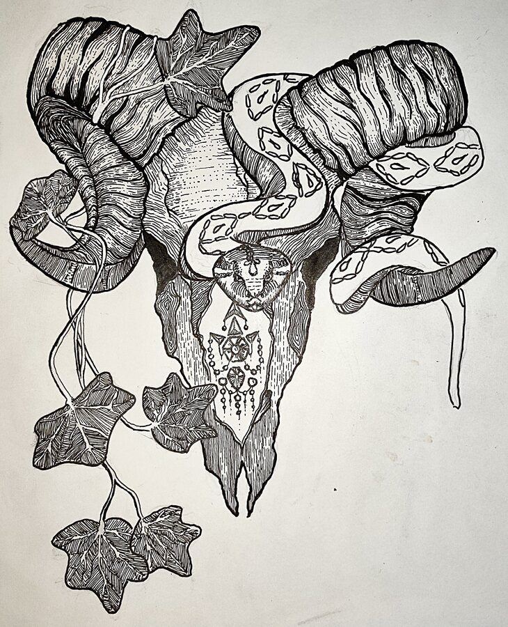</a>
    <figcaption><span>Remains</span><button type="button" class="body-response-open" data-response-open="remains">Where did this land?</button></figcaption>
  </figure>
  <figure class="art-piece" data-art-id="still-see-you">
    <a href="images/pages/art/full/istillseeyou.jpg">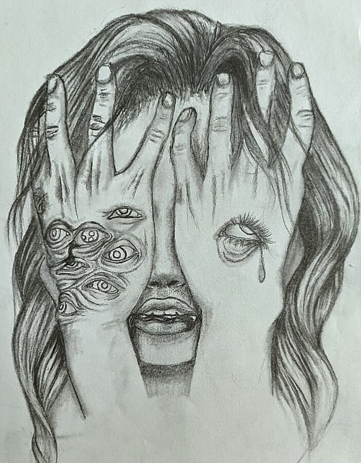</a>
    <figcaption><span>I Still See You</span><button type="button" class="body-response-open" data-response-open="still-see-you">Where did this land?</button></figcaption>
  </figure>
  <figure class="art-piece" data-art-id="agony">
    <a href="images/pages/art/full/agony.jpg">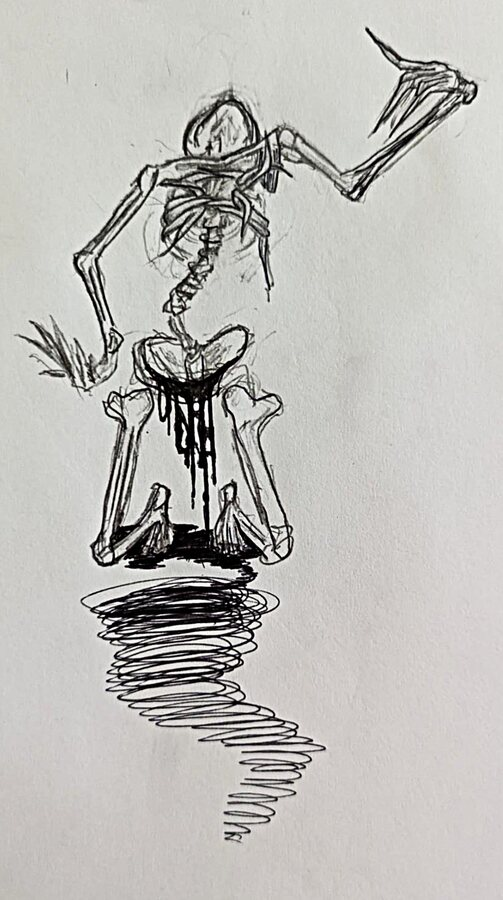</a>
    <figcaption><span>Agony</span><button type="button" class="body-response-open" data-response-open="agony">Where did this land?</button></figcaption>
  </figure>
  <figure class="art-piece" data-art-id="pained-smile">
    <a href="images/pages/art/full/pained_smile.jpg">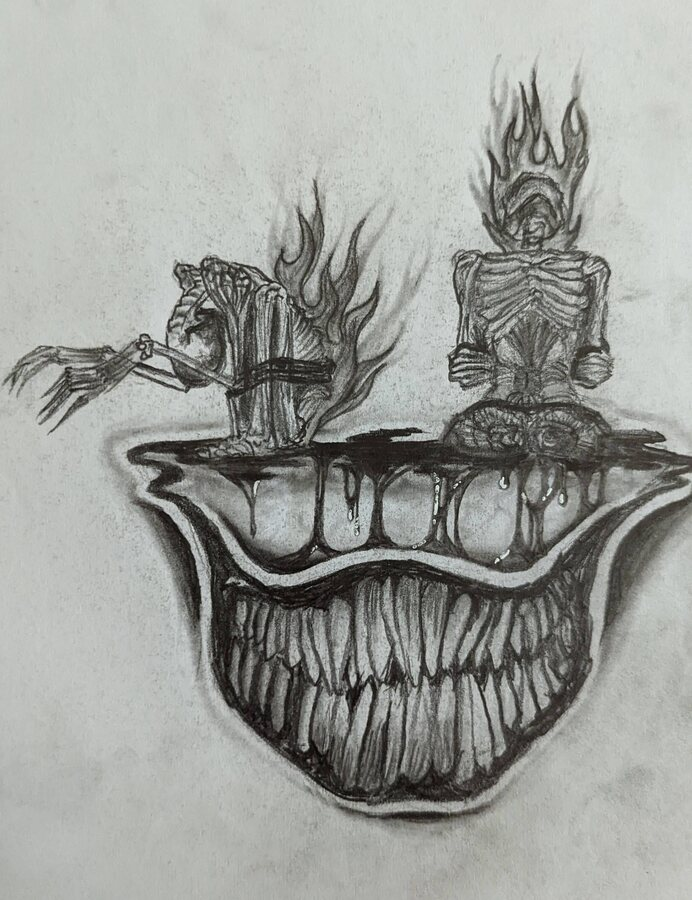</a>
    <figcaption><span>Pained Smile</span><button type="button" class="body-response-open" data-response-open="pained-smile">Where did this land?</button></figcaption>
  </figure>
  <figure class="art-piece" data-art-id="candy-clown">
    <details class="art-content-warning"><summary title="Graphic content warning"><span aria-hidden="true">⚠</span> Candy Clown <small>graphic content</small></summary><a href="images/pages/art/full/candy_clown.jpg">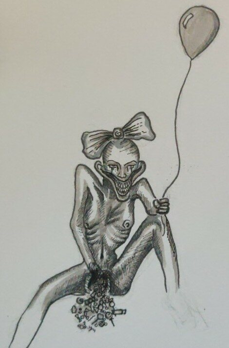</a><figcaption><span>Candy Clown</span><button type="button" class="body-response-open" data-response-open="candy-clown">Where did this land?</button></figcaption></details>
  </figure>
  <figure class="art-piece" data-art-id="sheltered">
    <a href="images/pages/art/full/sheltered.jpg">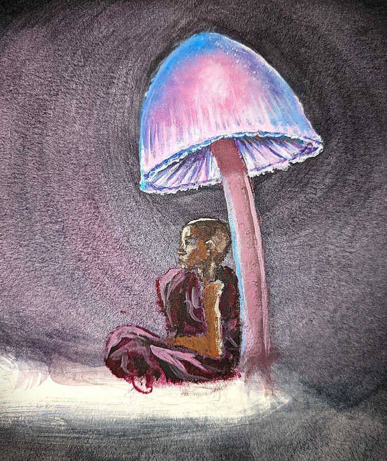</a>
    <figcaption><span>Sheltered</span><button type="button" class="body-response-open" data-response-open="sheltered">Where did this land?</button></figcaption>
  </figure>
  <figure class="art-piece" data-art-id="happy-place">
    <a href="images/pages/art/full/happy_place.jpg">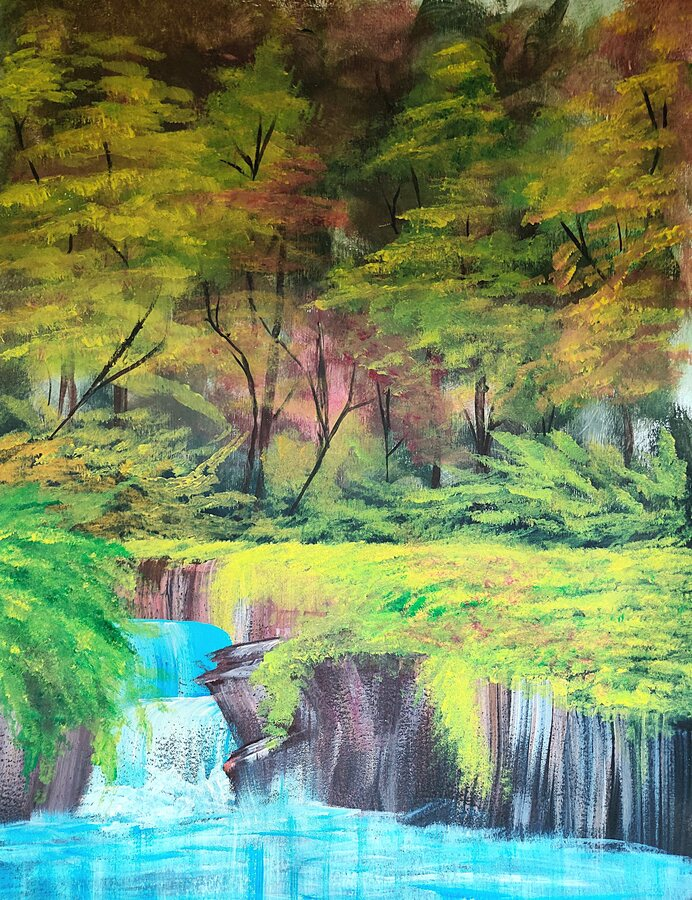</a>
    <figcaption><span>Happy Place</span><button type="button" class="body-response-open" data-response-open="happy-place">Where did this land?</button></figcaption>
  </figure>
  <figure class="art-piece" data-art-id="octo-tangle">
    <a href="images/pages/art/full/octo_tangle.jpg">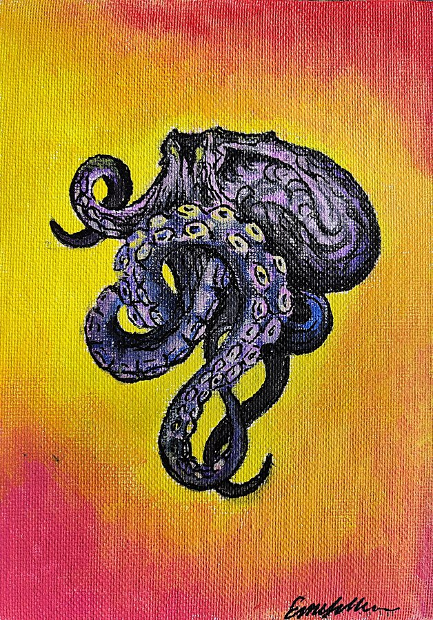</a>
    <figcaption><span>Octo Tangle</span><button type="button" class="body-response-open" data-response-open="octo-tangle">Where did this land?</button></figcaption>
  </figure>
  <figure class="art-piece" data-art-id="artists-collab">
    <a href="images/pages/art/full/artists_collab.jpg">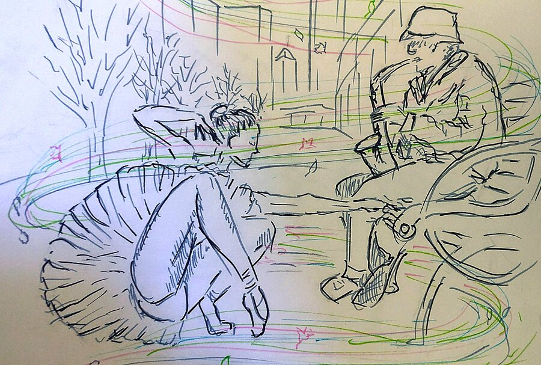</a>
    <figcaption><span>Artists' Collaboration</span><button type="button" class="body-response-open" data-response-open="artists-collab">Where did this land?</button></figcaption>
  </figure>
  <figure class="art-piece" data-art-id="akin"><a href="images/pages/art/full/akin.jpg">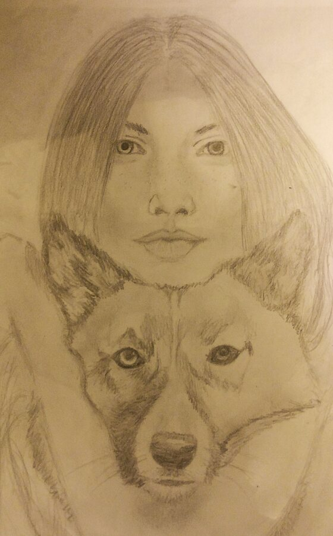</a><figcaption><span>Akin</span><button type="button" class="body-response-open" data-response-open="akin">Where did this land?</button></figcaption></figure>
  <figure class="art-piece" data-art-id="ancient-bond"><a href="images/pages/art/full/ancient_bond.jpg">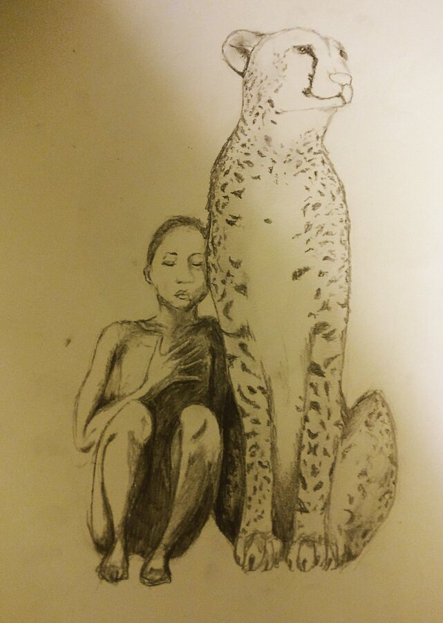</a><figcaption><span>Ancient Bond</span><button type="button" class="body-response-open" data-response-open="ancient-bond">Where did this land?</button></figcaption></figure>
  <figure class="art-piece" data-art-id="maternal-patience"><a href="images/pages/art/full/maternal_patience.jpg">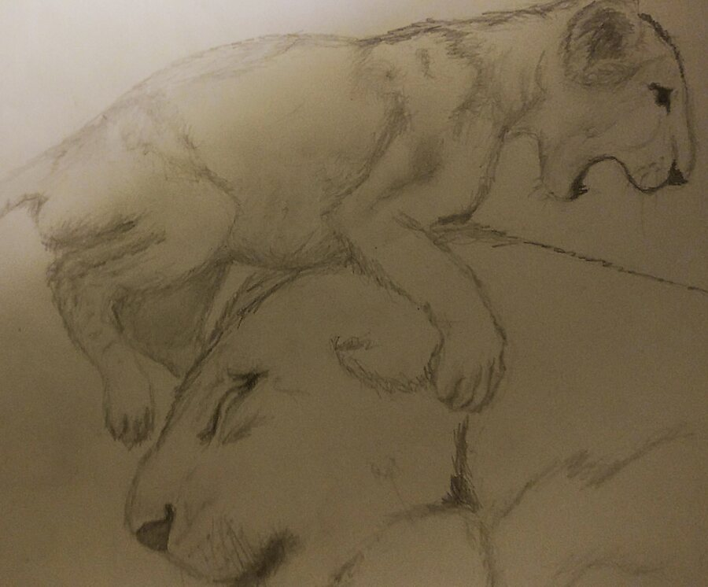</a><figcaption><span>Maternal Patience</span><button type="button" class="body-response-open" data-response-open="maternal-patience">Where did this land?</button></figcaption></figure>
  <figure class="art-piece" data-art-id="natural-interior"><a href="images/pages/art/full/natural_interior.jpg">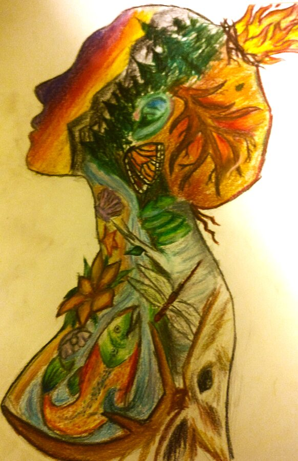</a><figcaption><span>Natural Interior</span><button type="button" class="body-response-open" data-response-open="natural-interior">Where did this land?</button></figcaption></figure>
  <figure class="art-piece" data-art-id="ocean-painting"><a href="images/pages/art/full/ocean_painting.jpg">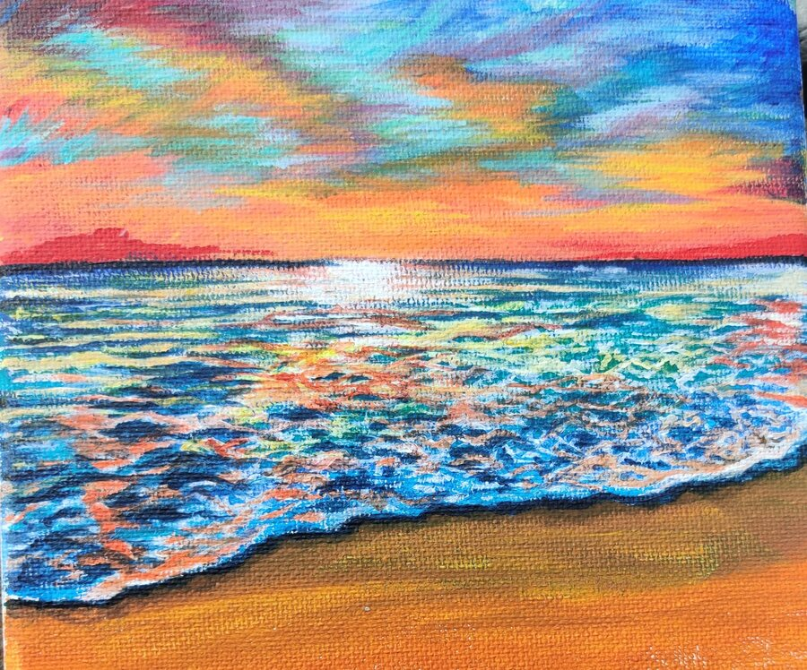</a><figcaption><span>Ocean</span><button type="button" class="body-response-open" data-response-open="ocean-painting">Where did this land?</button></figcaption></figure>
  <figure class="art-piece" data-art-id="smoking-woman"><a href="images/pages/art/full/smoking_woman.jpg">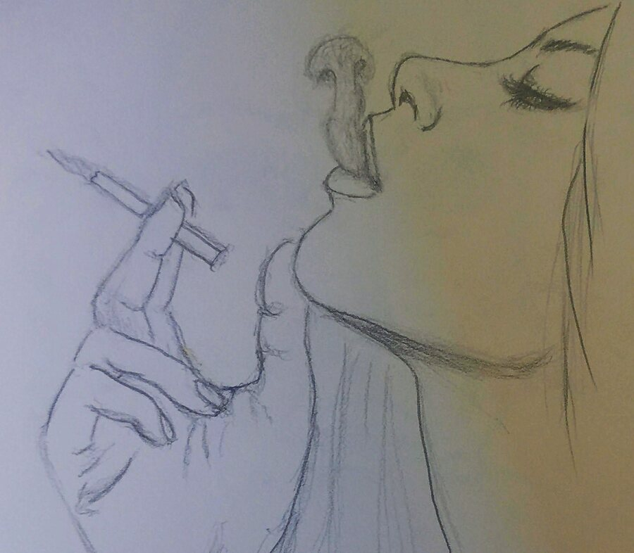</a><figcaption><span>Smoking Woman</span><button type="button" class="body-response-open" data-response-open="smoking-woman">Where did this land?</button></figcaption></figure>
  <figure class="art-piece" data-art-id="twisted-pose"><a href="images/pages/art/full/twisted_pose.jpg">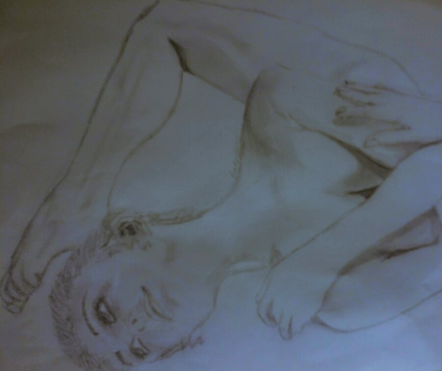</a><figcaption><span>Twisted Pose</span><button type="button" class="body-response-open" data-response-open="twisted-pose">Where did this land?</button></figcaption></figure>
  <figure class="art-piece" data-art-id="what-god"><details class="art-content-warning"><summary title="Graphic content warning"><span aria-hidden="true">⚠</span> What God <small>graphic content</small></summary><a href="images/pages/art/full/what_god.jpg">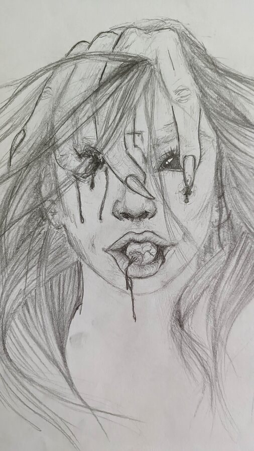</a><figcaption><span>What God</span><button type="button" class="body-response-open" data-response-open="what-god">Where did this land?</button></figcaption></details></figure>
</div>

<dialog class="body-response-dialog" data-response-dialog aria-labelledby="body-response-title">
  <form method="dialog">
    <button class="body-response-close" aria-label="Close">×</button>
  </form>
  <p class="aside-label">Body response</p>
  <h3 id="body-response-title">Where did this piece land?</h3>
  <p>Select every place that registered. Shared totals will appear after you vote once the collective response service is connected.</p>
  <div class="body-response-options" data-response-options></div>
  <button type="button" class="body-response-submit" data-response-submit disabled>Submit response</button>
  <p class="body-response-status" data-response-status aria-live="polite"></p>
  <div class="body-response-results" data-response-results hidden></div>
</dialog>
```

## Something stayed with you?

Tell me the line, image, or thought you are taking with you. I would genuinely like to know.

```{=html}
<p class="art-note-link"><a href="mailto:ermiller@ucsb.edu?subject=Something%20stayed%20with%20me">Send me a note →</a></p>
```

:::
