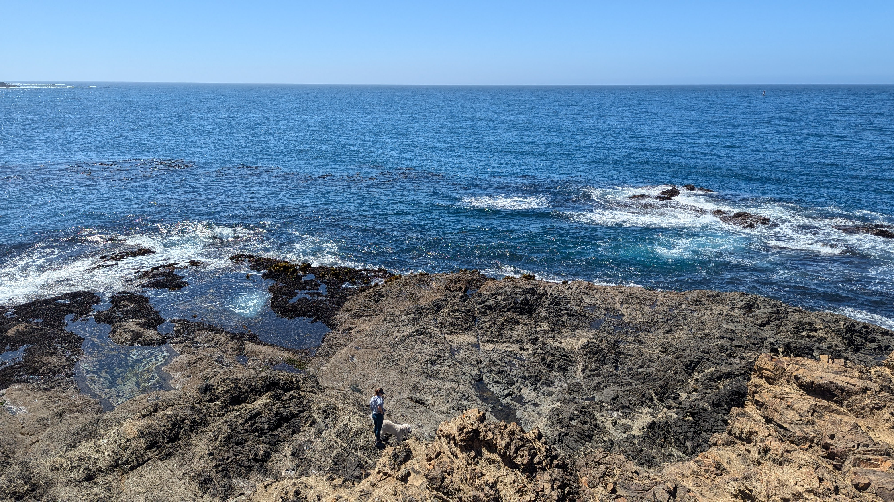
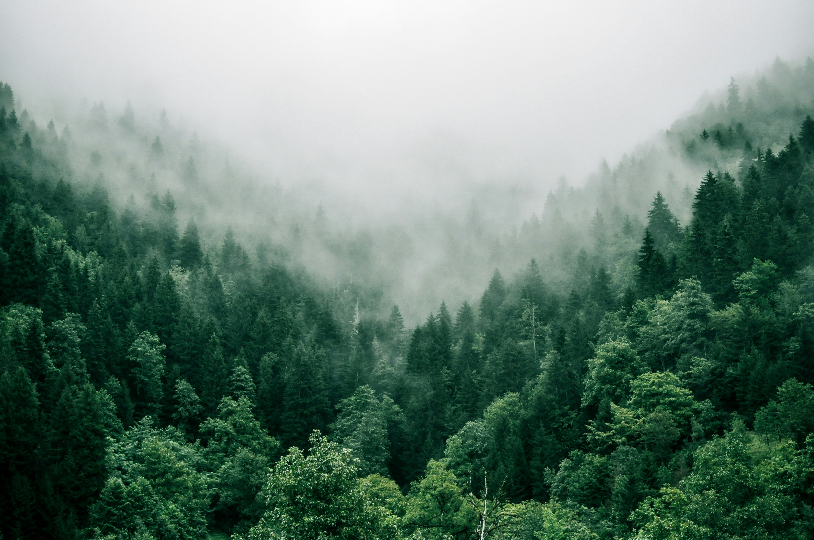
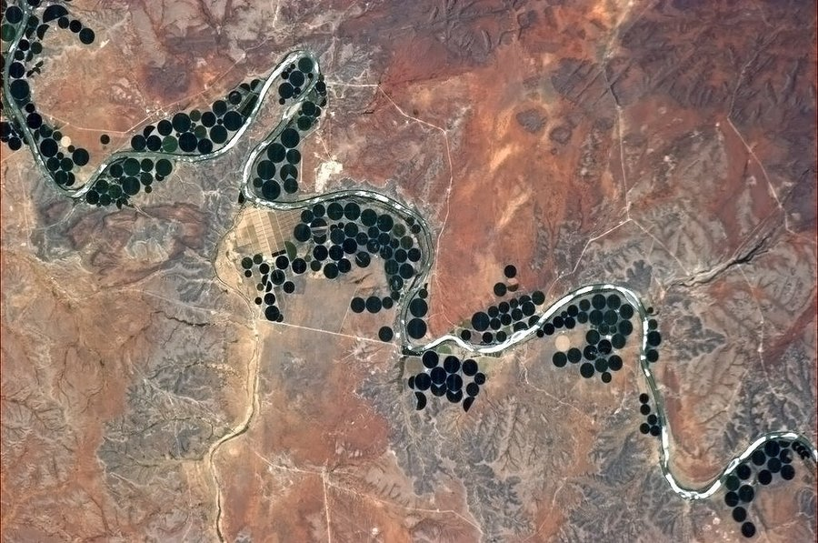
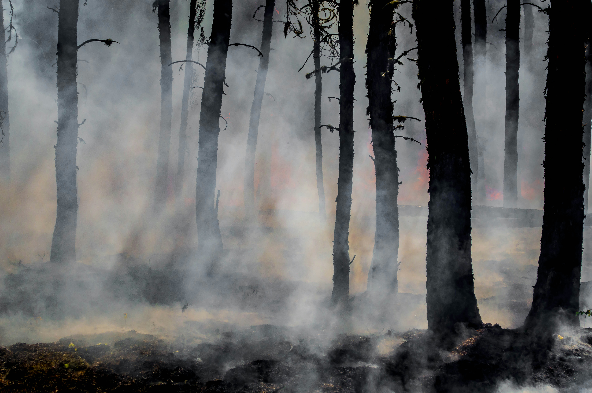

```{=html}
<section class="home-hero" aria-labelledby="home-hero-headline">
  
  <div class="home-hero-copy">
    <div id="home-hero-headline" class="home-hero-headline">
      <span class="hero-line hero-line--1" aria-label="What the world reflects.">What the world <span class="word-reflect"><span class="word-reflect-s">s</span>ʇɔǝʅɟǝɹ</span>.</span>
      <span class="hero-line hero-line--2">What our instruments preserve.</span>
      <span class="hero-line hero-line--3">What inference can honestly recover.</span>
    </div>
  </div>
</section>

<section class="home-shell home-intro" aria-labelledby="home-intro-title">
  <div class="home-section-head">
    <p class="home-section-kicker">About</p>
    <h2 id="home-intro-title" class="home-section-title">What I'm working on</h2>
  </div>
  <p class="home-intro-bio">I build geospatial data pipelines and apply machine learning to satellite imagery to understand how land and climate systems are changing. I'm finishing a Master of Environmental Data Science at UC Santa Barbara's Bren School, expected June 2026, alongside a B.S. in Mathematics. My work sits at the intersection of remote sensing, spatial statistics, and reproducible data engineering. Right now that looks like irrigation mapping, national-scale forest change analysis, and cloud-accessible wildfire resilience tools.</p>
</section>

<section class="home-shell home-featured" aria-labelledby="home-featured-title">
  <div class="home-section-head">
    <p class="home-section-kicker">Featured Work</p>
    <h2 id="home-featured-title" class="home-section-title">Selected projects</h2>
  </div>
  <div class="home-featured-grid">
    <a class="home-feature-card" href="research.html#forest-thermophilization-disturbance-analysis">
      
      <div class="home-feature-card-copy">
        <p class="home-feature-card-label">LOC Lab</p>
        <h3 class="home-feature-card-title">Forest Thermophilization &amp; Disturbance Analysis</h3>
        <p class="home-feature-card-summary">National-scale R and Python pipeline linking FIA, IDS, TerraClimate, PRISM, and WorldClim to study how U.S. forests are changing under climate and disturbance.</p>
        <span class="home-feature-card-link">View project -&gt;</span>
      </div>
    </a>
    <a class="home-feature-card" href="research.html#satellite-based-irrigation-mapping-in-sub-saharan-africa">
      
      <div class="home-feature-card-copy">
        <p class="home-feature-card-label">WaVeS Lab</p>
        <h3 class="home-feature-card-title">Satellite-Based Irrigation Mapping</h3>
        <p class="home-feature-card-summary">Python geospatial workflows and segmentation experiments for tracing where irrigation expansion is actually happening across Sub-Saharan Africa.</p>
        <span class="home-feature-card-link">View project -&gt;</span>
      </div>
    </a>
    <a class="home-feature-card" href="research.html#wildfire-resilience-index-data-access-r-package">
      
      <div class="home-feature-card-copy">
        <p class="home-feature-card-label">NCEAS Capstone</p>
        <h3 class="home-feature-card-title">Wildfire Resilience Index R Package</h3>
        <p class="home-feature-card-summary">Cloud-accessible wildfire resilience archive and open-source R package work so users can query, subset, and visualize 100+ layers without downloading terabytes locally.</p>
        <span class="home-feature-card-link">View project -&gt;</span>
      </div>
    </a>
  </div>
</section>

<section class="home-shell home-quote-intro" aria-label="Quotes">
  <div class="home-section-head">
    <p class="home-section-kicker">Quotes</p>
    <p class="home-quote-hint">Swipe, scroll, or use arrows</p>
  </div>
</section>
```

::::::::::::::::::::::::::::::: quote-section
:::::::::::::::::::::::::::::: slider-container
::::::::::::::::::::::::::::: click-slider
::: slick-slide
**"It is my experience that proofs involving matrices can be shortened by 50% if one throws the matrices out."**

-   Emil Artin
:::

::: slick-slide
**"Statisticians, like artists, have the bad habit of falling in love with their models."**

-   George Box
:::

::: slick-slide
**"With four parameters I can fit an elephant, and with five I can make him wiggle his trunk."**

-   John von Neumann
:::

::: slick-slide
**"I have no fear of losing my life-if I have to save a koala or a crocodile or a kangaroo or a snake, mate, I will save it."**

-   Steve Irwin
:::

::: slick-slide
**"Documentation is a love letter that you write to your future self."**

-   Damian Conway
:::

::: slick-slide
**"The first principle is that you must not fool yourself and you are the easiest person to fool."**

-   Richard Feynman
:::

::: slick-slide
**"The real problem of humanity is this: we have paleolithic emotions, medieval institutions, and god-like technology."**

-   E.O. Wilson
:::

::: slick-slide
**"Without data, you're just another person with an opinion."**

-   W. Edwards Deming
:::

::: slick-slide
**"An expert is a person who has made all the mistakes that can be made in a very narrow field."**

-   Niels Bohr
:::

::: slick-slide
**"The cure for boredom is curiosity. There is no cure for curiosity."**

-   Dorothy Parker
:::

::: slick-slide
**"If you don't know where you are going, any road will get you there."**

-   Lewis Carroll
:::

::: slick-slide
**"I would give my right arm for the simplicity on the far side of complexity."**

-   Oliver Wendell Holmes
:::

::: slick-slide
**"The climate has always changed. The difference now is that we are the cause."**

-   Kate Marvel, Climate Scientist
:::

::: slick-slide
**"What you do makes a difference. You have to decide what kind of difference you want to make."**

-   Jane Goodall
:::

::: slick-slide
**"It's not what you look at that matters, it's what you see."**

-   Henry David Thoreau
:::

::: slick-slide
**"Let yourself be silently drawn by the strange pull of what you really love."**

-   Rumi
:::

::: slick-slide
**"Tell me, what is it you plan to do with your one wild and precious life?"**

-   Mary Oliver, Wild Geese
:::

::: slick-slide
**"Nothing in life is to be feared, it is only to be understood."**

-   Marie Curie
:::

::: slick-slide
**"A ship in port is safe, but that's not what ships are built for."**

-   Grace Hopper
:::

::: slick-slide
**"Change happens by listening and then starting a dialogue with the people who are doing something you don't believe is right."**

-   Jane Goodall
:::

::: slick-slide
**"Study as if you were going to live forever; live as if you were going to die tomorrow."**

-   Maria Mitchell
:::

::: slick-slide
**"We are drowning in information, while starving for wisdom. The world henceforth will be run by synthesizers, people able to put together the right information at the right time, think critically about it, and make important choices wisely."**

-   E. O. Wilson
:::

::: slick-slide
**"It's easy to lie with statistics. It's hard to tell the truth without statistics."**

-   Andrejs Dunkels
:::

::: slick-slide
**"If you can't explain it simply, you don't understand it well enough."**

-   Albert Einstein
:::

::: slick-slide
**"When a measure becomes a target, it ceases to be a good measure"**

-   Charles Goodhart
:::

::: slick-slide
**"All models are wrong, but some are useful."**

-   George E. P. Box
:::
:::::::::::::::::::::::::::::
::::::::::::::::::::::::::::::
:::::::::::::::::::::::::::::::

```{=html}
<section class="home-shell home-link-band" aria-label="Homepage navigation and contact links">
  <div class="home-link-group">
    <p class="home-section-kicker">What I'm Working On</p>
    <div class="home-link-list">
      <a href="research.html">Research</a>
      <a href="blog.html">Blog</a>
      <a href="art.html">Art &amp; Poetry</a>
    </div>
  </div>
  <div class="home-link-group">
    <p class="home-section-kicker">Elsewhere</p>
    <div class="home-link-list">
      <a href="cv.html">CV</a>
      <a href="https://github.com/rellimylime">GitHub</a>
      <a href="mailto:ermiller@ucsb.edu">Contact</a>
    </div>
  </div>
</section>
```

```{=html}
<script>
document.addEventListener('DOMContentLoaded', function() {
  const hero = document.querySelector('.home-hero');
  const heroImage = document.querySelector('.home-hero-image');

  if (hero && heroImage && !window.matchMedia('(prefers-reduced-motion: reduce)').matches) {
    let ticking = false;

    function updateParallax() {
      const scrollY = window.scrollY;
      const heroHeight = hero.offsetHeight;
      if (scrollY <= heroHeight) {
        heroImage.style.transform = 'translateY(' + (scrollY * 0.1) + 'px)';
      }
      ticking = false;
    }

    window.addEventListener('scroll', function() {
      if (!ticking) {
        requestAnimationFrame(updateParallax);
        ticking = true;
      }
    }, { passive: true });
  }
});
</script>
```

```{=html}
<script>
document.addEventListener('DOMContentLoaded', function() {
  const sliders = document.querySelectorAll('.click-slider');

  sliders.forEach((slider) => {
    const slides = slider.querySelectorAll('.slick-slide');
    let currentSlide = 0;
    let touchStartX = null;
    let touchStartY = null;
    let wheelLocked = false;
    let wheelUnlockTimer = null;

    if (slides.length === 0) return;

    slides[0].classList.add('slick-active');
    slider.classList.add('is-swipe-ready');
    slider.setAttribute('tabindex', '0');
    slider.setAttribute('aria-label', 'Quote carousel');

    const prevBtn = document.createElement('button');
    prevBtn.classList.add('slick-prev');
    prevBtn.innerHTML = '&lsaquo;';
    prevBtn.setAttribute('aria-label', 'Previous quote');

    const nextBtn = document.createElement('button');
    nextBtn.classList.add('slick-next');
    nextBtn.innerHTML = '&rsaquo;';
    nextBtn.setAttribute('aria-label', 'Next quote');

    slider.parentElement.appendChild(prevBtn);
    slider.parentElement.appendChild(nextBtn);

    const dotsContainer = document.createElement('ul');
    dotsContainer.classList.add('slick-dots');

    slides.forEach((slide, index) => {
      const dot = document.createElement('li');
      const btn = document.createElement('button');
      btn.setAttribute('aria-label', `Go to quote ${index + 1}`);
      btn.onclick = (e) => {
        e.preventDefault();
        goToSlide(index);
      };
      dot.appendChild(btn);
      dotsContainer.appendChild(dot);

      if (index === 0) {
        dot.classList.add('slick-active');
      }
    });

    slider.parentElement.appendChild(dotsContainer);

    function showSlide(n) {
      const dots = dotsContainer.querySelectorAll('li');

      slides[currentSlide].classList.remove('slick-active');
      dots[currentSlide].classList.remove('slick-active');

      currentSlide = (n + slides.length) % slides.length;

      slides[currentSlide].classList.add('slick-active');
      dots[currentSlide].classList.add('slick-active');
    }

    function goToSlide(n) {
      showSlide(n);
    }

    function nextSlide() {
      showSlide(currentSlide + 1);
    }

    function prevSlide() {
      showSlide(currentSlide - 1);
    }

    nextBtn.addEventListener('click', nextSlide);
    prevBtn.addEventListener('click', prevSlide);

    slider.addEventListener('keydown', function(e) {
      if (e.key === 'ArrowRight') {
        e.preventDefault();
        nextSlide();
      } else if (e.key === 'ArrowLeft') {
        e.preventDefault();
        prevSlide();
      }
    });

    slider.addEventListener('touchstart', function(e) {
      const firstTouch = e.changedTouches[0];
      touchStartX = firstTouch.clientX;
      touchStartY = firstTouch.clientY;
    }, { passive: true });

    slider.addEventListener('touchend', function(e) {
      if (touchStartX === null || touchStartY === null) return;

      const endTouch = e.changedTouches[0];
      const deltaX = endTouch.clientX - touchStartX;
      const deltaY = endTouch.clientY - touchStartY;

      touchStartX = null;
      touchStartY = null;

      if (Math.abs(deltaX) < 48 || Math.abs(deltaX) <= Math.abs(deltaY)) return;

      if (deltaX < 0) {
        nextSlide();
      } else {
        prevSlide();
      }
    }, { passive: true });

    slider.addEventListener('wheel', function(e) {
      const horizontalIntent = Math.abs(e.deltaX) > Math.abs(e.deltaY) || e.shiftKey;

      if (!horizontalIntent || wheelLocked) return;

      const intendedDelta = Math.abs(e.deltaX) > 0 ? e.deltaX : e.deltaY;

      if (Math.abs(intendedDelta) < 8) return;

      e.preventDefault();
      wheelLocked = true;

      if (intendedDelta > 0) {
        nextSlide();
      } else {
        prevSlide();
      }

      window.clearTimeout(wheelUnlockTimer);
      wheelUnlockTimer = window.setTimeout(() => {
        wheelLocked = false;
      }, 320);
    }, { passive: false });
  });
});
</script>
```
