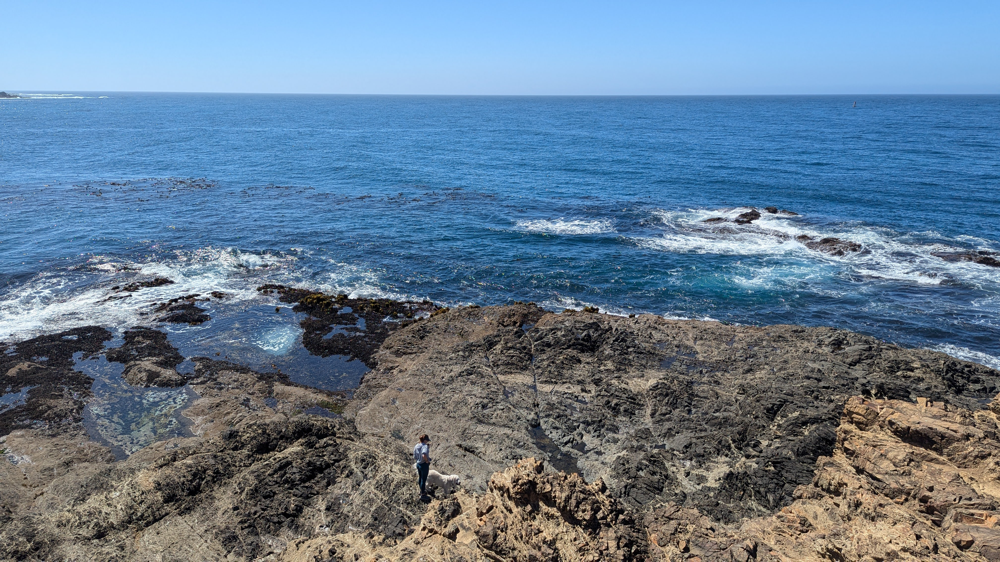
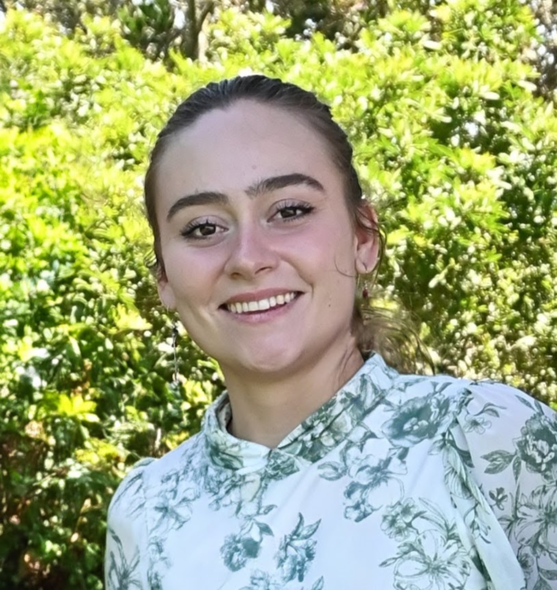
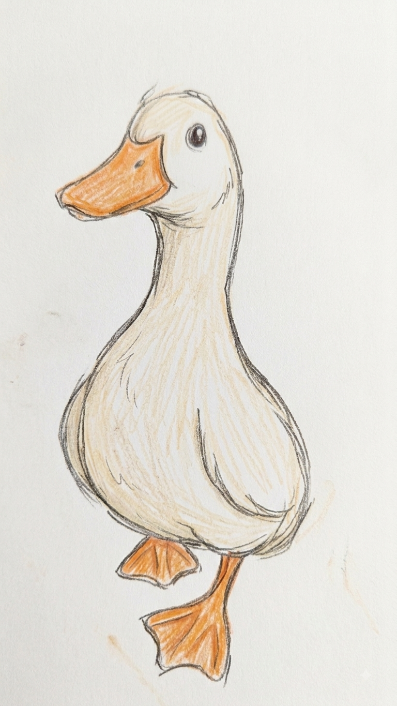
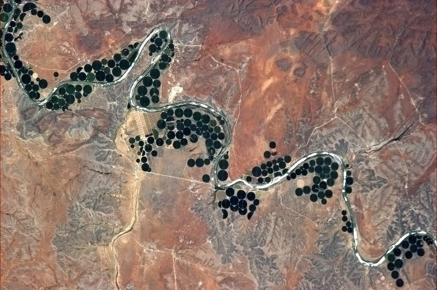
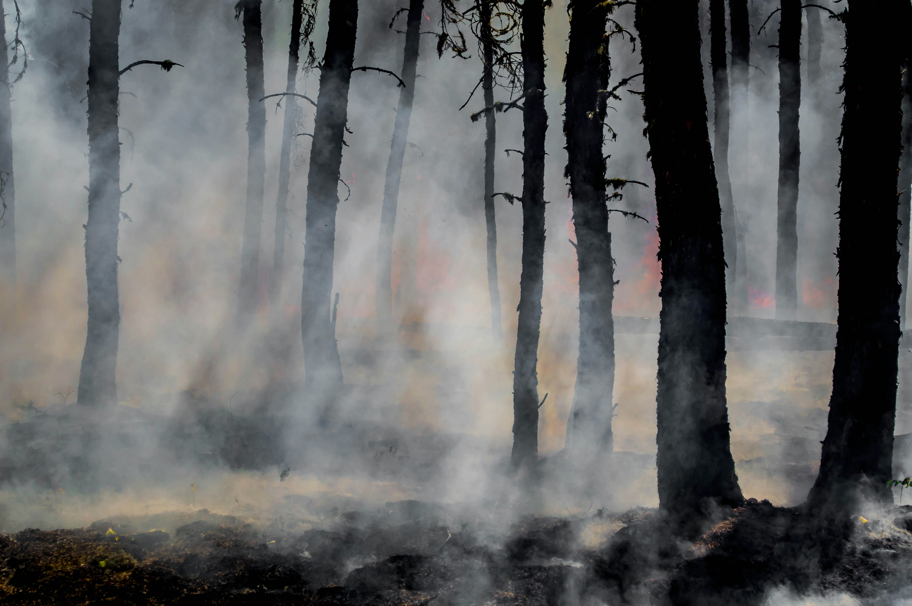

```{=html}
<section class="home-hero" aria-labelledby="home-hero-headline">
  
  <div class="home-hero-copy">
    <div id="home-hero-headline" class="home-hero-headline">
      <a class="hero-line hero-line--1" href="posts/hyperspectral-imaging/" aria-label="What the world reflects.">What the world <span class="word-reflect"><span class="word-reflect-s">s</span>ʇɔǝʅɟǝɹ</span>.</a>
      <a class="hero-line hero-line--2" href="posts/forest-data-compilation/">What our instruments preserve.</a>
      <a class="hero-line hero-line--3" href="posts/eds241-final/">What inference can honestly recover.</a>
    </div>
  </div>
</section>

<section class="home-shell home-intro" aria-label="About Emily">
  <div class="home-section-head">
    <p class="home-section-kicker">What I do</p>
  </div>
  <div class="home-intro-grid">
    
    <div class="home-intro-copy">
      <p class="home-intro-thesis">I learn complex systems, find the part making life difficult, and build solutions around the people who actually need to use them.</p>
      <p class="home-intro-bio">My background is in mathematics and environmental data science. What I really do is make complex data accessible: I ground a problem in why it matters, learn what the people and systems around it need, strip away the noise until I can see the root, and build outward from there.</p>
      <p class="home-intro-bio">I add complexity back only when it earns its place.</p>
    </div>
  </div>
</section>

<section class="home-shell home-duck" aria-labelledby="home-duck-title">
  <div class="home-section-head">
    <p class="home-section-kicker">The Duck Problem</p>
    <h2 id="home-duck-title" class="home-section-title">A small origin story about agency</h2>
  </div>
  <div class="duck-literary-card"><div class="duck-story"><p>When I was a little girl, I knew another little girl who could draw tiny ducks. I could not. She appeared to possess some mysterious duck-drawing faculty that had passed me over. But I had seen proof that a duck could be drawn, so I kept trying until I could draw one too.</p></div></div>
  <p>I did not recognize until recently that my response to the duck was an early version of a larger pattern in how I meet problems. The fork usually looks something like this:</p>
  <div class="thought-fork" aria-label="Two paths of thought after encountering the inconvenient, unexpected, or unknown">
    <div class="thought-fork-origin"><span>The inconvenient, unexpected, or unknown</span></div>
    <div class="thought-fork-branches">
      <div class="thought-path thought-path--away">
        <p class="thought-path-label">The usual path I observe</p>
        <div class="thought-node">This sucks.</div><span class="thought-arrow">↓</span>
        <div class="thought-node">Can someone else fix it?</div>
      </div>
      <div class="thought-path thought-path--mine">
        <p class="thought-path-label">Where my brain goes</p>
        <div class="thought-node">Dude, awesome.</div><span class="thought-arrow">↓</span>
        <div class="thought-node">Can I fix it?</div>
      </div>
    </div>
  </div>
  <p>What draws me is the pause in which that constant becomes a question. What is happening here? What can I learn? Where can I intervene? That pause is increasingly difficult to find inside the urgency pandemic of modern life, which trains us to keep moving before curiosity has time to become agency.</p>
  <p>Repair begins by believing there may be something worth noticing before we discard the object, the process, or the possibility that we have the capacity to understand it. Sometimes the reward is another ten years with a favorite shirt. Sometimes it is a better system. Either way, the pause matters. It is also the subject of one of my poems, <a href="art.html#urgency"><em>Urgency</em></a>.</p>
</section>

<section class="home-shell home-featured" aria-labelledby="home-featured-title">
  <div class="home-section-head">
    <h2 id="home-featured-title" class="home-section-title">Selected solutions</h2>
  </div>
  <div class="home-featured-grid">
    <a class="home-feature-card" href="research.html#forest-thermophilization-disturbance-analysis">
      
      <div class="home-feature-card-copy">
        <p class="home-feature-card-label">LOC Lab</p>
        <h3 class="home-feature-card-title">Forest Thermophilization &amp; Disturbance Analysis</h3>
        <p class="home-feature-card-summary">Pilot MEDS fellowship work building a national-scale R and Python repository, analysis pipeline, and apps for studying how U.S. forests are changing under climate and disturbance.</p>
        <span class="home-feature-card-link">View project -&gt;</span>
      </div>
    </a>
    <a class="home-feature-card" href="research.html#satellite-based-irrigation-mapping-in-sub-saharan-africa">
      
      <div class="home-feature-card-copy">
        <p class="home-feature-card-label">WaVeS Lab</p>
        <h3 class="home-feature-card-title">Satellite-Based Irrigation Mapping</h3>
        <p class="home-feature-card-summary">Python geospatial workflows and segmentation experiments for tracing where irrigation expansion is actually happening across Sub-Saharan Africa.</p>
        <span class="home-feature-card-link">View project -&gt;</span>
      </div>
    </a>
    <a class="home-feature-card" href="research.html#wildfire-resilience-index-data-access-r-package">
      
      <div class="home-feature-card-copy">
        <p class="home-feature-card-label">NCEAS Capstone</p>
        <h3 class="home-feature-card-title">Wildfire Resilience Index R Package</h3>
        <p class="home-feature-card-summary">Recent MEDS capstone work on a cloud-accessible wildfire resilience archive and open-source R package for querying, subsetting, and visualizing 100+ layers.</p>
        <span class="home-feature-card-link">View project -&gt;</span>
      </div>
    </a>
  </div>
</section>

<section class="home-shell home-link-band" aria-label="Homepage navigation and contact links">
  <div class="home-link-group">
    <p class="home-section-kicker">What I'm Working On</p>
    <div class="home-link-list">
      <a href="research.html">Research</a>
      <a href="blog.html">Blog</a>
      <a href="art.html">Art &amp; Poetry</a>
    </div>
  </div>
  <div class="home-link-group">
    <p class="home-section-kicker">Elsewhere</p>
    <div class="home-link-list">
      <a href="cv.html">CV</a>
      <a href="https://github.com/rellimylime">GitHub</a>
      <a href="mailto:ermiller@ucsb.edu">Contact</a>
    </div>
  </div>
</section>

<section class="home-shell home-quote-intro" aria-label="Quotes">
  <div class="home-section-head">
    <p class="home-section-kicker">Quotes</p>
    <p class="home-quote-hint">Swipe, scroll, or use arrows</p>
  </div>
</section>
```

::::::::::::::::::::::::::::::: quote-section
:::::::::::::::::::::::::::::: slider-container
::::::::::::::::::::::::::::: click-slider
::: slick-slide
**"It is my experience that proofs involving matrices can be shortened by 50% if one throws the matrices out."**

-   Emil Artin
:::

::: slick-slide
**"Documentation is a love letter that you write to your future self."**

-   Damian Conway
:::

::: slick-slide
**"Statisticians, like artists, have the bad habit of falling in love with their models."**

-   George Box
:::

::: slick-slide
**"With four parameters I can fit an elephant, and with five I can make him wiggle his trunk."**

-   John von Neumann
:::

::: slick-slide
**"I have no fear of losing my life-if I have to save a koala or a crocodile or a kangaroo or a snake, mate, I will save it."**

-   Steve Irwin
:::

::: slick-slide
**"The first principle is that you must not fool yourself and you are the easiest person to fool."**

-   Richard Feynman
:::

::: slick-slide
**"The real problem of humanity is this: we have paleolithic emotions, medieval institutions, and god-like technology."**

-   E.O. Wilson
:::

::: slick-slide
**"Without data, you're just another person with an opinion."**

-   W. Edwards Deming
:::

::: slick-slide
**"An expert is a person who has made all the mistakes that can be made in a very narrow field."**

-   Niels Bohr
:::

::: slick-slide
**"The cure for boredom is curiosity. There is no cure for curiosity."**

-   Dorothy Parker
:::

::: slick-slide
**"If you don't know where you are going, any road will get you there."**

-   Lewis Carroll
:::

::: slick-slide
**"I would give my right arm for the simplicity on the far side of complexity."**

-   Oliver Wendell Holmes
:::

::: slick-slide
**"The climate has always changed. The difference now is that we are the cause."**

-   Kate Marvel, Climate Scientist
:::

::: slick-slide
**"What you do makes a difference. You have to decide what kind of difference you want to make."**

-   Jane Goodall
:::

::: slick-slide
**"It's not what you look at that matters, it's what you see."**

-   Henry David Thoreau
:::

::: slick-slide
**"Let yourself be silently drawn by the strange pull of what you really love."**

-   Rumi
:::

::: slick-slide
**"Tell me, what is it you plan to do with your one wild and precious life?"**

-   Mary Oliver, Wild Geese
:::

::: slick-slide
**"Nothing in life is to be feared, it is only to be understood."**

-   Marie Curie
:::

::: slick-slide
**"A ship in port is safe, but that's not what ships are built for."**

-   Grace Hopper
:::

::: slick-slide
**"Change happens by listening and then starting a dialogue with the people who are doing something you don't believe is right."**

-   Jane Goodall
:::

::: slick-slide
**"Study as if you were going to live forever; live as if you were going to die tomorrow."**

-   Maria Mitchell
:::

::: slick-slide
**"We are drowning in information, while starving for wisdom. The world henceforth will be run by synthesizers, people able to put together the right information at the right time, think critically about it, and make important choices wisely."**

-   E. O. Wilson
:::

::: slick-slide
**"It's easy to lie with statistics. It's hard to tell the truth without statistics."**

-   Andrejs Dunkels
:::

::: slick-slide
**"If you can't explain it simply, you don't understand it well enough."**

-   Albert Einstein
:::

::: slick-slide
**"When a measure becomes a target, it ceases to be a good measure"**

-   Charles Goodhart
:::

::: slick-slide
**"All models are wrong, but some are useful."**

-   George E. P. Box
:::
:::::::::::::::::::::::::::::
::::::::::::::::::::::::::::::
:::::::::::::::::::::::::::::::

```{=html}
<script>
document.addEventListener('DOMContentLoaded', function() {
  const hero = document.querySelector('.home-hero');
  const heroImage = document.querySelector('.home-hero-image');

  if (hero && heroImage && !window.matchMedia('(prefers-reduced-motion: reduce)').matches) {
    let ticking = false;

    function updateParallax() {
      const scrollY = window.scrollY;
      const heroHeight = hero.offsetHeight;
      if (scrollY <= heroHeight) {
        heroImage.style.transform = 'translateY(' + (scrollY * 0.1) + 'px)';
      }
      ticking = false;
    }

    window.addEventListener('scroll', function() {
      if (!ticking) {
        requestAnimationFrame(updateParallax);
        ticking = true;
      }
    }, { passive: true });
  }
});
</script>
```

```{=html}
<script>
document.addEventListener('DOMContentLoaded', function() {
  const sliders = document.querySelectorAll('.click-slider');

  sliders.forEach((slider) => {
    const slides = slider.querySelectorAll('.slick-slide');
    let currentSlide = 0;
    let touchStartX = null;
    let touchStartY = null;
    let wheelLocked = false;
    let wheelUnlockTimer = null;

    if (slides.length === 0) return;

    slides[0].classList.add('slick-active');
    slider.classList.add('is-swipe-ready');
    slider.setAttribute('tabindex', '0');
    slider.setAttribute('aria-label', 'Quote carousel');

    const prevBtn = document.createElement('button');
    prevBtn.classList.add('slick-prev');
    prevBtn.innerHTML = '&lsaquo;';
    prevBtn.setAttribute('aria-label', 'Previous quote');

    const nextBtn = document.createElement('button');
    nextBtn.classList.add('slick-next');
    nextBtn.innerHTML = '&rsaquo;';
    nextBtn.setAttribute('aria-label', 'Next quote');

    slider.parentElement.appendChild(prevBtn);
    slider.parentElement.appendChild(nextBtn);

    const dotsContainer = document.createElement('ul');
    dotsContainer.classList.add('slick-dots');

    slides.forEach((slide, index) => {
      const dot = document.createElement('li');
      const btn = document.createElement('button');
      btn.setAttribute('aria-label', `Go to quote ${index + 1}`);
      btn.onclick = (e) => {
        e.preventDefault();
        goToSlide(index);
      };
      dot.appendChild(btn);
      dotsContainer.appendChild(dot);

      if (index === 0) {
        dot.classList.add('slick-active');
      }
    });

    slider.parentElement.appendChild(dotsContainer);

    function showSlide(n) {
      const dots = dotsContainer.querySelectorAll('li');

      slides[currentSlide].classList.remove('slick-active');
      dots[currentSlide].classList.remove('slick-active');

      currentSlide = (n + slides.length) % slides.length;

      slides[currentSlide].classList.add('slick-active');
      dots[currentSlide].classList.add('slick-active');
    }

    function goToSlide(n) {
      showSlide(n);
    }

    function nextSlide() {
      showSlide(currentSlide + 1);
    }

    function prevSlide() {
      showSlide(currentSlide - 1);
    }

    nextBtn.addEventListener('click', nextSlide);
    prevBtn.addEventListener('click', prevSlide);

    slider.addEventListener('keydown', function(e) {
      if (e.key === 'ArrowRight') {
        e.preventDefault();
        nextSlide();
      } else if (e.key === 'ArrowLeft') {
        e.preventDefault();
        prevSlide();
      }
    });

    slider.addEventListener('touchstart', function(e) {
      const firstTouch = e.changedTouches[0];
      touchStartX = firstTouch.clientX;
      touchStartY = firstTouch.clientY;
    }, { passive: true });

    slider.addEventListener('touchend', function(e) {
      if (touchStartX === null || touchStartY === null) return;

      const endTouch = e.changedTouches[0];
      const deltaX = endTouch.clientX - touchStartX;
      const deltaY = endTouch.clientY - touchStartY;

      touchStartX = null;
      touchStartY = null;

      if (Math.abs(deltaX) < 48 || Math.abs(deltaX) <= Math.abs(deltaY)) return;

      if (deltaX < 0) {
        nextSlide();
      } else {
        prevSlide();
      }
    }, { passive: true });

    slider.addEventListener('wheel', function(e) {
      const horizontalIntent = Math.abs(e.deltaX) > Math.abs(e.deltaY) || e.shiftKey;

      if (!horizontalIntent || wheelLocked) return;

      const intendedDelta = Math.abs(e.deltaX) > 0 ? e.deltaX : e.deltaY;

      if (Math.abs(intendedDelta) < 8) return;

      e.preventDefault();
      wheelLocked = true;

      if (intendedDelta > 0) {
        nextSlide();
      } else {
        prevSlide();
      }

      window.clearTimeout(wheelUnlockTimer);
      wheelUnlockTimer = window.setTimeout(() => {
        wheelLocked = false;
      }, 320);
    }, { passive: false });
  });
});
</script>
```
