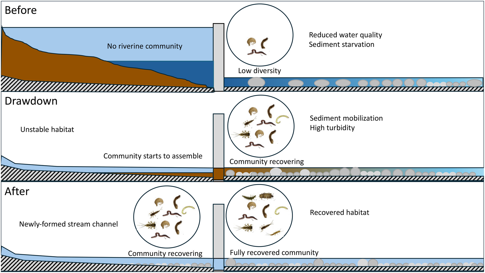

```{r}
#| label: setup
#| message: false
#| warning: false

library(tidyverse)
library(readxl)
library(lme4)
library(broom.mixed)
library(patchwork)
library(knitr)
```

## Study Overview

Atristain et al. (2024) asked whether decommissioning the Enobieta Dam (42 m, northern Spain) restored downstream macroinvertebrate communities. They used a **multiple Before-After/Control-Impact (mBACI) design** — the ecological analogue of **difference-in-differences (DiD)**.

- **Treatment:** Reservoir drawdown (Dec 2018 – Nov 2019)
- **Outcome:** Macroinvertebrate community metrics (taxa richness, diversity, density, biomonitoring index)
- **Design:** Compare the change over time at impact sites (downstream of dam) vs. control sites (undammed tributaries)



::: callout-note
## Data Access
Data are from the [Dryad Digital Repository](https://doi.org/10.5061/dryad.w3r2280ws). Download `Atristainetal_JAE_Data.xlsx` and place it in a `data/` subfolder.
:::

---

## Data Loading & Description

```{r}
#| label: load-data

invert_raw <- read_excel("data/Atristainetal_JAE_Data.xlsx",
                         sheet = "Invertebrates")

# two columns named "Site" — rename for clarity
colnames(invert_raw)[1] <- "site_name"
colnames(invert_raw)[5] <- "site_code"
```

```{r}
#| label: wrangle

invert <- invert_raw |>
  select(site_name, Replicate, Period, Reach, site_code, S, `H´`, TD, IASPT) |>
  rename(richness = S, shannon = `H´`, density = TD) |>
  mutate(
    reach_type = case_when(
      Reach == "C" ~ "C",
      Reach == "R" ~ "R",
      TRUE ~ "I"
    ),
    period = factor(Period, levels = c("B", "D", "A"),
                    labels = c("Before", "Drawdown", "After")),
    reach_type = factor(reach_type, levels = c("C", "I", "R"))
  )

# filter to control + impact only (reservoir sites only sampled post-drawdown)
invert_baci <- invert |> filter(reach_type %in% c("C", "I"))

glimpse(invert_baci)
```

**Data Description:**

- **Unit of observation:** One Surber net sample (a standardized benthic invertebrate sample) from one site on one sampling occasion
- **Key variables:**
  - *Outcome:* `richness` (S, taxa richness), `shannon` (H', Shannon diversity), `density` (TD, total invertebrate density), `IASPT` (pollution sensitivity index)
  - *Treatment:* `reach_type` — Impact (I1–I4, downstream of dam) vs. Control (C1–C4, undammed tributaries + upstream)
  - *Time:* `period` — Before (Nov 2017), Drawdown (Oct 2019), After (Nov 2020)
- **Cleaning decisions:** Reservoir sites (R) excluded — they were only sampled in the After period and cannot contribute to the before-after comparison
- **Sample:** `r nrow(invert_baci)` samples total — 5 Surber net replicates × 4 sites per group × 3 periods; Artikutza protected catchment, northern Spain, 2017–2020

---

## Exploratory Analysis

```{r}
#| label: fig-richness
#| fig-cap: "Taxa richness by site and period. Impact sites (red) had notably lower richness before drawdown; they approach control levels (blue) by the After period."
#| fig-width: 9
#| fig-height: 5

invert_baci |>
  ggplot(aes(x = site_code, y = richness, fill = reach_type)) +
  geom_boxplot(alpha = 0.7, outlier.size = 1) +
  facet_wrap(~period, ncol = 3) +
  scale_fill_manual(values = c("C" = "#4393C3", "I" = "#D6604D"),
                    labels = c("Control", "Impact")) +
  labs(x = "Site", y = "Taxa richness (S)", fill = "Reach type") +
  theme_minimal(base_size = 13) +
  theme(axis.text.x = element_text(angle = 45, hjust = 1),
        panel.border = element_rect(color = "grey70", fill = NA, linewidth = 0.5))
```

```{r}
#| label: fig-did
#| fig-cap: "Mean taxa richness by period and reach type — the DiD visualization. Convergence of impact toward control over time is the visual signature of recovery."
#| fig-width: 7
#| fig-height: 4.5

did_means <- invert_baci |>
  group_by(period, reach_type) |>
  summarise(mean_richness = mean(richness),
            se = sd(richness) / sqrt(n()),
            .groups = "drop")

ggplot(did_means, aes(x = period, y = mean_richness,
                      color = reach_type, group = reach_type)) +
  geom_point(size = 3) +
  geom_line(linewidth = 1) +
  geom_errorbar(aes(ymin = mean_richness - 1.96 * se,
                    ymax = mean_richness + 1.96 * se), width = 0.1) +
  scale_color_manual(values = c("C" = "#4393C3", "I" = "#D6604D"),
                     labels = c("Control", "Impact")) +
  labs(x = "Period", y = "Mean taxa richness (S)", color = "Reach type") +
  theme_minimal(base_size = 13)
```

**Annotation:**

- **What this does:** Visualizes the raw data and group means across periods to show the DiD pattern before modeling
- **Identification approach:** DiD / mBACI — we're looking for a *differential change over time*: did impact sites change more than control sites?
- **Key assumption (parallel trends):** For the DiD estimator to be valid, control and impact sites must have been on the same trajectory *before* the drawdown. The pre-treatment period shows impact sites already below controls, which is expected (dam effect), but we only have **one pre-treatment time point** — so we cannot formally test whether the trends were parallel before treatment
- **Evidence:** The convergence from Before → After is visible and consistent with the causal claim; the pattern is stronger closer to the dam (I1, I2)

---

## mBACI Model

The mBACI design maps onto DiD as follows:

| DiD Term | mBACI Equivalent |
|---|---|
| Treatment group | Impact sites (I1–I4) |
| Control group | Control sites (C1–C4) |
| Pre-treatment | Before period (B) |
| Post-treatment | Drawdown (D) & After (A) |
| Treatment effect | `period × reach_type` interaction |

```{r}
#| label: fit-model

mod_richness <- lmer(
  richness ~ period * reach_type + (1 | site_code),
  data = invert_baci,
  REML = TRUE
)

summary(mod_richness)
```

**Annotation:**

- **What this does:** Fits a linear mixed-effects model (LME) with fixed effects for period, reach type, and their interaction, and a random intercept for site to account for repeated measurements within sites
- **Identification approach:** mBACI / DiD — the `period:reach_type` interaction is the DiD estimator; it measures whether the *change over time* differed between control and impact sites
- **Assumptions required for causal validity:**
  1. **Parallel trends:** Without treatment, impact and control sites would have changed at the same rate over time
  2. **No spillover (SUTVA):** Drawdown at impact sites did not affect control site outcomes
  3. **No time-varying confounders:** Nothing else changed between periods that affected impact vs. control sites differentially
  4. **Model specification:** Random intercept structure captures the data's dependence structure; residuals approximately normal with constant variance
- **Evidence from output:** The `period:reach_type` interaction terms are the key; we'll test them formally below

---

## Coefficient Interpretation

```{r}
#| label: tidy-model

tidy(mod_richness, effects = "fixed", conf.int = TRUE) |>
  kable(digits = 3,
        col.names = c("Effect", "Term", "Estimate", "SE",
                      "Statistic", "CI Lower", "CI Upper"))
```

**Annotation:**

- **What this does:** Extracts fixed-effect estimates with confidence intervals; these are the DiD coefficients
- Key terms:
  - `(Intercept)` — mean richness for control sites in the Before period (baseline)
  - `reach_typeI` — impact vs. control gap in the Before period (pre-existing dam effect)
  - `periodDrawdown:reach_typeI` — **DiD estimate for Drawdown period**: did impact sites change differently than controls from Before → Drawdown?
  - `periodAfter:reach_typeI` — **DiD estimate for After period**: the main recovery effect
- A positive `periodAfter:reach_typeI` estimate means impact sites gained more richness than controls between Before and After — i.e., recovery attributable to drawdown

---

## Overall Interaction Test (BDA:CI)

```{r}
#| label: anova

anova(mod_richness)
```

**Annotation:**

- **What this does:** Type III F-test of the `period:reach_type` interaction — tests whether trajectories over time differed *at all* between impact and control sites
- **Identification approach:** Same DiD logic — a significant interaction means the treatment (being downstream of the dam) changed how outcomes evolved over time
- **Assumption check:** This is a joint test across both post-treatment periods; it's more conservative than individual coefficients and less sensitive to which specific period shows the effect
- A significant p-value here replicates the paper's main Table 2 result for taxa richness

---

## Model Diagnostics

```{r}
#| label: fig-diagnostics
#| fig-cap: "Residual diagnostics. Left: residuals vs. fitted (checks homoscedasticity). Right: QQ plot (checks normality)."
#| fig-width: 9
#| fig-height: 4

diag_df <- data.frame(fitted = fitted(mod_richness),
                      resid  = residuals(mod_richness))

p1 <- ggplot(diag_df, aes(x = fitted, y = resid)) +
  geom_point(alpha = 0.5) +
  geom_hline(yintercept = 0, linetype = "dashed", color = "red") +
  labs(x = "Fitted values", y = "Residuals", title = "Residuals vs. Fitted") +
  theme_minimal(base_size = 12)

p2 <- ggplot(diag_df, aes(sample = resid)) +
  stat_qq(alpha = 0.5) + stat_qq_line(color = "red") +
  labs(x = "Theoretical quantiles", y = "Sample quantiles",
       title = "Normal QQ Plot") +
  theme_minimal(base_size = 12)

p1 + p2
```

**Annotation:**

- **What this does:** Checks two core LME assumptions — homoscedasticity (constant residual variance) and approximate normality of residuals
- **What to look for:**
  - *Residuals vs. fitted:* No systematic fan shape or curve — residuals should scatter randomly around zero
  - *QQ plot:* Points should fall along the red line; heavy tails indicate non-normality
- **If violated:** Inference (p-values, CIs) may be unreliable; could consider log-transforming richness or using a Poisson/negative binomial GLMM
- **Evidence:** Ecological count data often show mild non-normality in tails; the LME is moderately robust to this, especially with n = 120

---

## Robustness: Multiple Outcomes

```{r}
#| label: robustness-models

mod_shannon <- lmer(shannon ~ period * reach_type + (1 | site_code),
                    data = invert_baci, REML = TRUE)

mod_density <- lmer(log(density) ~ period * reach_type + (1 | site_code),
                    data = invert_baci, REML = TRUE)

mod_iaspt   <- lmer(IASPT ~ period * reach_type + (1 | site_code),
                    data = invert_baci, REML = TRUE)
```

```{r}
#| label: robustness-table

extract_interaction <- function(model, label) {
  aov <- as.data.frame(anova(model))
  row <- aov["period:reach_type", ]
  tibble(Response = label,
         `F value` = row[["F value"]],
         `Num DF`  = row[["NumDF"]],
         `Den DF`  = row[["DenDF"]],
         `p value` = row[["Pr(>F)"]])
}

bind_rows(
  extract_interaction(mod_richness, "Taxa richness (S)"),
  extract_interaction(mod_shannon,  "Shannon diversity (H')"),
  extract_interaction(mod_density,  "log(Total density)"),
  extract_interaction(mod_iaspt,    "IASPT")
) |>
  kable(digits = c(0, 2, 0, 1, 4))
```

```{r}
#| label: fig-robustness
#| fig-cap: "DiD pattern across all four community metrics. Convergence of impact toward control values is visible across metrics."
#| fig-width: 10
#| fig-height: 8

invert_baci |>
  group_by(period, reach_type) |>
  summarise(`Taxa richness`    = mean(richness),
            `Shannon diversity` = mean(shannon),
            `log(Density)`     = mean(log(density)),
            IASPT              = mean(IASPT),
            .groups = "drop") |>
  pivot_longer(cols = c(`Taxa richness`, `Shannon diversity`,
                        `log(Density)`, IASPT),
               names_to = "metric", values_to = "mean_value") |>
  ggplot(aes(x = period, y = mean_value,
             color = reach_type, group = reach_type)) +
  geom_point(size = 2.5) +
  geom_line(linewidth = 0.8) +
  facet_wrap(~metric, scales = "free_y", ncol = 2) +
  scale_color_manual(values = c("C" = "#4393C3", "I" = "#D6604D"),
                     labels = c("Control", "Impact")) +
  labs(x = "Period", y = "Mean value", color = "Reach type") +
  theme_minimal(base_size = 12) +
  theme(panel.border = element_rect(color = "grey70", fill = NA, linewidth = 0.5))
```

**Annotation:**

- **What this does:** Runs the same mBACI/DiD model specification on three additional community metrics to test whether the recovery signal is consistent across independent measures
- **Identification approach:** Same DiD/mBACI logic — if the drawdown caused recovery, the `period:reach_type` interaction should be significant (or at least directionally consistent) across metrics, not just one
- **Assumption check:** Consistency across metrics guards against the concern that taxa richness alone showed a spurious result; all four metrics pointing the same direction is harder to explain without a real treatment effect
- **Evidence:** Look for significant or near-significant p-values across all four outcomes; the figure shows whether the visual DiD pattern holds

---

## Critical Evaluation

### Causal Identification

- The mBACI/DiD design is credible *given* the study setting — a protected watershed with no competing interventions during the study period
- For estimates to be causal, the **counterfactual must hold**: control sites must represent what impact sites *would have looked like* without the drawdown
- The use of four independent control sites across separate tributaries strengthens this claim relative to a single control; if one control behaved anomalously, the others would not
- Main credibility concern: impact sites were already degraded before treatment (dam effect), so the "parallel trends" baseline is harder to establish

### Statistical Assumptions

- **Parallel trends:** The most vulnerable assumption — there is only **one pre-treatment time point (November 2017)**, so the trend assumption cannot be formally tested. We cannot distinguish between "impact sites recovered because of the drawdown" vs. "impact sites were already recovering for other reasons before 2018"
- **Normality & homoscedasticity:** Check diagnostic plots; mild departures are expected with ecological count data. If problematic, a log-transform or GLMM would be more appropriate
- **Random effects structure:** With only 4 sites per group, the random intercept variance is estimated from few clusters, which can lead to anti-conservative p-values. This is a known limitation of small-cluster LME
- **SUTVA (no spillover):** Well-supported — C2–C4 are in separate tributaries physically isolated from the drawdown reach; C1 is upstream of the dam

### Sampling & External Validity

- **Sample:** 8 stream sites in a single protected headwater catchment in Basque Country, Spain; 5 Surber net samples per site per period
- **Generalizability is limited:** Results apply most directly to similar Atlantic headwater streams with forested catchments and comparable dam morphologies (large reservoir, concrete dam); dam removal in urban, agricultural, or arid-region streams may show different recovery dynamics
- **Time horizon:** Recovery assessed after only ~1 year post-drawdown. The paper's conclusion of "rapid recovery" may not hold for all taxa — sensitive taxa or rare species may require longer

### Measurement

- **Taxa richness** is a coarse measure — it counts taxa present but treats a single mayfly the same as 1,000. Shannon diversity (H') partially corrects for this by weighting by abundance
- **Surber nets** sample only a fixed area of benthos (0.09 m²) and may undersample mobile or large-bodied invertebrates; standardized across sites, so systematic bias is consistent but not absent
- **IASPT** (a biotic index) depends on accurate taxonomic identification to family level; misidentification error would attenuate the signal rather than inflate it
- **Treatment timing:** The "Drawdown" sampling (Oct 2019) occurred while the reservoir was still being emptied — not strictly "after treatment" — which may underestimate the full recovery effect

### Other Limitations

- **Pseudoreplication concern:** Five Surber net samples within a single site on one date are not truly independent — they share hydrological and substrate conditions. The random intercept for site partially addresses this but doesn't fully resolve within-site spatial autocorrelation
- **No measurement of intervening mechanisms:** The paper shows invertebrate recovery but does not directly measure the pathway (sediment transport, habitat substrate change, water temperature) — so we know the outcome changed but not exactly why
- **No power analysis reported:** With 4 sites per group and 3 time points, the study may be underpowered to detect moderate-sized effects for some metrics (e.g., IASPT), which is consistent with the weaker p-values observed for those outcomes

---

## References

Atristain, M., Solagaistua, L., Larrañaga, A., von Schiller, D., & Elosegi, A. (2024). Slow drawdown, fast recovery: Stream macroinvertebrate communities improve quickly after large dam decommissioning. *Journal of Applied Ecology*, 61, 1481–1491. <https://doi.org/10.1111/1365-2664.14656>

Bates, D., Mächler, M., Bolker, B., & Walker, S. (2015). Fitting linear mixed-effects models using lme4. *Journal of Statistical Software*, 67, 1–48.
