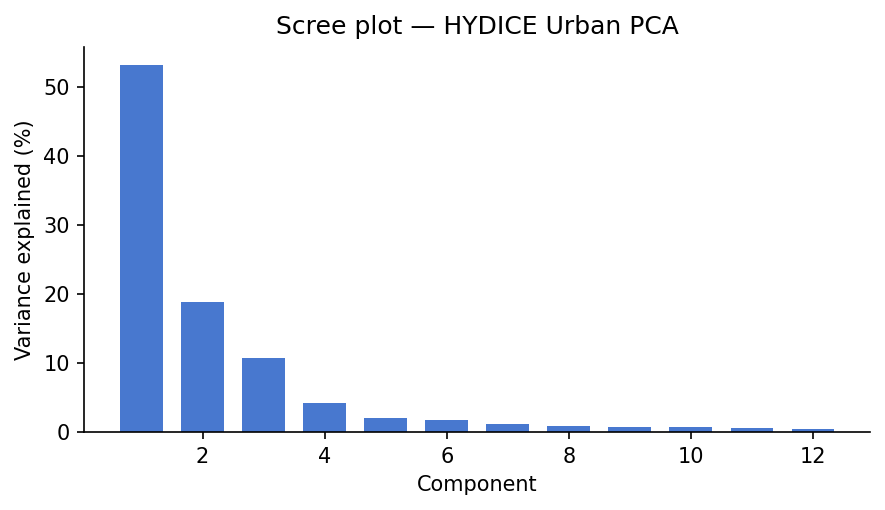
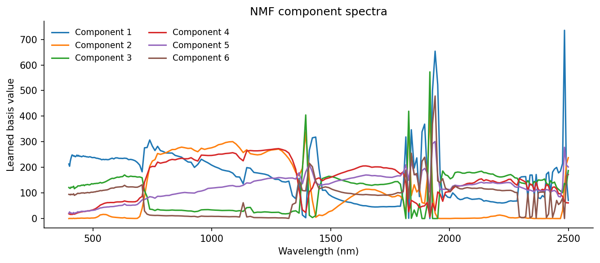

```{=html}
<style>
.hsi-mixer {
  margin: 1.75rem 0;
  padding: 1rem 1.05rem 1.1rem;
  border: 1px solid rgba(124, 146, 137, 0.55);
  border-left: 3px solid rgba(47, 111, 103, 0.85);
  border-radius: 0.45rem;
  background: rgba(250, 248, 244, 0.78);
}

.hsi-mixer h4 {
  margin: 0 0 0.35rem;
  font-size: 1rem;
}

.hsi-mixer p {
  margin: 0 0 0.8rem;
}

.hsi-mixer-grid {
  display: grid;
  grid-template-columns: minmax(0, 1fr) minmax(0, 1.2fr);
  gap: 1rem;
  align-items: start;
}

.hsi-mixer-controls {
  display: grid;
  gap: 0.75rem;
}

.hsi-mixer-control label {
  display: block;
  font-weight: 600;
  margin-bottom: 0.2rem;
}

.hsi-mixer-control input[type="range"] {
  width: 100%;
}

.hsi-mixer-readout {
  font-family: ui-monospace, SFMono-Regular, Menlo, Consolas, monospace;
  font-size: 0.88rem;
  color: rgba(39, 46, 54, 0.82);
}

.hsi-mixer-summary {
  min-height: 2.75rem;
  padding: 0.6rem 0.7rem;
  border-radius: 0.35rem;
  background: rgba(255, 255, 255, 0.72);
  font-size: 0.94rem;
}

.hsi-mixer-buttons {
  display: flex;
  flex-wrap: wrap;
  gap: 0.5rem;
}

.hsi-mixer-buttons button {
  padding: 0.42rem 0.7rem;
  border: 1px solid rgba(124, 146, 137, 0.6);
  border-radius: 999px;
  background: rgba(255, 255, 255, 0.88);
  color: rgba(39, 46, 54, 0.88);
  font-size: 0.88rem;
}

.hsi-mixer-figure {
  margin: 0;
}

.hsi-mixer-legend {
  display: flex;
  flex-wrap: wrap;
  gap: 0.7rem;
  margin-top: 0.55rem;
  font-size: 0.86rem;
}

.hsi-mixer-legend span {
  display: inline-flex;
  align-items: center;
  gap: 0.35rem;
}

.hsi-mixer-swatch {
  width: 0.8rem;
  height: 0.8rem;
  border-radius: 999px;
  display: inline-block;
}

.hsi-mixer-note {
  margin-top: 0.65rem;
  font-size: 0.88rem;
  color: rgba(39, 46, 54, 0.78);
}

@media (max-width: 760px) {
  .hsi-mixer-grid {
    grid-template-columns: 1fr;
  }
}
</style>
```

```{python}
#| label: setup
#| echo: false

import zipfile
import tempfile
import numpy as np
import matplotlib
matplotlib.use("Agg")  # non-interactive backend for headless rendering
import matplotlib.pyplot as plt
from pathlib import Path
from sklearn.decomposition import PCA, NMF
from scipy.optimize import nnls

DATA_DIR = Path("data/HYDICE_Urban/")  # expects Urban.zip here
FIG_DIR = Path("figures/")
FIG_DIR.mkdir(exist_ok=True)

plt.rcParams.update({
    "figure.dpi": 150,
    "axes.spines.top": False,
    "axes.spines.right": False,
    "font.family": "sans-serif",
})
```

## The question

This post came out of a gap in my own understanding. I knew what hyperspectral imagery was useful for, but I did not yet feel fluent enough to open a cube from scratch and trust what I was seeing. So I worked from the data upward: load the scene, inspect a few spectra, and follow the methods until they stopped feeling opaque.

What follows is the guide I wanted at the start. It is not a full hyperspectral textbook. It is a way to get from "I know how to read satellite imagery and false-color composites" to "I understand what a hyperspectral pixel is, why people reshape cubes into matrices, and what PCA, unmixing, and NMF are actually doing."

If you work with remote sensing imagery, you already know the usual move: choose a few bands, stretch them well, and interpret the resulting composite. Even a good false-color image, though, still compresses the scene down to a small number of broad spectral channels.

Hyperspectral imagery changes the question. Instead of 3 broad RGB bands, or even a modest multispectral stack, it records hundreds of narrow, contiguous wavelength channels. In the HYDICE Urban scene used here, each pixel carries a 210-value spectrum spanning the visible through the shortwave infrared.

That full spectral curve is what makes hyperspectral analysis different from standard image interpretation. Vegetation, asphalt, bare ground, rooftops, and metal surfaces can overlap in brightness or color in a broad-band composite while still differing strongly in spectral shape. The question stops being only "what does this object look like in a display image?" and becomes "what spectral signature is present in this pixel, and what does that imply about materials?"

So the real question in this post is: **given a full spectrum at each pixel, can we separate the scene into meaningful material patterns without labels?**

::: callout-note
**How to read this post**

-   If you are new to the topic, the most important sections are **Pixel spectra**, **From cube to matrix**, and the intuition summaries inside each method.
-   If you are comfortable with linear algebra, the displayed equations show the same ideas in matrix form.
-   If you mainly want the practical judgment call, skip to **What these methods are actually for** near the end.
:::

Three approaches, each with a different way of framing that problem:

1.  **Principal component analysis (PCA)**: What are the dominant directions of spectral variance in the scene? PCA is the compression view. It asks how much of the 210-band signal can be summarized with a small number of orthogonal patterns.
2.  **Linear spectral unmixing**: If we already know what a few pure materials look like, what fraction of each material is present in a given pixel? This is the fraction view, closest to the classic subpixel remote-sensing problem.
3.  **Non-negative matrix factorization (NMF)**: Can we learn additive, material-like spectral patterns directly from the data, without supplying endmembers ahead of time? This is the discovery view.

::: callout-tip
**Remote-sensing intuition.** A false-color composite asks: which three bands should I display? Hyperspectral analysis asks a different question: what can I learn if I use the *entire* spectral curve at each pixel instead of just a few display bands?
:::

::: callout-note
**Why a non-specialist might care.** The broader idea here is not unique to remote sensing. Once every observation carries a long feature vector instead of one or two numbers, the job becomes: find the main directions of variation, estimate mixtures, or learn parts. The same logic shows up in chemistry, audio mixtures, genomics, and other high-dimensional signals.
:::

::: panel-tabset
### PCA: Variance View

Use PCA when you want the strongest spectral contrasts in the scene, whether or not they map cleanly onto physical materials. It is especially useful for compression, QA, dimensionality reduction, and anomaly screening.

### Unmixing: Fraction View

Use linear unmixing when you already have plausible endmembers and want outputs that read like material fractions. This is the most direct fit to the remote-sensing question of mixed pixels and subpixel composition.

### NMF: Parts View

Use NMF when you want interpretable additive components but do not yet trust a fixed endmember library. It often sits between purely mathematical compression and fully supervised unmixing.
:::

| Method | Main question | Matrix view | Easiest way to read the output |
|----|----|----|----|
| PCA | What varies most across the scene? | $X_c \approx ZV^T$ | Contrast axes plus eigenimages |
| Unmixing | What is this pixel made of? | $X \approx SM^T$ | Material fractions |
| NMF | What additive parts can I learn? | $X \approx WH$ | Learned parts plus weight maps |

## The data

We'll use **HYDICE Urban** [@erdc_hypercube], a classic hyperspectral benchmark from the U.S. Army Engineer Research and Development Center. It is a 307 x 307 pixel urban scene with 210 bands spanning roughly 400-2500 nm, at about 2 m ground sampling distance.

It is a useful teaching scene because it mixes vegetation, roads, rooftops, bare ground, and shadow in a compact area. If you already have intuition for urban false-color imagery, this dataset is a natural next step: the same scene elements are there, but now we can analyze their full spectral behavior rather than only a few displayed bands.

::: callout-note
**Getting the data.** Download the URBAN sample ZIP from the [ERDC HyperCube page](https://www.erdc.usace.army.mil/Media/Fact-Sheets/Fact-Sheet-Article-View/Article/610433/hypercube/). Leave it zipped and place it at `data/HYDICE_Urban/Urban.zip` relative to this post, the loading code extracts it to a temporary directory automatically.

To run the code cells yourself, change `eval: false` to `eval: true` in the document YAML. All figures in this post were pre-generated and committed.
:::

If you want a more widely used imaging-spectroscopy benchmark, the same ideas also apply to AVIRIS Moffett Field [@aviris_moffett], a 224-band scene over water, vegetation, and urban land near Mountain View, California. The workflow is almost the same; you mainly change the file path and, if needed, mask a few strong water-absorption bands.

### Loading the cube

This is a sensor-native style product: a binary cube plus a few small metadata files. The main data file holds the radiance values, while the wavelength file tells us which wavelength corresponds to each band. If you have worked with ENVI-style remote-sensing products before, the layout will feel familiar.

The `.wvl` file is plain text, so we read it directly from the ZIP archive with Python's `zipfile` module:

```{python}
#| label: load-data

ZIP_PATH = DATA_DIR / "Urban.zip"

# Parse wavelengths from the .wvl file (tab-separated, \r line endings, col 1 = nm)
with zipfile.ZipFile(ZIP_PATH) as zf:
    wvl_name = next(n for n in zf.namelist() if n.endswith(".wvl"))
    with zf.open(wvl_name) as f:
        lines = f.read().decode("ascii").replace("\r", "\n").splitlines()
        wavelengths = np.array([float(l.split("\t")[1]) for l in lines if l.strip()])

# The .hdr is a custom HyperCube format, not standard ENVI, so we read the binary directly.
# Header specifies: big-endian int16, BIL interleave, 307 samples x 307 lines x 210 bands.
with zipfile.ZipFile(ZIP_PATH) as zf:
    data_name = next(n for n in zf.namelist() if not n.endswith(("/", ".hdr", ".wvl")))
    with zf.open(data_name) as f:
        raw = np.frombuffer(f.read(), dtype=np.dtype(">i2"))

H, W, B = 307, 307, 210
cube = raw.reshape(H, B, W).transpose(1, 0, 2)  # BIL: lines x bands x samples -> bands x rows x cols

print(f"Cube shape:       {cube.shape}")
print(f"Wavelength range: {wavelengths[0]:.0f} - {wavelengths[-1]:.0f} nm")
print(f"Dtype: {cube.dtype}, Min: {cube.min()}, Max: {cube.max()}")
```

The cube shape `(B, H, W)` means:

-   first index = wavelength band
-   second index = row
-   third index = column

That layout is convenient because it makes both views of the data easy: one band at a time as an image, or one pixel at a time as a spectrum.

::: callout-note
**Simple mental picture.** A hyperspectral cube is just a stack of grayscale images. Band 1 is the scene at one wavelength, band 2 is the same scene a few nanometers away, and so on. A pixel spectrum is what you get when you stop at one location and read straight down through that stack.
:::

### A note on radiance vs. reflectance

This dataset stores **radiance**, which is the light measured by the sensor. It does **not** store surface reflectance.

That distinction matters. Reflectance is usually easier to interpret as a surface property, because it is closer to "what fraction of incoming light did the target reflect?" Radiance still contains the material signal, but it also includes illumination geometry and atmospheric effects.

The relationship between the two is approximately:

$$\rho \approx \frac{\pi \, L \, d^2}{E_0 \cos(\theta_{SZ})}$$

where $L$ is at-sensor radiance, $E_0$ is top-of-atmosphere solar irradiance for that band, $d$ is the Earth-Sun distance in AU, and $\theta_{SZ}$ is the solar zenith angle [@nasa_seadas]. Atmospheric-correction workflows go further than this simple relation and try to remove path radiance so the result is closer to true surface reflectance.

For this demo, radiance is fine. The decomposition math is the same either way. The main difference is interpretation: if you want to compare across dates, sensors, or spectral libraries, reflectance is the more physically stable quantity.

::: callout-important
**Interpretation boundary.** The outputs below are still useful on radiance, but they should not be read as scene-invariant material signatures. For library matching, cross-scene comparison, or retrieval tasks, surface reflectance is the safer input.
:::

### RGB composite

To make a normal-looking color image, we pick one band near red, one near green, and one near blue. Choosing them by wavelength instead of by hard-coded band number makes the code easier to reuse on other datasets:

```{python}
#| label: rgb-composite
#| code-fold: true
#| fig-show: hide

def nearest_band(wavelengths: np.ndarray, target_nm: float) -> int:
    """Return the band index closest to target_nm."""
    return int(np.argmin(np.abs(wavelengths - target_nm)))

R     = nearest_band(wavelengths, 650)  # red
G     = nearest_band(wavelengths, 550)  # green
B_idx = nearest_band(wavelengths, 470)  # blue

rgb = cube[[R, G, B_idx], :, :].astype(np.float32).transpose(1, 2, 0)
lo, hi = np.percentile(rgb, [2, 98])
rgb = np.clip((rgb - lo) / (hi - lo), 0, 1)

fig, ax = plt.subplots(figsize=(6, 6))
ax.imshow(rgb)
ax.set_title("HYDICE Urban: RGB composite (650 / 550 / 470 nm)", fontsize=11)
ax.axis("off")
plt.tight_layout()
plt.savefig(FIG_DIR / "rgb_composite.png", bbox_inches="tight")
plt.show()
```

<figure>


<figcaption>RGB composite of the HYDICE Urban scene.</figcaption>

</figure>

### Pixel spectra

A pixel spectrum is the basic object in hyperspectral analysis: one pixel, plotted across wavelength. If two surfaces are made of different materials, their spectral shapes often differ even when they look similar in a composite image.

Here are four hand-picked examples from recognizable surfaces in the RGB image:

```{python}
#| label: pixel-spectra
#| code-fold: true
#| fig-show: hide

pixels = {
    "Asphalt road":  (200, 120),
    "Grass lawn":    (80,  200),
    "Metal rooftop": (150,  50),
    "Treed area":    (50,  150),
}

fig, ax = plt.subplots(figsize=(8, 4))
for label, (row, col) in pixels.items():
    spectrum = cube[:, row, col].astype(float)
    ax.plot(wavelengths, spectrum, label=label, linewidth=1.5)

ax.set_xlabel("Wavelength (nm)")
ax.set_ylabel("Radiance (DN)")
ax.set_title("Example pixel spectra - HYDICE Urban")
ax.legend(frameon=False, fontsize=9)
plt.tight_layout()
plt.savefig(FIG_DIR / "pixel_spectra.png", bbox_inches="tight")
plt.show()
```

<figure>


<figcaption>Spectra from four hand-picked pixels. Even in raw radiance, each material type has a recognizably distinct shape across wavelength.</figcaption>

</figure>

Even without atmospheric correction, these curves separate cleanly. Grass shows the familiar vegetation red edge, low values in the red and a strong rise into the near-infrared. Asphalt is flatter. Rooftops are brighter and less vegetation-like. Those differences are exactly the signal the decomposition methods below try to isolate.

A few useful things to notice in that figure:

-   vegetation curves are defined more by **shape** than by absolute brightness, especially around the red edge
-   asphalt is relatively flat, so it tends to stand out less as a dramatic curve and more as a low-contrast baseline
-   rooftops can be bright without looking vegetation-like, which is exactly why broad-band color alone is often not enough

## From cube to matrix

All three methods below want the data in matrix form rather than cube form, so we flatten the image:

$$X \in \mathbb{R}^{N \times B}, \quad N = H \cdot W$$

Each row is one pixel spectrum. Each column is one wavelength band. We have not changed the data itself, only its shape.

If that still feels abstract, here is a tiny toy version. Imagine a `2 x 2` scene with four pixels:

$$
\text{Scene} =
\begin{bmatrix}
A:\ \text{road} & B:\ \text{grass} \\
C:\ \text{roof} & D:\ \text{trees}
\end{bmatrix}
$$

After flattening, the same scene becomes a pixel-by-band matrix:

$$
X_{\text{toy}} =
\begin{bmatrix}
18 & 22 & 24 & 26 \\
10 & 16 & 9 & 41 \\
28 & 31 & 34 & 37 \\
9 & 14 & 8 & 38
\end{bmatrix}
$$

$$
\text{rows } = (A, B, C, D), \qquad
\text{bands } = (450, 550, 650, 850)\ \text{nm}
$$

Flattening turns image position into a row index. The spectrum in pixel $B$ does not change when we do that bookkeeping move, it just becomes row 2 of $X$.

```{python}
#| label: reshape

X = cube.astype(np.float64).reshape(B, H * W).T  # shape: (N, B)
N = X.shape[0]

print(f"Pixel matrix X: {X.shape}")  # (94249, 210)
```

In the real HYDICE scene, that bookkeeping step turns a `307 x 307 x 210` cube into a `94,249 x 210` matrix. Once the data are in this form, each pixel becomes one point in a 210-dimensional spectral space, and the methods below look for structure in that cloud of points.

## PCA / SVD

### Derivation

PCA looks for a small number of directions that explain most of the variation in the data. For a remote-sensing reader, one good way to think about it is this: if you had to summarize each 210-band spectrum with just a few spectral contrasts, which contrasts would matter most?

The plain-language version is:

1.  subtract the average spectrum
2.  rotate the data into the most informative spectral directions
3.  keep only the first few directions

::: callout-note
**What PCA actually does to the matrix**

-   It subtracts one average spectrum from every row.
-   It rotates the spectral axes into a new orthogonal basis ordered by variance.
-   It lets you keep the first few directions and ignore the rest.
:::

Mathematically, PCA is SVD applied to the mean-centered data. "Mean-centered" just means we subtract the average spectrum first:

$$X_c = X - \mathbf{1}\mu^T, \quad \mu = \frac{1}{N}\sum_{n=1}^{N} x_n$$

A centered spectrum is no longer "raw radiance." It is "how this pixel differs from the scene average" at each wavelength. For a toy three-band example,

$$
\mu =
\begin{bmatrix}
30 \\
28 \\
42
\end{bmatrix},
\qquad
x_n =
\begin{bmatrix}
26 \\
32 \\
51
\end{bmatrix},
\qquad
x_n - \mu =
\begin{bmatrix}
-4 \\
4 \\
9
\end{bmatrix}
$$

where those three entries correspond to 550 nm, 650 nm, and 850 nm.

That minus sign is the part that usually makes PCA feel strange at first. It does **not** mean negative light or negative material. It only means "below the average spectrum at this wavelength."

Then approximate the centered matrix with a low-rank factorization:

$$X_c \approx ZV^T$$

Under the hood, this comes from the economy SVD:

$$X_c = U \Sigma V^T, \quad Z = U\Sigma$$

The three factors have a useful remote-sensing interpretation:

-   $V \in \mathbb{R}^{B \times K}$: spectral loading vectors, or wavelength patterns that capture strong variance
-   $Z \in \mathbb{R}^{N \times K}$: the per-pixel scores telling us where each pixel lands in the reduced PC space
-   $\Sigma \in \mathbb{R}^{K \times K}$: the strength of those patterns in the full SVD view

If you reshape one score column of $Z$ back into image form, you get an **eigenimage**: a map showing where that spectral pattern is strong or weak. That is the exact bridge between the matrix factorization and the image. In scikit-learn, `components_` stores rows of $V^T$ and `transform` returns the score matrix $Z$ [@sklearn_pca].

### Code

```{python}
#| label: pca
#| code-fold: true

K = 12  # number of components to retain

pca = PCA(n_components=K, svd_solver="randomized", random_state=42)
Z = pca.fit_transform(X)         # pixel scores, shape (N, K)
Vt = pca.components_              # spectral patterns, shape (K, B)
explained = pca.explained_variance_ratio_

# Eigenimages: reshape each score column back to spatial dimensions
eigenimages = Z.T.reshape(K, H, W)  # shape: (K, H, W)

# Rank-K reconstruction and per-pixel L2 error
X_hat = pca.inverse_transform(Z)
error_map = np.linalg.norm(X - X_hat, axis=1).reshape(H, W)
```

### Scree plot and eigenimages

```{python}
#| label: scree-eigenimages
#| code-fold: true
#| fig-show: hide

fig, ax = plt.subplots(figsize=(6, 3.5))
ax.bar(range(1, K + 1), explained * 100, color="#4878CF", width=0.7)
ax.set_xlabel("Component")
ax.set_ylabel("Variance explained (%)")
ax.set_title("Scree plot: HYDICE Urban PCA")
plt.tight_layout()
plt.savefig(FIG_DIR / "scree.png", bbox_inches="tight")
plt.show()

fig2, axes2 = plt.subplots(2, 3, figsize=(12, 8))
for i, ax in enumerate(axes2.flat):
    img = eigenimages[i]
    vabs = np.percentile(np.abs(img), 99)
    ax.imshow(img, cmap="RdBu_r", vmin=-vabs, vmax=vabs)
    ax.set_title(f"PC {i+1}  ({explained[i]*100:.1f}%)", fontsize=10)
    ax.axis("off")
plt.suptitle("First 6 eigenimages", fontsize=12)
plt.tight_layout()
plt.savefig(FIG_DIR / "eigenimages.png", bbox_inches="tight")
plt.show()
```

<figure>



<figcaption>Scree plot for the HYDICE Urban PCA. The steep early drop is the visual cue that the first few components explain most of the variation.</figcaption>

</figure>

<figure>


<figcaption>Top 6 eigenimages, rendered with a diverging colormap. PC1 captures overall scene brightness. Subsequent components capture spectral contrast between material classes.</figcaption>

</figure>

The scree plot answers "how many components are doing most of the work?" The eigenimages answer a different question: "where in the scene does each component matter?"

Usually, the first component captures broad scene brightness, because many wavelengths rise and fall together. The next few components often pick up real material contrasts, especially vegetation versus built surfaces or bright rooftops versus darker pavement. Later components tend to capture finer structure and, eventually, noise.

One important point: PCA values can be positive or negative. That is fine mathematically, but awkward physically. A negative PCA score does **not** mean "negative asphalt" or "negative grass." It only means the pixel sits on one side of a mathematical axis instead of the other. That is why the next methods can be easier to interpret.

### Reconstruction error map

```{python}
#| label: error-map
#| code-fold: true
#| fig-show: hide

fig, ax = plt.subplots(figsize=(5.5, 5.5))
im = ax.imshow(error_map, cmap="inferno")
plt.colorbar(im, ax=ax, label="L2 reconstruction error (DN)")
ax.set_title(f"PCA reconstruction error (K = {K})", fontsize=11)
ax.axis("off")
plt.tight_layout()
plt.savefig(FIG_DIR / "pca_error.png", bbox_inches="tight")
plt.show()
```

<figure>


<figcaption>Per-pixel reconstruction error for K=12. Bright pixels are where a 12-dimensional subspace fits poorly, typically rare materials, mixed pixels at material boundaries, or sensor noise.</figcaption>

</figure>

This map comes from a simple round trip: project each pixel into the first 12 principal components, reconstruct it back into 210 bands, and measure how much changed. Bright areas are pixels whose spectra are unusual or hard to summarize with just 12 components.

In practice, those bright spots often correspond to rare materials, shadows, standing water, vehicles, or strongly mixed pixels. That makes the error map a simple but useful anomaly detector.

## Linear spectral unmixing

### The linear mixing model

Now switch from compression to mixing.

The linear mixing model says that one pixel can be approximated as a weighted sum of a few pure material spectra, called **endmembers** [@plaza_2012]. For an urban scene at 2 m resolution, that is a reasonable first model: many pixels are mixtures of vegetation, pavement, roof, and shadow rather than perfectly pure targets.

If PCA is the contrast view, unmixing is the recipe view. The pixel is the dish, the endmembers are the ingredients, and the abundance vector tells us how much of each ingredient is present.

$$x_n \approx \sum_{p=1}^{P} s_{np} \, m_p = M s_n$$

At a single wavelength, the same recipe logic applies band by band. At 650 nm, for example,

$$x_{n,650} \approx s_{n1}m_{1,650} + s_{n2}m_{2,650} + \cdots + s_{nP}m_{P,650}$$

So the matrix equation is not doing anything mysterious. It is just applying the same weighted-sum idea at every wavelength at once.

In matrix form for all pixels: $X \approx SM^T$, where $M \in \mathbb{R}^{B \times P}$ is the endmember matrix and $S \in \mathbb{R}^{N \times P}$ contains per-pixel abundance vectors.

This model is only an approximation, but it is a useful one. At 2 m resolution, many pixels cover more than one surface type, so "unmixing" means estimating the fractions of those hidden ingredients.

An illustrative toy abundance vector might look like this:

$$
s_n =
\begin{bmatrix}
0.55 \\
0.25 \\
0.15 \\
0.05
\end{bmatrix},
\qquad
\text{ordered as } (\text{asphalt}, \text{grass}, \text{rooftop}, \text{trees})
$$

That means "this pixel looks mostly like asphalt, with some vegetation and a little roof and tree signal mixed in."

::: callout-note
**What unmixing actually does to the matrix**

-   It keeps the endmember matrix $M$ fixed.
-   It solves for one abundance vector $s_n$ per pixel.
-   It uses the residual to tell you where your ingredient list is incomplete.
:::

### Try a toy mixed pixel

This is the same idea in playable form. The sliders below control the amounts of four toy endmembers. The app normalizes them to sum to one, then redraws the mixed spectrum. The point is not physical realism. The point is to make the "pixel as recipe" idea feel concrete.

```{=html}
<div class="hsi-mixer" id="hsi-mixer">
  <div class="hsi-mixer-grid">
    <div class="hsi-mixer-controls">
      <div class="hsi-mixer-control">
        <label for="hsi-asphalt">Asphalt</label>
        <input id="hsi-asphalt" type="range" min="0" max="100" value="45" step="1" data-component="asphalt">
        <div class="hsi-mixer-readout" data-readout="asphalt">45%</div>
      </div>
      <div class="hsi-mixer-control">
        <label for="hsi-grass">Grass</label>
        <input id="hsi-grass" type="range" min="0" max="100" value="25" step="1" data-component="grass">
        <div class="hsi-mixer-readout" data-readout="grass">25%</div>
      </div>
      <div class="hsi-mixer-control">
        <label for="hsi-roof">Rooftop</label>
        <input id="hsi-roof" type="range" min="0" max="100" value="20" step="1" data-component="roof">
        <div class="hsi-mixer-readout" data-readout="roof">20%</div>
      </div>
      <div class="hsi-mixer-control">
        <label for="hsi-trees">Trees</label>
        <input id="hsi-trees" type="range" min="0" max="100" value="10" step="1" data-component="trees">
        <div class="hsi-mixer-readout" data-readout="trees">10%</div>
      </div>
      <div class="hsi-mixer-buttons">
        <button type="button" data-preset="road-heavy">Road-heavy</button>
        <button type="button" data-preset="vegetation-heavy">Vegetation-heavy</button>
        <button type="button" data-preset="roof-heavy">Roof-heavy</button>
      </div>
      <div class="hsi-mixer-summary" aria-live="polite"></div>
    </div>
    <figure class="hsi-mixer-figure">
      <svg id="hsi-mixer-svg" viewBox="0 0 420 240" role="img" aria-labelledby="hsi-mixer-title hsi-mixer-desc">
        <title id="hsi-mixer-title">Toy hyperspectral mixing chart</title>
        <desc id="hsi-mixer-desc">A line chart showing four toy endmember spectra and their weighted mixture.</desc>
        <rect x="0" y="0" width="420" height="240" fill="white"></rect>
        <line x1="48" y1="24" x2="48" y2="196" stroke="rgba(39,46,54,0.35)" stroke-width="1"></line>
        <line x1="48" y1="196" x2="390" y2="196" stroke="rgba(39,46,54,0.35)" stroke-width="1"></line>
        <polyline id="hsi-line-asphalt" fill="none" stroke="#6f5b4b" stroke-width="2" opacity="0.48"></polyline>
        <polyline id="hsi-line-grass" fill="none" stroke="#4b8b3b" stroke-width="2" opacity="0.48"></polyline>
        <polyline id="hsi-line-roof" fill="none" stroke="#c86d4d" stroke-width="2" opacity="0.48"></polyline>
        <polyline id="hsi-line-trees" fill="none" stroke="#2f6f67" stroke-width="2" opacity="0.48"></polyline>
        <polyline id="hsi-line-mix" fill="none" stroke="#1f2937" stroke-width="4"></polyline>
        <g id="hsi-axis-labels" font-size="11" fill="rgba(39,46,54,0.75)"></g>
      </svg>
      <div class="hsi-mixer-legend">
        <span><i class="hsi-mixer-swatch" style="background:#6f5b4b"></i>Asphalt</span>
        <span><i class="hsi-mixer-swatch" style="background:#4b8b3b"></i>Grass</span>
        <span><i class="hsi-mixer-swatch" style="background:#c86d4d"></i>Rooftop</span>
        <span><i class="hsi-mixer-swatch" style="background:#2f6f67"></i>Trees</span>
        <span><i class="hsi-mixer-swatch" style="background:#1f2937"></i>Mixture</span>
      </div>
      <div class="hsi-mixer-note">The mixture line is the weighted sum of the four toy spectra. This is the intuition behind linear unmixing before any solver enters the picture.</div>
    </figure>
  </div>
</div>
<script>
(() => {
  const root = document.getElementById("hsi-mixer");
  if (!root) return;

  const wavelengths = [450, 550, 650, 850, 1200, 1800, 2200];
  const endmembers = {
    asphalt: [0.23, 0.25, 0.27, 0.29, 0.31, 0.30, 0.28],
    grass:   [0.12, 0.18, 0.10, 0.72, 0.58, 0.34, 0.22],
    roof:    [0.38, 0.44, 0.50, 0.56, 0.52, 0.46, 0.40],
    trees:   [0.10, 0.16, 0.09, 0.64, 0.49, 0.28, 0.18]
  };

  const presets = {
    "road-heavy": { asphalt: 75, grass: 10, roof: 10, trees: 5 },
    "vegetation-heavy": { asphalt: 10, grass: 45, roof: 5, trees: 40 },
    "roof-heavy": { asphalt: 15, grass: 10, roof: 65, trees: 10 }
  };

  const sliders = Array.from(root.querySelectorAll('input[type="range"]'));
  const summary = root.querySelector(".hsi-mixer-summary");
  const svg = root.querySelector("#hsi-mixer-svg");
  const axisLabels = root.querySelector("#hsi-axis-labels");
  const lines = {
    asphalt: root.querySelector("#hsi-line-asphalt"),
    grass: root.querySelector("#hsi-line-grass"),
    roof: root.querySelector("#hsi-line-roof"),
    trees: root.querySelector("#hsi-line-trees"),
    mix: root.querySelector("#hsi-line-mix")
  };

  const x0 = 48;
  const y0 = 196;
  const width = 342;
  const height = 172;
  const yMax = 0.8;

  function seriesToPoints(values) {
    return values.map((value, i) => {
      const x = x0 + (i / (values.length - 1)) * width;
      const y = y0 - (value / yMax) * height;
      return `${x.toFixed(1)},${y.toFixed(1)}`;
    }).join(" ");
  }

  function normalize(raw) {
    const total = Object.values(raw).reduce((a, b) => a + b, 0);
    if (!total) {
      const equal = 1 / Object.keys(raw).length;
      return Object.fromEntries(Object.keys(raw).map((key) => [key, equal]));
    }
    return Object.fromEntries(Object.entries(raw).map(([key, value]) => [key, value / total]));
  }

  function currentRawWeights() {
    return Object.fromEntries(
      sliders.map((slider) => [slider.dataset.component, Number(slider.value)])
    );
  }

  function drawAxes() {
    axisLabels.innerHTML = wavelengths.map((w, i) => {
      const x = x0 + (i / (wavelengths.length - 1)) * width;
      return `<text x="${x}" y="214" text-anchor="middle">${w}</text>`;
    }).join("") + `
      <text x="14" y="30" transform="rotate(-90 14 30)">toy value</text>
      <text x="208" y="232" text-anchor="middle">wavelength (nm)</text>
    `;
  }

  function update() {
    const raw = currentRawWeights();
    const weights = normalize(raw);

    Object.entries(weights).forEach(([key, value]) => {
      const readout = root.querySelector(`[data-readout="${key}"]`);
      if (readout) readout.textContent = `${(value * 100).toFixed(1)}%`;
    });

    Object.entries(endmembers).forEach(([key, values]) => {
      lines[key].setAttribute("points", seriesToPoints(values));
    });

    const mixed = wavelengths.map((_, i) =>
      Object.keys(endmembers).reduce((sum, key) => sum + weights[key] * endmembers[key][i], 0)
    );
    lines.mix.setAttribute("points", seriesToPoints(mixed));

    summary.textContent =
      `Normalized mixture: asphalt ${(weights.asphalt * 100).toFixed(1)}%, ` +
      `grass ${(weights.grass * 100).toFixed(1)}%, ` +
      `rooftop ${(weights.roof * 100).toFixed(1)}%, ` +
      `trees ${(weights.trees * 100).toFixed(1)}%.`;
  }

  sliders.forEach((slider) => slider.addEventListener("input", update));

  root.querySelectorAll("[data-preset]").forEach((button) => {
    button.addEventListener("click", () => {
      const preset = presets[button.dataset.preset];
      sliders.forEach((slider) => {
        slider.value = preset[slider.dataset.component];
      });
      update();
    });
  });

  drawAxes();
  update();
})();
</script>
```

Two physical constraints on the abundance vector $s_n$:

-   **Abundance nonnegativity (ANC):** $s_n \geq 0$, you can't have a negative fraction of a material
-   **Abundance sum-to-one (ASC):** $\mathbf{1}^T s_n = 1$, the fractions must add up

Together, those constraints make the weights behave like fractions. The optimization problem per pixel is:

$$s_n^* = \arg\min_{s \,\in\, \Delta^{P-1}} \|x_n - Ms\|_2^2$$

Once $M$ is fixed, this is a well-behaved optimization problem that returns one abundance vector per pixel [@heinz_chang_2001].

A toy example of why the constraints matter:

| Solver | Asphalt | Grass | Roof | Interpretation |
|----|----|----|----|----|
| Unconstrained least squares | 1.08 | -0.11 | 0.03 | Algebraically possible, physically nonsense |
| FCLS | 0.97 | 0.00 | 0.03 | Readable as fractions |

### Endmember selection

Before we can solve for fractions, we need example spectra for the pure materials.

In a full remote-sensing workflow, you might estimate those endmembers automatically with algorithms such as N-FINDR or vertex component analysis. For a tutorial, hand-picking a few obvious pixels is easier to follow: choose one pixel that looks like road, one that looks like grass, one rooftop, and one tree patch.

```{python}
#| label: endmember-selection
#| fig-show: hide

# Hand-picked pixel coordinates (row, col)
endmember_pixels = {
    "Asphalt": (200, 120),
    "Grass":   (80,  200),
    "Rooftop": (150,  50),
    "Trees":   (50,  150),
}

P = len(endmember_pixels)
M = np.zeros((B, P))
for i, (name, (r, c)) in enumerate(endmember_pixels.items()):
    M[:, i] = cube[:, r, c].astype(float)

fig, ax = plt.subplots(figsize=(8, 4))
for i, name in enumerate(endmember_pixels):
    ax.plot(wavelengths, M[:, i], label=name, linewidth=1.5)
ax.set_xlabel("Wavelength (nm)")
ax.set_ylabel("Radiance (DN)")
ax.set_title("Endmember spectra")
ax.legend(frameon=False, fontsize=9)
plt.tight_layout()
plt.savefig(FIG_DIR / "endmembers.png", bbox_inches="tight")
plt.show()
```

<figure>


<figcaption>Selected endmember spectra. Each represents a pure material type: the vegetation signatures (Grass, Trees) show the characteristic red-edge feature near 700 nm.</figcaption>

</figure>

These four curves are not "the truth." They are a small hand-built library. If one important material is missing, the residual map will tell on us later.

### Solving for abundances: FCLS

Now we solve for the fractions in each pixel.

We use fully constrained least squares (FCLS). The goal is to estimate the nonnegative abundance vector that best reconstructs the observed spectrum while also forcing the abundances to sum to one. The implementation below uses a common NNLS-based trick from @heinz_chang_2001.

```{python}
#| label: fcls
#| code-fold: true

def fcls(M: np.ndarray, y: np.ndarray, delta: float = 100.0) -> np.ndarray:
    """Fully constrained least squares (ANC + ASC).

    Embeds the sum-to-one constraint by augmenting [M; delta*1^T] @ s = [y; delta],
    solves via NNLS (enforcing ANC), then normalizes to ensure sum(s) = 1.

    Parameters
    ----------
    M : (B, P) endmember matrix
    y : (B,) pixel spectrum
    delta : scaling factor for the ASC constraint row (larger = stricter enforcement)
    """
    M_aug = np.vstack([M, delta * np.ones((1, M.shape[1]))])
    y_aug = np.append(y, delta)
    s, _ = nnls(M_aug, y_aug)
    total = s.sum()
    if total > 1e-10:
        s /= total
    return s


# Solve per pixel
S = np.zeros((N, P))
for n in range(N):
    S[n] = fcls(M, X[n])

# Reshape abundance maps to (P, H, W)
abundance_maps = S.T.reshape(P, H, W)

# Per-pixel residual: ||y_n - M s_n||
residual = np.linalg.norm(X - S @ M.T, axis=1).reshape(H, W)
```

::: callout-note
The loop above is easy to read, but not especially fast. For HYDICE at 307 x 307 pixels it is still manageable. For much larger scenes, you would usually parallelize it or move to a more specialized solver.
:::

```{python}
#| label: abundance-maps
#| code-fold: true
#| fig-show: hide

names = list(endmember_pixels.keys())
cmaps = ["Reds", "Greens", "Oranges", "YlGn"]

fig, axes = plt.subplots(1, P + 1, figsize=(16, 4))
for i, (name, cmap) in enumerate(zip(names, cmaps)):
    axes[i].imshow(abundance_maps[i], cmap=cmap, vmin=0, vmax=1)
    axes[i].set_title(name, fontsize=10)
    axes[i].axis("off")

im = axes[-1].imshow(residual, cmap="inferno")
plt.colorbar(im, ax=axes[-1], label="Residual (DN)")
axes[-1].set_title("Residual", fontsize=10)
axes[-1].axis("off")

plt.suptitle("FCLS abundance maps + unmixing residual", fontsize=12)
plt.tight_layout()
plt.savefig(FIG_DIR / "abundance_maps.png", bbox_inches="tight")
plt.show()
```

<figure>


<figcaption>Abundance maps for each endmember plus the per-pixel unmixing residual. Warmer colors indicate higher fractional abundance of that material. High residual highlights pixels the four-endmember model can't explain.</figcaption>

</figure>

The residual map tells you where the chosen endmembers are not enough. Bright residuals often mean "there is something here that the current material library cannot explain well," such as shadow, water, or bare soil.

Compared with PCA, these abundance maps are easier to explain. Each one answers a direct question like: "Where in the scene does this ingredient seem common?" The trade-off is that the answer depends heavily on the endmembers you chose.

## NMF

NMF asks a similar question to unmixing, but with less supervision: can we factor $X$ into two nonnegative matrices without telling the model in advance what the materials are?

The easiest mental picture is: learn the ingredients and the ingredient amounts at the same time.

::: callout-note
**What NMF actually does to the matrix**

-   It learns the spectral ingredients and their weights at the same time.
-   It keeps both factors nonnegative, so components can add but not cancel.
-   It trades physical constraints for exploratory flexibility.
:::

$$X \approx WH, \quad W \in \mathbb{R}_{\geq 0}^{N \times K}, \; H \in \mathbb{R}_{\geq 0}^{K \times B}$$

The objective (squared Frobenius norm) is:

$$\min_{W,\, H\, \geq\, 0} \;\frac{1}{2}\|X - WH\|_F^2$$

Rows of $H$ are learned spectral patterns. Each row of $W$ tells us how strongly one pixel uses those patterns, and each column of $W$ becomes a spatial weight map when reshaped back into image form. Unlike PCA, NMF does not allow negative values, and unlike unmixing, it does not require the weights to sum to one.

The main idea from @lee_seung_1999 is simple: nonnegative parts can only add, not cancel each other out. That often makes the learned components easier to read. PCA can produce positive-negative contrast patterns. NMF tends to produce parts that look more like material pieces of the scene.

The downside is that NMF is not unique. Different initial guesses can lead to somewhat different answers. Using `nndsvda` gives the algorithm a stable starting point and usually leads to cleaner results [@sklearn_nmf].

| Method | Spectral ingredients | Weight rule |
|----|----|----|
| Unmixing | supplied by you | nonnegative and sums to one |
| NMF | learned from the data | nonnegative only |

```{python}
#| label: nmf
#| code-fold: true
#| fig-show: hide

K_nmf = 6

nmf = NMF(
    n_components=K_nmf,
    init="nndsvda",           # deterministic SVD-based initialization
    solver="mu",              # multiplicative updates (Lee & Seung)
    beta_loss="frobenius",
    random_state=42,
    max_iter=500,
)

W_nmf = nmf.fit_transform(X)    # pixel weights, shape (N, K_nmf)
H_nmf = nmf.components_          # component spectra, shape (K_nmf, B)
nmf_maps = W_nmf.T.reshape(K_nmf, H, W)

fig, ax = plt.subplots(figsize=(9, 4))
for k in range(K_nmf):
    ax.plot(wavelengths, H_nmf[k], label=f"Component {k+1}", linewidth=1.5)
ax.set_xlabel("Wavelength (nm)")
ax.set_ylabel("Learned basis value")
ax.set_title("NMF component spectra")
ax.legend(frameon=False, fontsize=9, ncol=2)
plt.tight_layout()
plt.savefig(FIG_DIR / "nmf_spectra.png", bbox_inches="tight")
plt.show()

fig2, axes2 = plt.subplots(2, 3, figsize=(12, 8))
for k, ax in enumerate(axes2.flat):
    ax.imshow(nmf_maps[k], cmap="viridis")
    ax.set_title(f"NMF component {k+1}", fontsize=10)
    ax.axis("off")
plt.suptitle("NMF spatial weight maps", fontsize=12)
plt.tight_layout()
plt.savefig(FIG_DIR / "nmf_maps.png", bbox_inches="tight")
plt.show()
```

<figure>



<figcaption>NMF component spectra. Unlike PCA loadings, these are strictly nonnegative, so they read more like additive parts than contrast directions.</figcaption>

</figure>

<figure>


<figcaption>NMF spatial weight maps. Because the weights are nonnegative but not constrained to sum to one, several components can be strong in the same pixel.</figcaption>

</figure>

Where PCA gives contrast axes, NMF gives positive-only parts. Those parts are not guaranteed to be true materials, but they often look material-like enough to be useful. In practice, NMF is good for exploration when you do not yet know the right endmembers, while linear unmixing is better when you do know them and want physically interpretable fractions.

## What These Methods Are Actually For

The cheap version of this section would be: classical methods are old, deep learning is newer, use deep learning when you can. I do not think that is very helpful.

The more honest version is that these methods answer different questions.

| If your real goal is... | Best first move | Why |
|----|----|----|
| Understand what is varying in the cube | PCA | Fast global structure, good for QA and anomaly screening |
| Estimate subpixel composition with plausible materials | Linear unmixing | Gives fractions plus a residual you can inspect |
| Explore additive parts before you trust a library | NMF | Learns basis spectra directly from the scene |
| Predict classes, detect targets, or segment with labels | Supervised ML or deep learning | Optimizes prediction rather than interpretation |
| Capture nonlinear spectral-spatial patterns | Deep learning | Uses context and nonlinearities the linear methods cannot |

Recent reviews are still useful here, but mostly as a reality check. They show that the field has moved strongly toward spectral-spatial deep models for tasks like crop mapping, denoising, onboard triage, and classification, while also repeating the same constraints over and over: labels are expensive, compute is finite, and interpretability does not come for free [@ghasemi_2025; @bourriz_2025].

### What deep models genuinely add

Deep models can learn nonlinear relationships and spatial context that PCA, FCLS, and NMF simply do not model. That matters when neighboring pixels help disambiguate a target, when the decision boundary is not linear, or when the real goal is predictive accuracy rather than interpretability.

### What I would not let them skip

Even if the eventual solution is a spectral-spatial neural network, I would still want to know:

-   what the spectra look like before training
-   whether the radiometry is trustworthy
-   whether the scene is dominated by a few materials or many mixed ones
-   where the weird pixels are
-   whether a simpler baseline already explains most of the structure

That is what the classical methods are buying you. They are not just old alternatives. They are how you learn what kind of problem you have.

### The workflow that feels honest to me

1.  Look at the cube as an image and as spectra.
2.  Use PCA to understand dominant variance and obvious outliers.
3.  Use unmixing or NMF to ask whether the scene reads more clearly as fractions or as learned parts.
4.  Only then decide whether the task actually wants a predictive model.

That is why I did not want to skip straight to "here is a transformer." A model can be impressive and still leave you with very little intuition about what it learned.

## Exporting products

All three methods produce spatial outputs worth saving. HYDICE Urban does not include geospatial metadata such as a CRS or geotransform, so `.npy` files are a simple and honest export format here. For georeferenced datasets, you would usually write GeoTIFFs instead:

```{python}
#| label: export
#| code-fold: true

derived = Path("data/derived")
derived.mkdir(exist_ok=True)

# Save as .npy, HYDICE Urban has no CRS or geotransform, so plain arrays are more honest
# than an empty GeoTIFF. Each array is (layers, H, W), float32.
np.save(derived / "eigenimages.npy", eigenimages.astype(np.float32))
np.save(derived / "abundances.npy", abundance_maps.astype(np.float32))
np.save(derived / "nmf_maps.npy", nmf_maps.astype(np.float32))
np.save(derived / "wavelengths.npy", wavelengths)

print("Saved:", [str(p) for p in sorted(derived.glob("*.npy"))])
```

## Where this fits in a real pipeline

The analysis above sits in the middle of a larger hyperspectral workflow. One thing I had to keep reminding myself while learning this is that decomposition is not the whole pipeline. In a production setting, you would usually do several preprocessing steps before running PCA, unmixing, or NMF:

| Demo step | Production analogue | Why it matters |
|----|----|----|
| Load ENVI cube, parse wavelengths | Data ingest, metadata validation | Wrong wavelength labels corrupt every downstream result |
| Radiance discussion | Radiometric calibration, unit consistency | Decompositions are only cross-scene comparable when inputs share a radiometric convention |
| Spatial subset / windowed read | Tiling, chunked processing, distributed compute | Windowed I/O and chunk sizing are core scaling tactics for cubes that exceed RAM |
| PCA eigenimages + error map | QA, compression, anomaly flagging | Error maps surface model mismatch and flag rare materials |
| FCLS abundance maps | Subpixel material estimation | ANC + ASC encode physical meaning; residuals guide endmember library iteration |
| NMF component maps | Blind source separation, interpretable bases | Nonnegativity improves spectral factor interpretability without manual endmember selection |
| Export derived products | `.npy` here (no geospatial metadata); GeoTIFF/COG for georeferenced datasets | Product generation, GIS integration |

Real pipelines usually include radiometric calibration, geometric correction, and atmospheric correction before this stage [@plaza_2012]. This post skips those steps because the goal is to teach the decomposition ideas clearly, not to build a full operational workflow.

## If You Only Remember Three Things

-   A hyperspectral pixel is not just a color. It is a curve.
-   PCA, unmixing, and NMF are three different ways of asking what that curve is made of or how it varies.
-   The most useful question is not "which method is best?" but "what kind of answer do I need from this cube?"

## Reproducibility

-   Random seeds: `random_state=42` for PCA and NMF ensures deterministic results across runs.
-   All figures use the full 307 x 307 scene with no extra spatial cropping, so re-renders should match exactly.
-   Freeze your environment: `conda env export > environment.yml` or `uv pip freeze > requirements.txt`.
-   The dataset is freely available from ERDC [@erdc_hypercube]; record the access date and use the provided handle as a citation.

## References

::: {#refs}
:::
