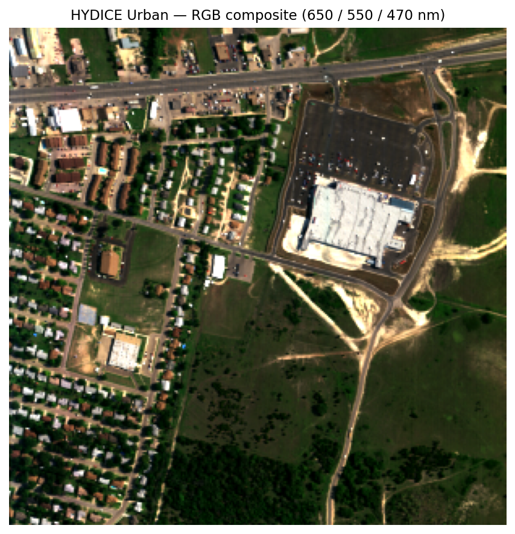
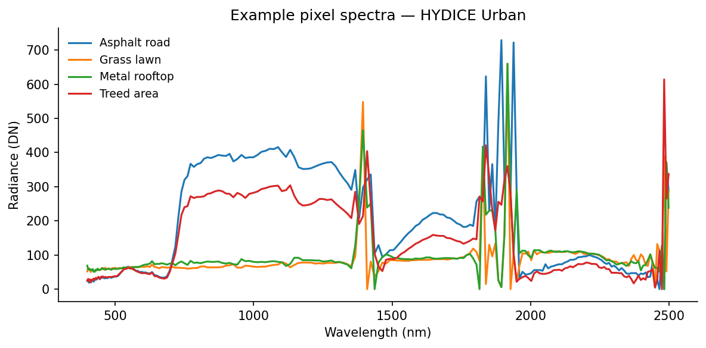
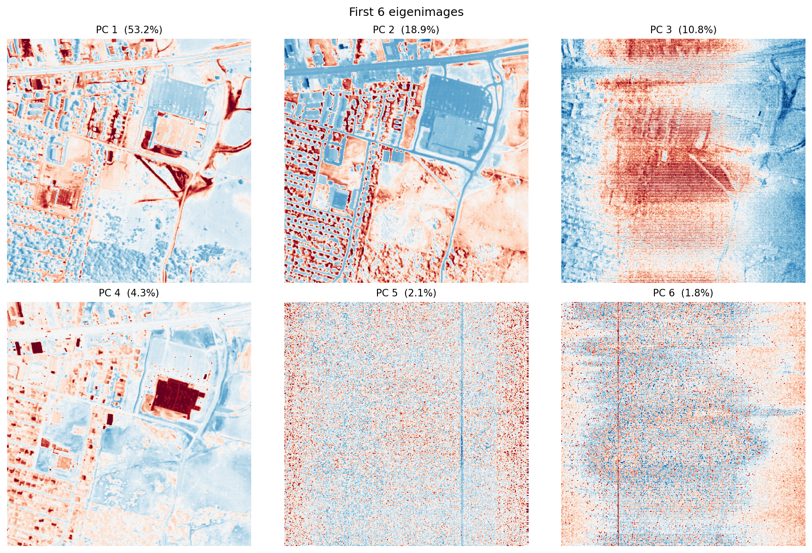
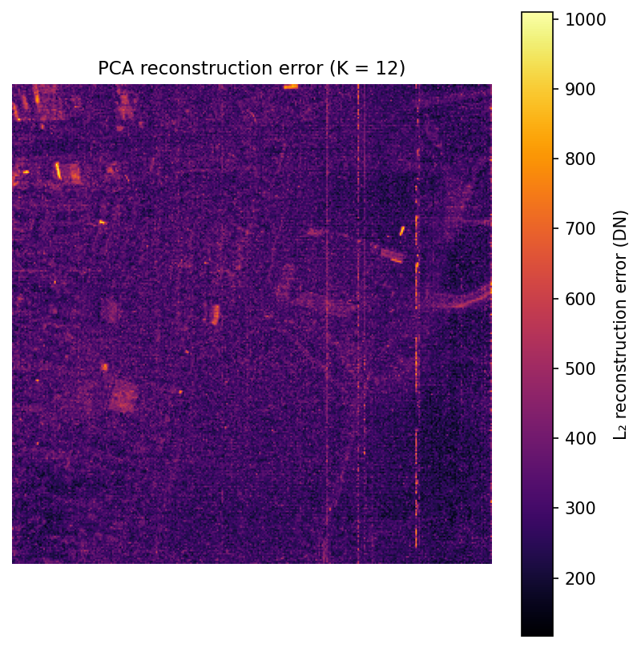
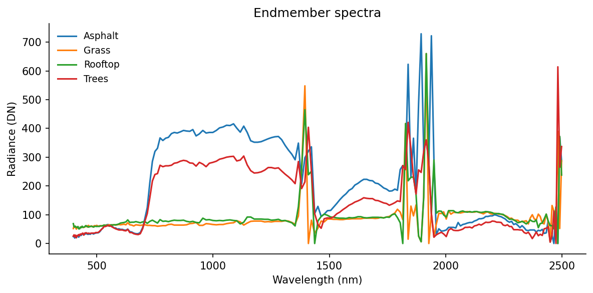
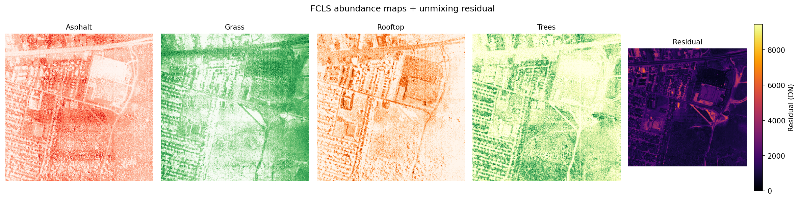
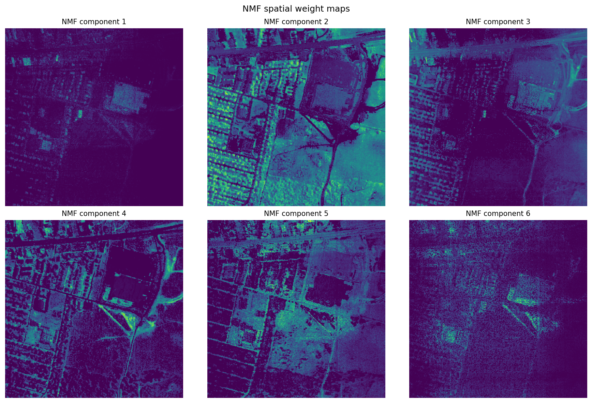

```{python}
#| label: setup
#| echo: false

import zipfile
import tempfile
import numpy as np
import matplotlib
matplotlib.use("Agg")  # non-interactive backend for headless rendering
import matplotlib.pyplot as plt
from pathlib import Path
from sklearn.decomposition import PCA, NMF
from scipy.optimize import nnls

DATA_DIR = Path("data/HYDICE_Urban/")  # expects Urban.zip here
FIG_DIR = Path("figures/")
FIG_DIR.mkdir(exist_ok=True)

plt.rcParams.update({
    "figure.dpi": 150,
    "axes.spines.top": False,
    "axes.spines.right": False,
    "font.family": "sans-serif",
})
```

## The question

This post came out of a spring-break learning project. I wanted to go from "I know remote sensing and false-color imagery" to "I can actually open a hyperspectral cube, inspect pixel spectra, and run a few standard decomposition methods." What follows is the tutorial I wish I had at the start: not a full hyperspectral textbook, but a guided walkthrough of the ideas and code I used to teach myself the basics.

If you work with remote sensing imagery, you already know the usual move: choose a few bands, stretch them well, and interpret the resulting composite. Even a false-color image, though, still compresses the scene down to a small number of broad spectral channels.

Hyperspectral imagery changes that. Instead of 3 broad RGB bands, or even a modest multispectral stack, it records hundreds of narrow, contiguous wavelength channels. In the HYDICE Urban scene used here, each pixel carries a 210-value spectrum spanning the visible through the shortwave infrared.

That full spectral curve is what makes hyperspectral analysis different from standard image interpretation. Vegetation, asphalt, bare ground, rooftops, and metal surfaces can overlap in brightness or color in a broad-band composite while still differing strongly in spectral shape. The question stops being only "what does this object look like in a display image?" and becomes "what spectral signature is present in this pixel, and what does that imply about materials?"

So the real question in this post is: **given a full spectrum at each pixel, can we separate the scene into meaningful material patterns without labels?**

Three approaches, each with a different way of framing that problem:

1.  **Principal component analysis (PCA)**: What are the dominant directions of spectral variance in the scene? PCA is the compression view. It asks how much of the 210-band signal can be summarized with a small number of orthogonal patterns.
2.  **Linear spectral unmixing**: If we already know what a few pure materials look like, what fraction of each material is present in a given pixel? This is the fraction view, closest to the classic subpixel remote-sensing problem.
3.  **Non-negative matrix factorization (NMF)**: Can we learn additive, material-like spectral patterns directly from the data, without supplying endmembers ahead of time? This is the discovery view.

::: callout-tip
**Remote-sensing intuition.** A false-color composite asks: which three bands should I display? Hyperspectral analysis asks a different question: what can I learn if I use the *entire* spectral curve at each pixel instead of just a few display bands?
:::

::: {.panel-tabset}
### PCA: Variance View

Use PCA when you want the strongest spectral contrasts in the scene, whether or not they map cleanly onto physical materials. It is especially useful for compression, QA, dimensionality reduction, and anomaly screening.

### Unmixing: Fraction View

Use linear unmixing when you already have plausible endmembers and want outputs that read like material fractions. This is the most direct fit to the remote-sensing question of mixed pixels and subpixel composition.

### NMF: Parts View

Use NMF when you want interpretable additive components but do not yet trust a fixed endmember library. It often sits between purely mathematical compression and fully supervised unmixing.
:::

## The data

We'll use **HYDICE Urban** [@erdc_hypercube], a classic hyperspectral benchmark from the U.S. Army Engineer Research and Development Center. It is a 307 x 307 pixel urban scene with 210 bands spanning roughly 400-2500 nm, at about 2 m ground sampling distance.

It is a useful teaching scene because it mixes vegetation, roads, rooftops, bare ground, and shadow in a compact area. If you already have intuition for urban false-color imagery, this dataset is a natural next step: the same scene elements are there, but now we can analyze their full spectral behavior rather than only a few displayed bands.

::: callout-note
**Getting the data.** Download the URBAN sample ZIP from the [ERDC HyperCube page](https://www.erdc.usace.army.mil/Media/Fact-Sheets/Fact-Sheet-Article-View/Article/610433/hypercube/). Leave it zipped and place it at `data/HYDICE_Urban/Urban.zip` relative to this post, the loading code extracts it to a temporary directory automatically.

To run the code cells yourself, change `eval: false` to `eval: true` in the document YAML. All figures in this post were pre-generated and committed.
:::

If you want a more widely used imaging-spectroscopy benchmark, the same ideas also apply to AVIRIS Moffett Field [@aviris_moffett], a 224-band scene over water, vegetation, and urban land near Mountain View, California. The workflow is almost the same; you mainly change the file path and, if needed, mask a few strong water-absorption bands.

### Loading the cube

This is a sensor-native style product: a binary cube plus a few small metadata files. The main data file holds the radiance values, while the wavelength file tells us which wavelength corresponds to each band. If you have worked with ENVI-style remote-sensing products before, the layout will feel familiar.

The `.wvl` file is plain text, so we read it directly from the ZIP archive with Python's `zipfile` module:

```{python}
#| label: load-data

ZIP_PATH = DATA_DIR / "Urban.zip"

# Parse wavelengths from the .wvl file (tab-separated, \r line endings, col 1 = nm)
with zipfile.ZipFile(ZIP_PATH) as zf:
    wvl_name = next(n for n in zf.namelist() if n.endswith(".wvl"))
    with zf.open(wvl_name) as f:
        lines = f.read().decode("ascii").replace("\r", "\n").splitlines()
        wavelengths = np.array([float(l.split("\t")[1]) for l in lines if l.strip()])

# The .hdr is a custom HyperCube format, not standard ENVI, so we read the binary directly.
# Header specifies: big-endian int16, BIL interleave, 307 samples x 307 lines x 210 bands.
with zipfile.ZipFile(ZIP_PATH) as zf:
    data_name = next(n for n in zf.namelist() if not n.endswith(("/", ".hdr", ".wvl")))
    with zf.open(data_name) as f:
        raw = np.frombuffer(f.read(), dtype=np.dtype(">i2"))

H, W, B = 307, 307, 210
cube = raw.reshape(H, B, W).transpose(1, 0, 2)  # BIL: lines x bands x samples -> bands x rows x cols

print(f"Cube shape:       {cube.shape}")
print(f"Wavelength range: {wavelengths[0]:.0f} - {wavelengths[-1]:.0f} nm")
print(f"Dtype: {cube.dtype}, Min: {cube.min()}, Max: {cube.max()}")
```

The cube shape `(B, H, W)` means:

-   first index = wavelength band
-   second index = row
-   third index = column

That layout is convenient because it makes both views of the data easy: one band at a time as an image, or one pixel at a time as a spectrum.

### A note on radiance vs. reflectance

This dataset stores **radiance**, which is the light measured by the sensor. It does **not** store surface reflectance.

That distinction matters. Reflectance is usually easier to interpret as a surface property, because it is closer to "what fraction of incoming light did the target reflect?" Radiance still contains the material signal, but it also includes illumination geometry and atmospheric effects.

The relationship between the two is approximately:

$$\rho \approx \frac{\pi \, L \, d^2}{E_0 \cos(\theta_{SZ})}$$

where $L$ is at-sensor radiance, $E_0$ is top-of-atmosphere solar irradiance for that band, $d$ is the Earth-Sun distance in AU, and $\theta_{SZ}$ is the solar zenith angle [@nasa_seadas]. Atmospheric-correction workflows go further than this simple relation and try to remove path radiance so the result is closer to true surface reflectance.

For this demo, radiance is fine. The decomposition math is the same either way. The main difference is interpretation: if you want to compare across dates, sensors, or spectral libraries, reflectance is the more physically stable quantity.

::: callout-important
**Interpretation boundary.** The outputs below are still useful on radiance, but they should not be read as scene-invariant material signatures. For library matching, cross-scene comparison, or retrieval tasks, surface reflectance is the safer input.
:::

### RGB composite

To make a normal-looking color image, we pick one band near red, one near green, and one near blue. Choosing them by wavelength instead of by hard-coded band number makes the code easier to reuse on other datasets:

```{python}
#| label: rgb-composite
#| code-fold: true
#| fig-show: hide

def nearest_band(wavelengths: np.ndarray, target_nm: float) -> int:
    """Return the band index closest to target_nm."""
    return int(np.argmin(np.abs(wavelengths - target_nm)))

R     = nearest_band(wavelengths, 650)  # red
G     = nearest_band(wavelengths, 550)  # green
B_idx = nearest_band(wavelengths, 470)  # blue

rgb = cube[[R, G, B_idx], :, :].astype(np.float32).transpose(1, 2, 0)
lo, hi = np.percentile(rgb, [2, 98])
rgb = np.clip((rgb - lo) / (hi - lo), 0, 1)

fig, ax = plt.subplots(figsize=(6, 6))
ax.imshow(rgb)
ax.set_title("HYDICE Urban: RGB composite (650 / 550 / 470 nm)", fontsize=11)
ax.axis("off")
plt.tight_layout()
plt.savefig(FIG_DIR / "rgb_composite.png", bbox_inches="tight")
plt.show()
```

<figure>
  
  <figcaption>RGB composite of the HYDICE Urban scene.</figcaption>
</figure>

### Pixel spectra

A pixel spectrum is the basic object in hyperspectral analysis: one pixel, plotted across wavelength. If two surfaces are made of different materials, their spectral shapes often differ even when they look similar in a composite image.

Here are four hand-picked examples from recognizable surfaces in the RGB image:

```{python}
#| label: pixel-spectra
#| code-fold: true
#| fig-show: hide

pixels = {
    "Asphalt road":  (200, 120),
    "Grass lawn":    (80,  200),
    "Metal rooftop": (150,  50),
    "Treed area":    (50,  150),
}

fig, ax = plt.subplots(figsize=(8, 4))
for label, (row, col) in pixels.items():
    spectrum = cube[:, row, col].astype(float)
    ax.plot(wavelengths, spectrum, label=label, linewidth=1.5)

ax.set_xlabel("Wavelength (nm)")
ax.set_ylabel("Radiance (DN)")
ax.set_title("Example pixel spectra - HYDICE Urban")
ax.legend(frameon=False, fontsize=9)
plt.tight_layout()
plt.savefig(FIG_DIR / "pixel_spectra.png", bbox_inches="tight")
plt.show()
```

<figure>
  
  <figcaption>Spectra from four hand-picked pixels. Even in raw radiance, each material type has a recognizably distinct shape across wavelength.</figcaption>
</figure>

Even without atmospheric correction, these curves separate cleanly. Grass shows the familiar vegetation red edge, low values in the red and a strong rise into the near-infrared. Asphalt is flatter. Rooftops are brighter and less vegetation-like. Those differences are exactly the signal the decomposition methods below try to isolate.

## From cube to matrix

All three methods below want the data in matrix form rather than cube form, so we flatten the image:

$$X \in \mathbb{R}^{N \times B}, \quad N = H \cdot W$$

Each row is one pixel spectrum. Each column is one wavelength band. We have not changed the data itself, only its shape.

```{python}
#| label: reshape

X = cube.astype(np.float64).reshape(B, H * W).T  # shape: (N, B)
N = X.shape[0]

print(f"Pixel matrix X: {X.shape}")  # (94249, 210)
```

This is more than bookkeeping. Once the data are in this form, each pixel becomes one point in a 210-dimensional spectral space, and the methods below look for structure in that cloud of points.

## PCA / SVD

### Derivation

PCA looks for a small number of directions that explain most of the variation in the data. For a remote-sensing reader, one good way to think about it is this: if you had to summarize each 210-band spectrum with just a few spectral contrasts, which contrasts would matter most?

Mathematically, PCA is SVD applied to the mean-centered data. "Mean-centered" just means we subtract the average spectrum first:

$$X_c = X - \mathbf{1}\mu^T, \quad \mu = \frac{1}{N}\sum_{n=1}^{N} x_n$$

Then apply the economy SVD:

$$X_c = U \Sigma V^T$$

The three factors have a useful remote-sensing interpretation:

-   $V \in \mathbb{R}^{B \times K}$: spectral loading vectors, or wavelength patterns that capture strong variance
-   $\Sigma \in \mathbb{R}^{K \times K}$: the strength of those patterns
-   $U \in \mathbb{R}^{N \times K}$: the per-pixel scores telling us how strongly each pixel expresses each pattern

If you reshape one score column of $U$ back into image form, you get an **eigenimage**: a map showing where that spectral pattern is strong or weak. In scikit-learn, `components_` stores the spectral loadings and `transform` returns the pixel scores [@sklearn_pca].

### Code

```{python}
#| label: pca
#| code-fold: true

K = 12  # number of components to retain

pca = PCA(n_components=K, svd_solver="randomized", random_state=42)
Z = pca.fit_transform(X)         # pixel scores, shape (N, K)
Vt = pca.components_              # spectral patterns, shape (K, B)
explained = pca.explained_variance_ratio_

# Eigenimages: reshape each score column back to spatial dimensions
eigenimages = Z.T.reshape(K, H, W)  # shape: (K, H, W)

# Rank-K reconstruction and per-pixel L2 error
X_hat = pca.inverse_transform(Z)
error_map = np.linalg.norm(X - X_hat, axis=1).reshape(H, W)
```

### Scree plot and eigenimages

```{python}
#| label: scree-eigenimages
#| code-fold: true
#| fig-show: hide

fig, ax = plt.subplots(figsize=(6, 3.5))
ax.bar(range(1, K + 1), explained * 100, color="#4878CF", width=0.7)
ax.set_xlabel("Component")
ax.set_ylabel("Variance explained (%)")
ax.set_title("Scree plot: HYDICE Urban PCA")
plt.tight_layout()
plt.savefig(FIG_DIR / "scree.png", bbox_inches="tight")
plt.show()

fig2, axes2 = plt.subplots(2, 3, figsize=(12, 8))
for i, ax in enumerate(axes2.flat):
    img = eigenimages[i]
    vabs = np.percentile(np.abs(img), 99)
    ax.imshow(img, cmap="RdBu_r", vmin=-vabs, vmax=vabs)
    ax.set_title(f"PC {i+1}  ({explained[i]*100:.1f}%)", fontsize=10)
    ax.axis("off")
plt.suptitle("First 6 eigenimages", fontsize=12)
plt.tight_layout()
plt.savefig(FIG_DIR / "eigenimages.png", bbox_inches="tight")
plt.show()
```

<figure>
  
  <figcaption>Top 6 eigenimages, rendered with a diverging colormap. PC1 captures overall scene brightness. Subsequent components capture spectral contrast between material classes.</figcaption>
</figure>

The scree plot tells us how much each component matters. The eigenimages show where each component is active in space.

Usually, the first component captures broad scene brightness. The next few components often pick up real material contrasts, especially vegetation versus built surfaces or bright rooftops versus darker pavement. Later components tend to capture finer structure and, eventually, noise.

One important point: PCA values can be positive or negative. That is fine mathematically, but awkward physically. A negative PCA score does **not** mean "negative asphalt" or "negative grass." It only means the pixel sits on one side of a mathematical axis instead of the other. That is why the next methods can be easier to interpret.

### Reconstruction error map

```{python}
#| label: error-map
#| code-fold: true
#| fig-show: hide

fig, ax = plt.subplots(figsize=(5.5, 5.5))
im = ax.imshow(error_map, cmap="inferno")
plt.colorbar(im, ax=ax, label="L2 reconstruction error (DN)")
ax.set_title(f"PCA reconstruction error (K = {K})", fontsize=11)
ax.axis("off")
plt.tight_layout()
plt.savefig(FIG_DIR / "pca_error.png", bbox_inches="tight")
plt.show()
```

<figure>
  
  <figcaption>Per-pixel reconstruction error for K=12. Bright pixels are where a 12-dimensional subspace fits poorly, typically rare materials, mixed pixels at material boundaries, or sensor noise.</figcaption>
</figure>

This map shows where a 12-component PCA model fits poorly. Bright areas are pixels whose spectra are unusual or hard to summarize with just 12 components.

In practice, those bright spots often correspond to rare materials, shadows, standing water, vehicles, or strongly mixed pixels. That makes the error map a simple but useful anomaly detector.

## Linear spectral unmixing

### The linear mixing model

Now switch from compression to mixing.

The linear mixing model says that one pixel can be approximated as a weighted sum of a few pure material spectra, called **endmembers** [@plaza_2012]. For an urban scene at 2 m resolution, that is a reasonable first model: many pixels are mixtures of vegetation, pavement, roof, and shadow rather than perfectly pure targets.

$$y_n \approx \sum_{p=1}^{P} s_{np} \, m_p = M s_n$$

In matrix form for all pixels: $Y \approx S M^T$, where $M \in \mathbb{R}^{B \times P}$ is the endmember matrix and $S \in \mathbb{R}^{N \times P}$ contains per-pixel abundance vectors.

This model is only an approximation, but it is a useful one. At 2 m resolution, many pixels cover more than one surface type, so "unmixing" means estimating the fractions of those hidden ingredients.

Two physical constraints on the abundance vector $s_n$:

-   **Abundance nonnegativity (ANC):** $s_n \geq 0$, you can't have a negative fraction of a material
-   **Abundance sum-to-one (ASC):** $\mathbf{1}^T s_n = 1$, the fractions must add up

Together, those constraints make the weights behave like fractions. The optimization problem per pixel is:

$$s_n^* = \arg\min_{s \,\in\, \Delta^{P-1}} \|y_n - Ms\|_2^2$$

Once $M$ is fixed, this is a well-behaved optimization problem with one best solution per pixel [@heinz_chang_2001].

### Endmember selection

Before we can solve for fractions, we need example spectra for the pure materials.

In a full remote-sensing workflow, you might estimate those endmembers automatically with algorithms such as N-FINDR or vertex component analysis. For a tutorial, hand-picking a few obvious pixels is easier to follow: choose one pixel that looks like road, one that looks like grass, one rooftop, and one tree patch.

```{python}
#| label: endmember-selection
#| fig-show: hide

# Hand-picked pixel coordinates (row, col)
endmember_pixels = {
    "Asphalt": (200, 120),
    "Grass":   (80,  200),
    "Rooftop": (150,  50),
    "Trees":   (50,  150),
}

P = len(endmember_pixels)
M = np.zeros((B, P))
for i, (name, (r, c)) in enumerate(endmember_pixels.items()):
    M[:, i] = cube[:, r, c].astype(float)

fig, ax = plt.subplots(figsize=(8, 4))
for i, name in enumerate(endmember_pixels):
    ax.plot(wavelengths, M[:, i], label=name, linewidth=1.5)
ax.set_xlabel("Wavelength (nm)")
ax.set_ylabel("Radiance (DN)")
ax.set_title("Endmember spectra")
ax.legend(frameon=False, fontsize=9)
plt.tight_layout()
plt.savefig(FIG_DIR / "endmembers.png", bbox_inches="tight")
plt.show()
```

<figure>
  
  <figcaption>Selected endmember spectra. Each represents a pure material type: the vegetation signatures (Grass, Trees) show the characteristic red-edge feature near 700 nm.</figcaption>
</figure>

### Solving for abundances: FCLS

Now we solve for the fractions in each pixel.

We use fully constrained least squares (FCLS). The goal is to estimate the nonnegative abundance vector that best reconstructs the observed spectrum while also forcing the abundances to sum to one. The implementation below uses a common NNLS-based trick from @heinz_chang_2001.

```{python}
#| label: fcls
#| code-fold: true

def fcls(M: np.ndarray, y: np.ndarray, delta: float = 100.0) -> np.ndarray:
    """Fully constrained least squares (ANC + ASC).

    Embeds the sum-to-one constraint by augmenting [M; delta*1^T] @ s = [y; delta],
    solves via NNLS (enforcing ANC), then normalizes to ensure sum(s) = 1.

    Parameters
    ----------
    M : (B, P) endmember matrix
    y : (B,) pixel spectrum
    delta : scaling factor for the ASC constraint row (larger = stricter enforcement)
    """
    M_aug = np.vstack([M, delta * np.ones((1, M.shape[1]))])
    y_aug = np.append(y, delta)
    s, _ = nnls(M_aug, y_aug)
    total = s.sum()
    if total > 1e-10:
        s /= total
    return s


# Solve per pixel
S = np.zeros((N, P))
for n in range(N):
    S[n] = fcls(M, X[n])

# Reshape abundance maps to (P, H, W)
abundance_maps = S.T.reshape(P, H, W)

# Per-pixel residual: ||y_n - M s_n||
residual = np.linalg.norm(X - S @ M.T, axis=1).reshape(H, W)
```

::: callout-note
The loop above is easy to read, but not especially fast. For HYDICE at 307 x 307 pixels it is still manageable. For much larger scenes, you would usually parallelize it or move to a more specialized solver.
:::

```{python}
#| label: abundance-maps
#| code-fold: true
#| fig-show: hide

names = list(endmember_pixels.keys())
cmaps = ["Reds", "Greens", "Oranges", "YlGn"]

fig, axes = plt.subplots(1, P + 1, figsize=(16, 4))
for i, (name, cmap) in enumerate(zip(names, cmaps)):
    axes[i].imshow(abundance_maps[i], cmap=cmap, vmin=0, vmax=1)
    axes[i].set_title(name, fontsize=10)
    axes[i].axis("off")

im = axes[-1].imshow(residual, cmap="inferno")
plt.colorbar(im, ax=axes[-1], label="Residual (DN)")
axes[-1].set_title("Residual", fontsize=10)
axes[-1].axis("off")

plt.suptitle("FCLS abundance maps + unmixing residual", fontsize=12)
plt.tight_layout()
plt.savefig(FIG_DIR / "abundance_maps.png", bbox_inches="tight")
plt.show()
```

<figure>
  
  <figcaption>Abundance maps for each endmember plus the per-pixel unmixing residual. Warmer colors indicate higher fractional abundance of that material. High residual highlights pixels the four-endmember model can't explain.</figcaption>
</figure>

The residual map tells you where the chosen endmembers are not enough. Bright residuals often mean "there is something here that the current material library cannot explain well," such as shadow, water, or bare soil.

Compared with PCA, these abundance maps are easier to explain. Each one answers a direct question like: "Where in the scene does this material seem common?" The trade-off is that the answer depends heavily on the endmembers you chose.

## NMF

NMF asks a similar question to unmixing, but with less supervision: can we factor $X$ into two nonnegative matrices without telling the model in advance what the materials are?

$$X \approx WH, \quad W \in \mathbb{R}_{\geq 0}^{N \times K}, \; H \in \mathbb{R}_{\geq 0}^{K \times B}$$

The objective (squared Frobenius norm) is:

$$\min_{W,\, H\, \geq\, 0} \;\frac{1}{2}\|X - WH\|_F^2$$

Rows of $H$ are learned spectral patterns. Columns of $W$ tell us how much of each pattern appears in each pixel. Unlike PCA, NMF does not allow negative values, and unlike unmixing, it does not require the weights to sum to one.

The main idea from @lee_seung_1999 is simple: nonnegative parts can only add, not cancel each other out. That often makes the learned components easier to read. PCA can produce positive-negative contrast patterns. NMF tends to produce parts that look more like material pieces of the scene.

The downside is that NMF is not unique. Different initial guesses can lead to somewhat different answers. Using `nndsvda` gives the algorithm a stable starting point and usually leads to cleaner results [@sklearn_nmf].

```{python}
#| label: nmf
#| code-fold: true
#| fig-show: hide

K_nmf = 6

nmf = NMF(
    n_components=K_nmf,
    init="nndsvda",           # deterministic SVD-based initialization
    solver="mu",              # multiplicative updates (Lee & Seung)
    beta_loss="frobenius",
    random_state=42,
    max_iter=500,
)

W_nmf = nmf.fit_transform(X)    # pixel weights, shape (N, K_nmf)
H_nmf = nmf.components_          # component spectra, shape (K_nmf, B)
nmf_maps = W_nmf.T.reshape(K_nmf, H, W)

fig, ax = plt.subplots(figsize=(9, 4))
for k in range(K_nmf):
    ax.plot(wavelengths, H_nmf[k], label=f"Component {k+1}", linewidth=1.5)
ax.set_xlabel("Wavelength (nm)")
ax.set_ylabel("Learned basis value")
ax.set_title("NMF component spectra")
ax.legend(frameon=False, fontsize=9, ncol=2)
plt.tight_layout()
plt.savefig(FIG_DIR / "nmf_spectra.png", bbox_inches="tight")
plt.show()

fig2, axes2 = plt.subplots(2, 3, figsize=(12, 8))
for k, ax in enumerate(axes2.flat):
    ax.imshow(nmf_maps[k], cmap="viridis")
    ax.set_title(f"NMF component {k+1}", fontsize=10)
    ax.axis("off")
plt.suptitle("NMF spatial weight maps", fontsize=12)
plt.tight_layout()
plt.savefig(FIG_DIR / "nmf_maps.png", bbox_inches="tight")
plt.show()
```

<figure>
  
  <figcaption>NMF component spectra (top) and spatial weight maps (bottom). Unlike PCA eigenvectors, NMF spectra are strictly nonnegative, they can be visually compared to known material spectra in a spectral library.</figcaption>
</figure>

Where PCA gives contrast axes, NMF gives positive-only parts. Those parts are not guaranteed to be true materials, but they often look material-like enough to be useful. In practice, NMF is good for exploration when you do not yet know the right endmembers, while linear unmixing is better when you do know them and want physically interpretable fractions.

### Exporting products

All three methods produce spatial outputs worth saving. HYDICE Urban does not include geospatial metadata such as a CRS or geotransform, so `.npy` files are a simple and honest export format here. For georeferenced datasets, you would usually write GeoTIFFs instead:

```{python}
#| label: export
#| code-fold: true

derived = Path("data/derived")
derived.mkdir(exist_ok=True)

# Save as .npy, HYDICE Urban has no CRS or geotransform, so plain arrays are more honest
# than an empty GeoTIFF. Each array is (layers, H, W), float32.
np.save(derived / "eigenimages.npy", eigenimages.astype(np.float32))
np.save(derived / "abundances.npy", abundance_maps.astype(np.float32))
np.save(derived / "nmf_maps.npy", nmf_maps.astype(np.float32))
np.save(derived / "wavelengths.npy", wavelengths)

print("Saved:", [str(p) for p in sorted(derived.glob("*.npy"))])
```

## Where this fits in a real pipeline

The analysis above sits in the middle of a larger hyperspectral workflow. In a production setting, you would usually do several preprocessing steps before running PCA, unmixing, or NMF:

| Demo step | Production analogue | Why it matters |
|------------------------|------------------------|------------------------|
| Load ENVI cube, parse wavelengths | Data ingest, metadata validation | Wrong wavelength labels corrupt every downstream result |
| Radiance discussion | Radiometric calibration, unit consistency | Decompositions are only cross-scene comparable when inputs share a radiometric convention |
| Spatial subset / windowed read | Tiling, chunked processing, distributed compute | Windowed I/O and chunk sizing are core scaling tactics for cubes that exceed RAM |
| PCA eigenimages + error map | QA, compression, anomaly flagging | Error maps surface model mismatch and flag rare materials |
| FCLS abundance maps | Subpixel material estimation | ANC + ASC encode physical meaning; residuals guide endmember library iteration |
| NMF component maps | Blind source separation, interpretable bases | Nonnegativity improves spectral factor interpretability without manual endmember selection |
| Export derived products | `.npy` here (no geospatial metadata); GeoTIFF/COG for georeferenced datasets | Product generation, GIS integration | Georeferenced outputs connect the analysis to downstream spatial workflows |

Real pipelines usually include radiometric calibration, geometric correction, and atmospheric correction before this stage [@plaza_2012]. This post skips those steps because the goal is to teach the decomposition ideas clearly, not to build a full operational workflow.

## Reproducibility

-   Random seeds: `random_state=42` for PCA and NMF ensures deterministic results across runs.
-   All figures use the full 307 x 307 scene with no extra spatial cropping, so re-renders should match exactly.
-   Freeze your environment: `conda env export > environment.yml` or `uv pip freeze > requirements.txt`.
-   The dataset is freely available from ERDC [@erdc_hypercube]; record the access date and use the provided handle as a citation.

## References

::: {#refs}
:::
