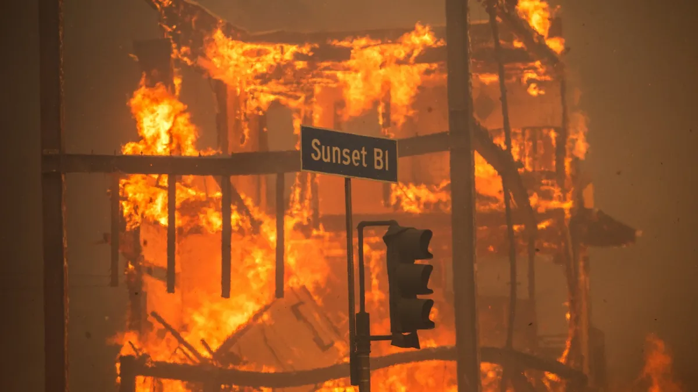
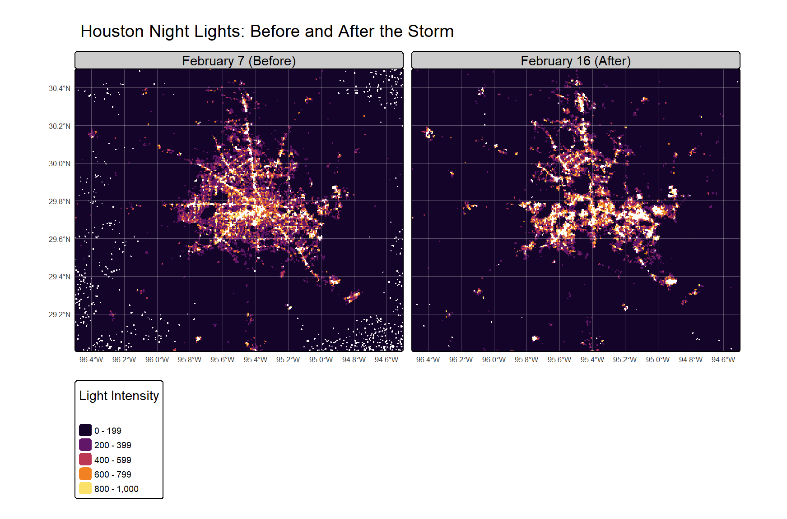
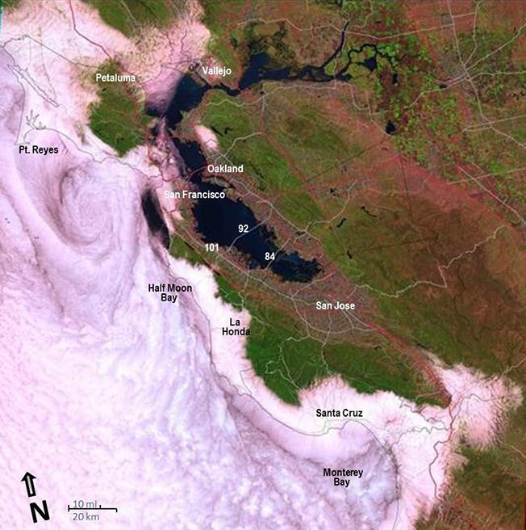
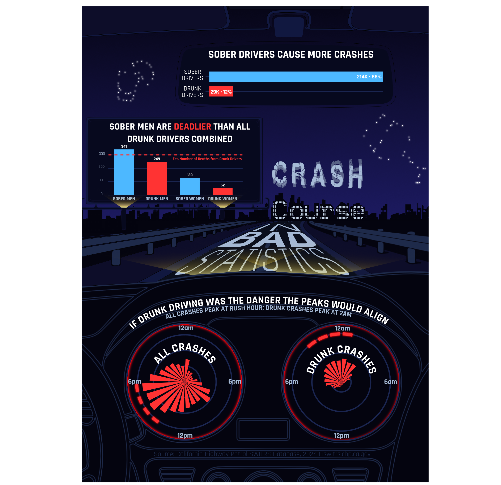
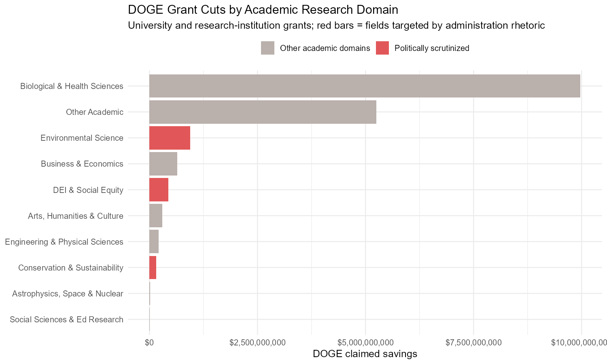
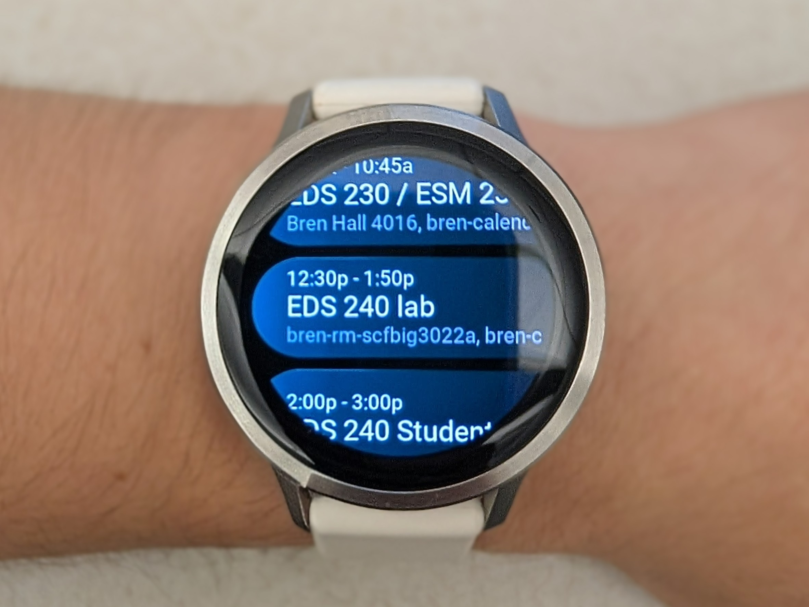

<!-- NOTE: keep this file in Source mode in VS Code (not Visual) -->
<!-- Install closeread first: quarto add qmd-lab/closeread       -->

```{=html}
<style>
#title-block-header { display: none !important; }
#quarto-content main#quarto-document-content { padding-top: 0; margin-top: 0; }

.cr-section.cr-column-screen { background-color: #f8f6f3; }
.cr-section.cr-column-screen.overlay-center,
.cr-section.cr-column-screen.overlay-left,
.cr-section.cr-column-screen.overlay-right {
  background:
    radial-gradient(circle at 18% 18%, rgba(42, 157, 143, 0.28) 0%, rgba(42, 157, 143, 0) 40%),
    radial-gradient(circle at 82% 12%, rgba(106, 76, 147, 0.3) 0%, rgba(106, 76, 147, 0) 42%),
    linear-gradient(165deg, #1d3557 0%, #2f4f79 40%, #4f5d8a 72%, #6a4c93 100%);
}

.sticky-col-stack {
  background: transparent !important;
  border: none !important;
  box-shadow: none !important;
  padding: 0 !important;
  border-radius: 0 !important;
}

.sticky-card {
  background: linear-gradient(180deg, #fffefb 0%, #f3f7ff 100%) !important;
  border-radius: 12px !important;
  box-shadow: 0 8px 28px rgba(10, 16, 31, 0.1), 0 0 0 1px rgba(112, 146, 194, 0.14) !important;
  border: 1px solid rgba(112, 146, 194, 0.25) !important;
}

.cr-section.hero-scroll-x .narrative-col .trigger { padding: 0 !important; }
.cr-section.hero-scroll-x .narrative-col .trigger .narrative { display: none !important; }
.cr-section.hero-scroll-x .sticky-col .sticky-col-stack .sticky { opacity: 0 !important; transition: opacity 120ms ease !important; }
.cr-section.hero-scroll-x .sticky-col .sticky-col-stack .sticky.cr-active { opacity: 1 !important; }

.hero-card {
  width: 100%;
  height: 100%;
  min-height: 100dvh;
  display: flex;
  flex-direction: column;
  align-items: center;
  justify-content: center;
  text-align: center;
  padding: 80px 60px;
  color: #fff;
  background: linear-gradient(160deg, #2a9d8f 0%, #6a4c93 55%, #e76f51 100%);
}

.cr-section.hero-scroll-x .hero-card { background: transparent; }
.hero-stage-home .giant-title { font-family: "Libre Baskerville", serif; font-size: clamp(3rem, 7vw, 5rem); font-weight: 700; line-height: 1.08; }
.hero-stage-home .subtitle-text { font-size: clamp(1.2rem, 2.8vw, 2rem); font-weight: 400; margin-top: 1rem; letter-spacing: 0.01em; }
.hero-stage-home .meta-text { font-size: 0.95rem; opacity: 0.78; margin-top: 1.3rem; letter-spacing: 0.03em; }
.hero-crawl-stage { justify-content: center; padding-top: clamp(8vh, 12vh, 16vh); padding-bottom: clamp(10vh, 16vh, 20vh); }
.hero-crawl-text {
  max-width: min(900px, 90vw);
  margin: 0 auto;
  font-family: "Space Grotesk", sans-serif;
  font-size: clamp(1.2rem, 2.4vw, 1.9rem);
  font-weight: 500;
  line-height: 1.6;
  letter-spacing: 0.01em;
  text-transform: none;
  color: #f5f8ff;
  text-shadow: 0 2px 12px rgba(16, 28, 54, 0.32);
}

.chapter-label.teal-text { color: #2a9d8f !important; text-shadow: none; }
.chapter-card .giant-title { color: #fff; letter-spacing: 0.01em; text-transform: none; text-shadow: 0 8px 24px rgba(14, 20, 34, 0.28); }
.chapter-card .subtitle-text { color: #e7efff; letter-spacing: 0.04em; text-transform: none; }

.cr-section.overlay-left .narrative-col .narrative,
.cr-section.overlay-right .narrative-col .narrative {
  background-color: rgba(10, 22, 44, 0.56);
  color: #f6f8ff;
  border-left: 3px solid rgba(78, 205, 196, 0.85);
  border-radius: 10px;
}
.cr-section.overlay-left .narrative-col .narrative p,
.cr-section.overlay-right .narrative-col .narrative p { color: #f6f8ff; }

/* Banner-style center overlays: text only, no floating box */
.cr-section.overlay-center .narrative-col .narrative {
  display: none !important;
}

.sticky-card img.course-visual {
  width: 100%;
  max-height: 340px;
  object-fit: contain;
  border-radius: 10px;
  border: 1px solid rgba(112, 146, 194, 0.25);
  background: #ffffff;
  padding: 4px;
  margin-bottom: 0.8rem;
}
</style>
```


<!-- =============================== -->
<!-- HERO                            -->
<!-- =============================== -->

::::{.cr-section .hero-scroll-x cr-layout="overlay-center"}

:::{focus-on="cr-hero-home" style="height: 110vh;"}
:::

:::{focus-on="cr-hero-home" style="height: 70vh;"}
:::

:::{focus-on="cr-hero-crawl-1" style="height: 110vh;"}
:::

:::{focus-on="cr-hero-crawl-2" style="height: 110vh;"}
:::

:::{#cr-hero-home .hero-card .hero-stage-home}
[A Year in Data]{.giant-title .white-text}

[My Story Through MEDS]{.subtitle-text .white-text}

[Emily Miller - Bren School, UCSB - 2025 - 2026]{.meta-text .white-text}

:::

:::{#cr-hero-crawl-1 .hero-card .hero-crawl-stage}
:::{.hero-crawl-text}
I came to MEDS with a mathematics background and limited coding experience. By the end of the program, I was regularly moving between statistics, geospatial analysis, reproducible workflows, and communication.
:::
:::

:::{#cr-hero-crawl-2 .hero-card .hero-crawl-stage}
:::{.hero-crawl-text}
This post is organized chronologically: Summer Session B foundations, Fall data and geospatial work, Winter modeling and policy evaluation, and Spring databases, machine learning, and capstone delivery.
:::
:::

::::


<!-- =============================== -->
<!-- TIMELINE OVERVIEW               -->
<!-- =============================== -->

::::{.cr-section cr-layout="sidebar-right"}

:::{focus-on="cr-program-timeline" style="height: 32vh;"}
:::

:::{focus-on="cr-program-timeline"}
:::{.body-text-m style="margin-left: 40px;"}
This timeline follows the official MEDS sequence you shared:
Summer Session B (EDS 212, 214, 217, 221), Fall (EDS 220, 222, 223, 242), Winter (EDS 230, 240, 241 plus capstone 411A), and Spring (EDS 213, 232 plus capstone 411B).
:::
:::

:::{focus-on="cr-program-timeline"}
:::{.body-text-m style="margin-left: 40px;"}
I also include short-format electives from the same year - EDS 231 (text and sentiment analysis) and EDS 296-1S (Intro to Shiny) - because both influenced how I approached my capstone communication workflow.
:::
:::

:::{#cr-program-timeline .sticky-card style="padding: 40px; margin-top: 40px;"}
[**Program Timeline (58 units)**]{.teal-text .body-text-m}

**Summer Session B 2025 (12 units)**

EDS 212, EDS 214, EDS 217, EDS 221

**Fall 2025 (14 units)**

EDS 220, EDS 222, EDS 223, EDS 242

**Winter 2026 (16 units)**

EDS 230, EDS 240, EDS 241, EDS 411A

**Spring 2026 (16 units)**

EDS 213, EDS 232, EDS 411B, EDS 231, EDS 296-1S
:::

::::


<!-- =============================== -->
<!-- PROLOGUE: BEFORE MEDS           -->
<!-- =============================== -->

::::{.cr-section cr-layout="sidebar-right"}

:::{focus-on="cr-before" style="height: 30vh;"}
:::

:::{#cr-before .body-text-xl .dark-text style="padding: 50px 40px; margin-top: 60px;"}
[Starting Point]{.chapter-label .teal-text}

**Before MEDS**
:::

:::{focus-on="cr-before"}
:::{.body-text-m style="margin-left: 40px;"}
My undergraduate degree is in mathematics. Clean proofs and elegant structures felt like navigation charts before takeoff. I loved it. I still do. But by senior year, I kept asking the same question: *what is all of this for?*
:::
:::

:::{focus-on="cr-before"}
:::{.body-text-m style="margin-left: 40px;"}
Environmental data science felt like an answer. A way to bring rigor to the questions that kept me up at night: how do we manage water in a warming world? Who gets left out when infrastructure fails? What can a satellite see that a field researcher can't?
:::
:::

:::{focus-on="cr-before"}
:::{.body-text-m style="margin-left: 40px;"}
I arrived at Bren in the summer of 2025 with strong calculus, shaky programming instincts, and a lot of excitement. What follows is a chronological record of how the year unfolded.
:::
:::

::::


<!-- =============================== -->
<!-- CHAPTER 1: BOOT CAMP BLUR       -->
<!-- =============================== -->

::::{.cr-section cr-layout="sidebar-right"}

:::{focus-on="cr-bootcamp-title" style="height: 24vh;"}
:::

:::{#cr-bootcamp-title .body-text-xl .dark-text style="padding: 50px 40px; margin-top: 60px;"}
[Summer Session B 2025]{.chapter-label .teal-text}

**Week 1 Boot Camp: A Productive Blur**
:::

::::


::::{.cr-section cr-layout="sidebar-right"}

:::{focus-on="cr-bootcamp" style="height: 58vh;"}
:::{.body-text-m style="margin-left: 40px;"}
That first week was a blur by design. We moved fast through math refreshers, GitHub workflow, Python and R foundations, package setup, reproducibility habits, and data management basics.
:::
:::

:::{focus-on="cr-bootcamp" style="height: 58vh;"}
:::{.body-text-m style="margin-left: 40px;"}
For me, it was mostly dusting off the shelves and prepping for the real work: getting fluent enough with tools that later quarters could focus on questions, not setup friction.
:::
:::

:::{#cr-bootcamp .sticky-card style="padding: 40px; margin-top: 40px;"}
[**Boot Camp in One Snapshot**]{.teal-text .body-text-m}

**Math + Scientific Thinking (EDS 212)**  
algebra, calculus, linear algebra, and logic for environmental analysis

**Reproducible Workflows (EDS 214)**  
scripts, modular projects, version control, and collaboration habits

**Programming Foundations (EDS 217 + EDS 221)**  
Python, R, packages, debugging, and GitHub-based teamwork

**Data Management Mindset**  
documentation, naming conventions, and reusable project structure

[It was less "look what I built" and more "now I am ready to build."]{.gray-text .body-text-s}
:::

::::


<!-- =============================== -->
<!-- CHAPTER 3: EDS-222              -->
<!-- =============================== -->

::::{.cr-section cr-layout="sidebar-left"}

:::{focus-on="cr-ch3-title" style="height: 25vh;"}
:::

:::{#cr-ch3-title .body-text-xl .dark-text style="padding: 50px 40px; margin-top: 60px; text-align: right;"}
[Fall Quarter 2025]{.chapter-label .teal-text}

**EDS 222: Statistics for Environmental Data Science**
:::

::::


::::{.cr-section cr-layout="sidebar-left"}

:::{focus-on="cr-eds222-dag" style="height: 62vh;"}
:::{.body-text-m style="margin-right: 40px;"}
[EDS 222: Statistics for Environmental Data Science]{.teal-text .body-text-s}

EDS 222 was where statistics became practical instead of abstract. We moved from formulas to real inference decisions: study design, model assumptions, uncertainty, and how to defend conclusions with data.
:::
:::

:::{focus-on="cr-eds222-dist" style="height: 62vh;"}
:::{.body-text-m style="margin-right: 40px;"}
The final project used Danish roadkill data to separate two questions: where collisions happen at all, and where they become frequent. That framing changed how I think about environmental pattern analysis.
:::
:::

:::{#cr-eds222-dag .sticky-card style="padding: 36px; margin-top: 40px;"}
{.course-visual}

[**Figure 1: Causal framing**]{.teal-text .body-text-s}  
explicitly map assumptions before modeling, so interpretation stays tied to mechanism.
:::

:::{#cr-eds222-dist .sticky-card style="padding: 36px; margin-top: 40px;"}
{.course-visual}

[**Figure 2: Predictor structure**]{.teal-text .body-text-s}  
distribution checks guide model choice and make edge cases visible before inference.

[**Big Idea**]{.teal-text .body-text-s}
statistics is a framework for uncertainty-aware decisions, not just a menu of tests.

[Read the EDS 222 final post](../eds222-final/){.body-text-s}
:::

::::


<!-- =============================== -->
<!-- TRANSITION: LOOKING UP          -->
<!-- =============================== -->

::::{.cr-section cr-layout="overlay-center"}

:::{#cr-looking-up .chapter-card}
[Fall 2025]{style="font-size: 1rem; letter-spacing: 0.08em; text-transform: uppercase; opacity: 0.7; margin-bottom: 1rem; display: block;"}
[Datasets, Space, and Ethics]{.giant-title .white-text}
[EDS 220, EDS 223, and EDS 242]{.subtitle-text .white-text style="opacity: 0.75;"}
:::

:::{focus-on="cr-looking-up" style="height: 82vh;"}
:::{.body-text-m}
Fall course work was highly integrated. EDS 220 emphasized environmental data formats, cloud repositories, and Python analysis workflows; EDS 223 focused on spatial data models and remote sensing in R; EDS 242 pushed us to evaluate bias, representation, and ethics in every stage of an analysis.
:::
:::

::::


<!-- =============================== -->
<!-- CHAPTER 4: EDS-220              -->
<!-- =============================== -->

::::{.cr-section cr-layout="sidebar-right"}

:::{focus-on="cr-ch4-title" style="height: 25vh;"}
:::

:::{#cr-ch4-title .body-text-xl .dark-text style="padding: 50px 40px; margin-top: 60px;"}
[Fall Quarter 2025]{.chapter-label .teal-text}

**EDS 220: Working with Environmental Datasets**
:::

::::


::::{.cr-section cr-layout="sidebar-right"}

:::{focus-on="cr-eds220-card" style="height: 62vh;"}
:::{.body-text-m style="margin-left: 40px;"}
[EDS 220: Working with Environmental Datasets]{.teal-text .body-text-s}

EDS 220 was the first class where data access became a full workflow: finding trustworthy sources, handling spatial formats, and documenting assumptions before analysis even starts.
:::
:::

:::{focus-on="cr-eds220-card" style="height: 62vh;"}
:::{.body-text-m style="margin-left: 40px;"}
My final paired wildfire remote sensing with demographic context in Los Angeles. The big shift was learning to treat technical results and equity context as one analysis, not two separate products.
:::
:::

:::{#cr-eds220-card .sticky-card style="padding: 36px; margin-top: 40px;"}
{.course-visual}

[**Big Idea**]{.teal-text .body-text-s}  
environmental datasets are powerful only when data quality, provenance, and social context are handled together.

[Read the EDS 220 final post](../eds220-final/){.body-text-s}
:::

::::


<!-- =============================== -->
<!-- CHAPTER 5: EDS-223              -->
<!-- =============================== -->

::::{.cr-section cr-layout="sidebar-left"}

:::{focus-on="cr-ch5-title" style="height: 25vh;"}
:::

:::{#cr-ch5-title .body-text-xl .dark-text style="padding: 50px 40px; margin-top: 60px; text-align: right;"}
[Fall Quarter 2025]{.chapter-label .teal-text}

**EDS 223 + EDS 242: Geospatial Analysis and Ethics**
:::

::::


::::{.cr-section cr-layout="sidebar-left"}

:::{focus-on="cr-eds223-242" style="height: 66vh;"}
:::{.body-text-m style="margin-right: 40px;"}
[EDS 223: Geospatial Analysis and Remote Sensing]{.teal-text .body-text-s}

EDS 223 was where geospatial workflow finally clicked for me: raster plus vector reasoning, spatial joins, and remote sensing as evidence for policy-relevant questions.
:::
:::

:::{focus-on="cr-eds223-242" style="height: 66vh;"}
:::{.body-text-m style="margin-right: 40px;"}
[EDS 242: Ethics and Bias in Environmental Data Science]{.teal-text .body-text-s}

Running EDS 242 at the same time made the framing explicit: methods are never neutral, and model choices distribute risk and visibility in the real world.
:::
:::

:::{#cr-eds223-242 .sticky-card style="padding: 36px; margin-top: 40px;"}
{.course-visual}

[**EDS 223 Big Idea**]{.teal-text .body-text-s}  
geospatial methods connect physical signals (night lights, fire extent, land cover) to community-level outcomes.

{.course-visual}

[**EDS 242 Big Idea**]{.teal-text .body-text-s}  
ethical blind spots in data and modeling can become planning failures with real human costs.

[Read the EDS 223 final post](../eds223-final/)  
[Read the EDS 242 final post](../eds242-final/)
:::

::::


<!-- =============================== -->
<!-- CHAPTER 6: EDS-240              -->
<!-- =============================== -->

::::{.cr-section cr-layout="sidebar-right"}

:::{focus-on="cr-ch6-title" style="height: 25vh;"}
:::

:::{#cr-ch6-title .body-text-xl .dark-text style="padding: 50px 40px; margin-top: 60px;"}
[Winter Quarter 2026]{.chapter-label .teal-text}

**EDS 240: Data Visualization and Communication**
:::

::::


::::{.cr-section cr-layout="sidebar-right"}

:::{focus-on="cr-eds240-card" style="height: 62vh;"}
:::{.body-text-m style="margin-left: 40px;"}
[EDS 240: Data Visualization and Communication]{.teal-text .body-text-s}

EDS 240 pushed me to treat visualization as argument design, not decoration. Every chart decision either clarifies a claim or muddies it.
:::
:::

:::{focus-on="cr-eds240-card" style="height: 62vh;"}
:::{.body-text-m style="margin-left: 40px;"}
My final explored how the same crash dataset can tell very different stories depending on framing. That project permanently changed how I read charts in policy and media contexts.
:::
:::

:::{#cr-eds240-card .sticky-card style="padding: 36px; margin-top: 40px;"}
{.course-visual}

[**Big Idea**]{.teal-text .body-text-s}  
visualization literacy is critical: design choices can reveal insight or manufacture narrative.

[Read the EDS 240 final post](../eds240-final/){.body-text-s}
:::

::::


<!-- =============================== -->
<!-- CHAPTER 7: EDS-241              -->
<!-- =============================== -->

::::{.cr-section cr-layout="sidebar-right"}

:::{focus-on="cr-ch7-title" style="height: 25vh;"}
:::

:::{#cr-ch7-title .body-text-xl .dark-text style="padding: 50px 40px; margin-top: 60px;"}
[Winter Quarter 2026]{.chapter-label .teal-text}

**EDS 241 + EDS 230: Causal Inference and Modeling**
:::

::::


::::{.cr-section cr-layout="sidebar-right"}

:::{focus-on="cr-eds241-230" style="height: 66vh;"}
:::{.body-text-m style="margin-left: 40px;"}
[EDS 241: Policy Evaluation and Causal Inference]{.teal-text .body-text-s}

EDS 241 turned policy questions into identification strategy questions. We used difference-in-differences and related designs to estimate causal effects instead of just reporting associations.
:::
:::

:::{focus-on="cr-eds241-230" style="height: 66vh;"}
:::{.body-text-m style="margin-left: 40px;"}
EDS 230 stayed in winter and complemented this perfectly: conceptual and dynamic modeling, sensitivity analysis, calibration, and scenario design. EDS 241 asked "what changed because of policy?" while EDS 230 asked "how does the system behave over time?"
:::
:::

:::{#cr-eds241-230 .sticky-card style="padding: 36px; margin-top: 40px;"}
{.course-visual}

[**EDS 241 Big Idea**]{.teal-text .body-text-s}  
credible policy claims depend on research design, not just model output.

[**EDS 230 Big Idea**]{.teal-text .body-text-s}  
mechanistic models and sensitivity analysis help test system behavior under realistic scenarios.

[Read the EDS 241 final post](../eds241-final/){.body-text-s}
:::

::::


<!-- =============================== -->
<!-- TRANSITION: THE LAB             -->
<!-- =============================== -->

::::{.cr-section cr-layout="overlay-center"}

:::{#cr-lab-transition .chapter-card}
[Research in Parallel]{.giant-title .white-text}
[coursework plus lab application]{.subtitle-text .white-text style="opacity: 0.75;"}
:::

:::{focus-on="cr-lab-transition" style="height: 82vh;"}
:::{.body-text-m}
Coursework gives you tools. Research teaches you the tools are never quite enough, and figuring out what to do when they fall short is where real science happens.
:::
:::

::::


<!-- =============================== -->
<!-- CHAPTER 8: WAVES LAB            -->
<!-- =============================== -->

::::{.cr-section cr-layout="sidebar-right"}

:::{focus-on="cr-ch8-title" style="height: 25vh;"}
:::

:::{#cr-ch8-title .body-text-xl .dark-text style="padding: 50px 40px; margin-top: 60px;"}
[Ongoing Research]{.chapter-label .teal-text}

**WaVeS Lab: Remote Sensing and Water**
:::

::::


::::{.cr-section cr-layout="sidebar-right"}

:::{focus-on="cr-research-card"}
:::{.body-text-m style="margin-left: 40px;"}
[WaVeS Lab - Water and Vegetation Remote Sensing]{.teal-text .body-text-s}

My research sits at the intersection of remote sensing and water resource management. Through the WaVeS Lab, I have been mapping center pivot irrigation systems in Sub-Saharan Africa using satellite imagery to understand how agricultural water use is changing across a continent where freshwater access is increasingly precarious.
:::
:::

:::{focus-on="cr-research-card"}
:::{.body-text-m style="margin-left: 40px;"}
Center pivot irrigation creates distinctive circular patterns visible from orbit. These circles represent both productivity and extraction; each one is a claim on an aquifer or a river. Mapping them at scale is a prerequisite for understanding where water stress is building.
:::
:::

:::{focus-on="cr-research-card"}
:::{.body-text-m style="margin-left: 40px;"}
In December 2024, I presented this work at the AGU Fall Meeting, one of the largest Earth science conferences in the world. Both it and the Mantell Symposium presentation at UCSB taught me that explaining methods to a room of skeptical scientists is its own form of rigor.
:::
:::

:::{focus-on="cr-research-card"}
:::{.body-text-m style="margin-left: 40px;"}
The coursework in EDS 220 and 223 prepared me for this research more than I expected. The Python and R skills, the STAC workflows, the understanding of spectral indices - all of it showed up directly in my research pipeline.
:::
:::

:::{#cr-research-card style="padding: 40px; margin-top: 40px; border-left: 5px solid #2A9D8F; background: rgba(42,157,143,0.04);"}
[**WaVeS Lab Research**]{.teal-text .body-text-m}

<br>

**Region:** Sub-Saharan Africa

**Method:** Multi-temporal Sentinel-2 and Landsat analysis for circular pivot detection

**Question:** How is irrigated area expanding across water-stressed regions, and what water sources drive that expansion?

**Output:** Scalable detection pipeline - Water source attribution model - AGU Fall Meeting 2024

<br>

[*"What can a satellite see that a field researcher can't? Continuity. Satellites see everywhere, every week, for decades. That temporal density changes what questions you can ask."*]{.gray-text .body-text-s}
:::

::::


<!-- =============================== -->
<!-- CHAPTER 9: CAPSTONE             -->
<!-- =============================== -->

::::{.cr-section cr-layout="sidebar-right"}

:::{focus-on="cr-ch9-title" style="height: 25vh;"}
:::

:::{#cr-ch9-title .body-text-xl .dark-text style="padding: 50px 40px; margin-top: 60px;"}
[Winter + Spring 2026]{.chapter-label .teal-text}

**Capstone and Final Quarter Coursework**
:::

::::


::::{.cr-section cr-layout="sidebar-right"}

:::{focus-on="cr-capstone-code"}
:::{.body-text-m style="margin-left: 40px;"}
[Capstone: ignitR - Client: NCEAS / Arctic Data Center]{.teal-text .body-text-s}

Capstone (EDS 411A in winter and EDS 411B in spring) ran alongside EDS 213 and EDS 232. EDS 213 emphasized relational schemas, SQL queries, metadata, and data archiving; EDS 232 focused on model selection, preprocessing, overfitting, and machine learning pipelines. Those pieces directly shaped how we designed `ignitR` for the Arctic Data Center.
:::
:::

:::{focus-on="cr-capstone-code"}
:::{.body-text-m style="margin-left: 40px;"}
I also took short-format electives in this window: EDS 231 (text and sentiment analysis for environmental problems) and EDS 296-1S (Intro to Shiny). Those courses expanded the communication side of my toolkit with NLP workflows, reactive app design, and deployment to `shinyapps.io`.
:::
:::
:::{focus-on="cr-capstone-code" highlight="1,2,3,4,5,6"}
:::{.body-text-m style="margin-left: 40px;"}
We built `ignitR` - an R package that fetches FAIR quality scores from the DataONE API across entire repositories. Lines 1-6: the function signature and `roxygen2` documentation. Writing docs isn't glamorous, but other people's ability to use your tool depends on them.
:::
:::

:::{focus-on="cr-capstone-code" highlight="7,8,9"}
:::{.body-text-m style="margin-left: 40px;"}
Lines 7-9: constructing the API URL with `glue`. Getting this right - handling pagination, managing rate limits, surfacing errors gracefully - is the engineering work of data science. Less flashy than modeling, and just as important.
:::
:::

:::{focus-on="cr-capstone-code" highlight="11,12,13,14,15"}
:::{.body-text-m style="margin-left: 40px;"}
Lines 11-15: fetching and parsing with `httr2`. The JSON becomes a tidy tibble, immediately usable downstream. Designing this function to return consistent output regardless of the node or suite was the core engineering challenge.
:::
:::

:::{focus-on="cr-capstone-code"}
:::{.body-text-m style="margin-left: 40px;"}
`ignitR` is open source. When we're done, researchers at NCEAS and other DataONE member nodes will be able to run it to audit their collections. I've spent a year learning to use other people's tools. It's satisfying, finally, to build one.
:::
:::

:::{#cr-capstone-code .sticky-card style="padding: 40px; margin-top: 40px;"}
````r
#' Fetch FAIR quality scores from the DataONE API
#'
#' @param node  DataONE member node ID (e.g., "urn:node:KNB")
#' @param suite Quality suite (default: FAIR.suite.2.1.0)
#' @param count Records per page
#' @return      A tibble of quality scores by dataset identifier
fetch_quality_scores <- function(node,
                                 suite = "FAIR.suite.2.1.0",
                                 count = 100) {
  url <- glue::glue(
    "https://quality.dataone.org/quality/suite/{suite}/{node}",
    "?count={count}"
  )

  httr2::request(url) |>
    httr2::req_perform() |>
    httr2::resp_body_json(simplifyDataFrame = TRUE) |>
    tibble::as_tibble()
}
````
:::

::::


<!-- =============================== -->
<!-- CHAPTER 10: SELF-DIRECTED WORK  -->
<!-- =============================== -->

::::{.cr-section cr-layout="sidebar-left"}

:::{focus-on="cr-ch10-title" style="height: 24vh;"}
:::

:::{#cr-ch10-title .body-text-xl .dark-text style="padding: 50px 40px; margin-top: 60px; text-align: right;"}
[Winter + Spring 2026]{.chapter-label .teal-text}

**Self-Directed Methods Projects**
:::

::::


::::{.cr-section cr-layout="sidebar-left"}

:::{focus-on="cr-self-methods" style="height: 66vh;"}
:::{.body-text-m style="margin-right: 40px;"}
Outside core classes, I used independent posts to practice method transfer: taking techniques from coursework and applying them to messier, real-world data and tooling problems.
:::
:::

:::{focus-on="cr-self-methods" style="height: 66vh;"}
:::{.body-text-m style="margin-right: 40px;"}
These projects became a parallel track in the same timeline: public-policy scraping pipelines, large ecological database navigation, and practical API automation with safety-first engineering habits.
:::
:::

:::{#cr-self-methods .sticky-card style="padding: 36px; margin-top: 40px;"}
{.course-visual}

[**Getting Data That Doesn't Come in a CSV**]{.teal-text .body-text-s}  
Paginated APIs, ID-based enrichment, and HTML scraping as one reproducible data pipeline.

{.course-visual}

[**Building a Navigator for the World's Largest Forest Database**]{.teal-text .body-text-s}  
Metadata-first tooling for a 70 GB ecological database and a dashboard workflow that lowered friction for forest analysis.

{.course-visual}

[**40 Spam Emails and a Garmin**]{.teal-text .body-text-s}  
API automation with guardrails: dry runs, idempotency checks, reversible tagging, and notification-safe defaults.

[Read the federal grant post](../federal-grant-watch/)  
[Read the forest database post](../forest-data-compilation/)  
[Read the Garmin automation post](../garmin-calendar-sync/)
:::

::::


<!-- =============================== -->
<!-- CLOSING                         -->
<!-- =============================== -->

::::{.cr-section cr-layout="overlay-center"}

:::{#cr-closing .chapter-card}
[Closing Reflection]{.giant-title .white-text}

[what MEDS changed for me]{.subtitle-text .white-text style="opacity: 0.75;"}
:::

:::{focus-on="cr-closing" style="height: 88vh;"}
:::{.body-text-m}
I arrived at MEDS thinking the degree would teach me a set of skills. It taught me something harder: a way of *approaching* problems. How to ask questions that data can actually answer. How to be honest about uncertainty. How to hold technical rigor and human context in the same frame.
:::
:::

:::{focus-on="cr-closing"}
:::{.body-text-m}
I also arrived thinking environmental data science was primarily about analysis. It turns out it is primarily about communication: to scientists, to policymakers, to communities, and to the public. Every visualization, every model, every report is a choice about who gets to understand what.
:::
:::

:::{focus-on="cr-closing"}
:::{.body-text-m}
What's next: graduating in June 2026, continuing with WaVeS Lab, shipping `ignitR` to production. After that, wherever there is a hard environmental problem and a gap where better data infrastructure could help.
:::
:::

:::{focus-on="cr-closing"}
:::{.body-text-m}
The best thing MEDS gave me was not any particular tool. It was a community of people who believe that data, handled carefully and communicated honestly, can help us take better care of this planet. I believed that before I got here. Now I know how to act on it.
:::
:::

::::


<!-- =============================== -->
<!-- SKILLS RECAP                    -->
<!-- =============================== -->

:::{#cr-skills .sticky-card .body-text-m .dark-text style="padding: 40px; margin: 64px auto 84px; max-width: 960px;"}
[**Toolbox built across MEDS**]{.teal-text}

Across this year, the throughline was less about any one class and more about building a connected workflow: acquire data responsibly, model with care, communicate clearly, and ship reproducible tools.

<div style="width:60px;height:3px;background:linear-gradient(90deg,#2A9D8F,#E76F51,#F4A261);border-radius:2px;margin:1rem 0 1.5rem;opacity:0.7;"></div>

<div style="display:grid;grid-template-columns:1fr 1fr;gap:0.65rem;">
<span style="font-family:'JetBrains Mono',monospace;font-size:0.8rem;padding:7px 13px;border-radius:6px;background:rgba(42,157,143,0.08);border:1px solid rgba(42,157,143,0.2);">R - tidyverse</span>
<span style="font-family:'JetBrains Mono',monospace;font-size:0.8rem;padding:7px 13px;border-radius:6px;background:rgba(42,157,143,0.08);border:1px solid rgba(42,157,143,0.2);">Python - pandas</span>
<span style="font-family:'JetBrains Mono',monospace;font-size:0.8rem;padding:7px 13px;border-radius:6px;background:rgba(42,157,143,0.08);border:1px solid rgba(42,157,143,0.2);">Git - GitHub</span>
<span style="font-family:'JetBrains Mono',monospace;font-size:0.8rem;padding:7px 13px;border-radius:6px;background:rgba(42,157,143,0.08);border:1px solid rgba(42,157,143,0.2);">Quarto</span>
<span style="font-family:'JetBrains Mono',monospace;font-size:0.8rem;padding:7px 13px;border-radius:6px;background:rgba(42,157,143,0.08);border:1px solid rgba(42,157,143,0.2);">ggplot2</span>
<span style="font-family:'JetBrains Mono',monospace;font-size:0.8rem;padding:7px 13px;border-radius:6px;background:rgba(42,157,143,0.08);border:1px solid rgba(42,157,143,0.2);">sf - terra</span>
<span style="font-family:'JetBrains Mono',monospace;font-size:0.8rem;padding:7px 13px;border-radius:6px;background:rgba(42,157,143,0.08);border:1px solid rgba(42,157,143,0.2);">rioxarray</span>
<span style="font-family:'JetBrains Mono',monospace;font-size:0.8rem;padding:7px 13px;border-radius:6px;background:rgba(42,157,143,0.08);border:1px solid rgba(42,157,143,0.2);">STAC / Planetary Computer</span>
<span style="font-family:'JetBrains Mono',monospace;font-size:0.8rem;padding:7px 13px;border-radius:6px;background:rgba(42,157,143,0.08);border:1px solid rgba(42,157,143,0.2);">Statistical inference</span>
<span style="font-family:'JetBrains Mono',monospace;font-size:0.8rem;padding:7px 13px;border-radius:6px;background:rgba(42,157,143,0.08);border:1px solid rgba(42,157,143,0.2);">Causal inference</span>
<span style="font-family:'JetBrains Mono',monospace;font-size:0.8rem;padding:7px 13px;border-radius:6px;background:rgba(42,157,143,0.08);border:1px solid rgba(42,157,143,0.2);">Remote sensing</span>
<span style="font-family:'JetBrains Mono',monospace;font-size:0.8rem;padding:7px 13px;border-radius:6px;background:rgba(42,157,143,0.08);border:1px solid rgba(42,157,143,0.2);">R package dev</span>
<span style="font-family:'JetBrains Mono',monospace;font-size:0.8rem;padding:7px 13px;border-radius:6px;background:rgba(42,157,143,0.08);border:1px solid rgba(42,157,143,0.2);">Logistic / Poisson regression</span>
<span style="font-family:'JetBrains Mono',monospace;font-size:0.8rem;padding:7px 13px;border-radius:6px;background:rgba(42,157,143,0.08);border:1px solid rgba(42,157,143,0.2);">Difference-in-differences</span>
<span style="font-family:'JetBrains Mono',monospace;font-size:0.8rem;padding:7px 13px;border-radius:6px;background:rgba(42,157,143,0.08);border:1px solid rgba(42,157,143,0.2);">ODE modeling</span>
<span style="font-family:'JetBrains Mono',monospace;font-size:0.8rem;padding:7px 13px;border-radius:6px;background:rgba(42,157,143,0.08);border:1px solid rgba(42,157,143,0.2);">Data viz & design</span>
</div>

<br>

[still learning.]{.gray-text .body-text-s}
:::
