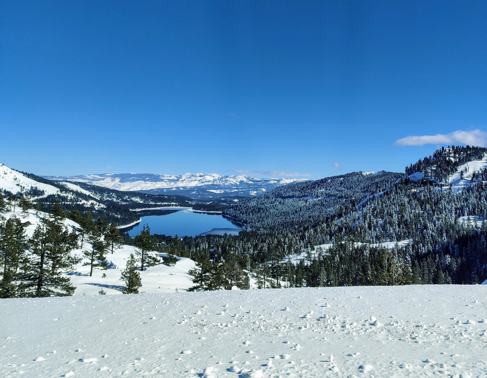

::: {.page-intro .research-bg-trigger data-bg-id="intro"}
Remote sensing, machine learning, and scientific/geospatial data infrastructure for projects that need to be useful on the ground and in the lab.
:::

```{=html}
<!-- Research section background images live in images/pages/research/backgrounds/. -->
<div class="research-bg-stage" aria-hidden="true">
  <div class="research-bg research-bg--neutral is-active" data-bg-id="neutral"></div>
  <div class="research-bg research-bg--intro" data-bg-id="intro">
    
  </div>
  <div class="research-bg research-bg--waves" data-bg-id="waves">
    
  </div>
  <div class="research-bg research-bg--loc" data-bg-id="loc">
    
  </div>
  <div class="research-bg research-bg--wri" data-bg-id="wri">
    
  </div>
  <div class="research-bg research-bg--proposed" data-bg-id="proposed">
    
  </div>
</div>
```

:::::::: page-shell
```{=html}
<div class="research-overview research-bg-trigger" data-bg-id="intro">
  <p class="research-kicker">Current work centers on national-scale forest thermophilization analysis, a research repository that doubles as a tool, and ongoing manuscript development on irrigation expansion in Sub-Saharan Africa.</p>
  <p class="research-context">That work currently lives in the <a href="https://www.landscapesofchangelab.com/"><strong>LOC Lab</strong></a> through a pilot MEDS fellowship with Joan Dudney, with continuing ties to the <a href="https://www.waveslab.org/"><strong>WaVeS Lab</strong></a> and recent capstone work with the <a href="https://www.nceas.ucsb.edu/wildfire-resilience-index"><strong>Wildfire Resilience Index</strong></a> team at NCEAS.</p>
</div>
```

::: {.research-project .research-bg-trigger data-bg-id="waves"}
### Satellite-Based Irrigation Mapping in Sub-Saharan Africa

**Lab:** UCSB Water Vegetation and Society (WaVeS) Lab, Prof. Kelly Caylor\
**Timeline:** June 2024 - Present\
**Status:** Manuscript Development

Irrigated agriculture is expanding rapidly across arid Sub-Saharan Africa, and large dams are often assumed to be the engine of that growth. This project tests that assumption spatially: as new irrigation appears across the region, is it clustering inside the areas that large dams could plausibly serve, or is it emerging well beyond them? Where the growth falls shapes how we understand who and what is actually driving irrigation expansion.

#### How I approached it

The analysis models "command-area" envelopes around large dams - the land each reservoir could realistically irrigate, derived from its storage capacity, surrounding elevation, river-basin structure, and distance - and then measures how much of the region's growth in area equipped for irrigation from 1980 to 2015 falls inside versus outside those envelopes. It combines gridded irrigation records, center-pivot inventories, dam and reservoir databases, digital elevation and basin data, and aridity and groundwater layers, all processed through a reproducible, versioned pipeline with built-in sensitivity testing.

```{=html}
<aside class="research-margin-note">
  <span class="research-margin-label">Grounding</span>
  It is useful to know where irrigation expanded. I also want to know what we should understand,or do,differently once we know.
</aside>
```

I work closely with Prof. Kelly Caylor and [Anna Boser](https://anna-boser.github.io/), who has been an important advisor and mentor throughout the project. Anna's work on small-scale irrigation and agricultural systems helps ground the broader research agenda, and related technical development in [this pivot-detection repository](https://github.com/Jason-Perez27/SSA-Pivot-Detect) is part of the larger infrastructure that this work can both contribute to and benefit from.

#### What I am learning from the model

The most consequential assumptions are often the ones that turn a concept into a boundary. Sensitivity testing is therefore not an appendix to this analysis; it is how I learn whether the spatial pattern is robust or merely a product of one plausible definition. How much do the results change when the command-area definition changes?

```{=html}
<aside class="research-margin-note">
  <span class="research-margin-label">Decision trail</span>
  An assumption does not become a fact because it is difficult to model. If changing a defensible assumption changes the result, that sensitivity belongs in the interpretation.
</aside>
```

```{=html}
<p class="research-note"><strong>Technical details:</strong> Python geospatial stack (Rasterio, GeoPandas, Shapely) for area-weighted raster extraction and vector processing; Google Earth Engine for continental-scale command-area modeling from dam, elevation, and basin data; a script-first analysis pipeline with input validation, versioned data products, and sensitivity testing for reproducibility.</p>
```
:::

::: {.research-project .research-bg-trigger data-bg-id="loc"}
### Forest Thermophilization & Disturbance Analysis

**Lab:** Landscapes of Change (LOC) Lab, Prof. Joan Dudney, Bren School, UCSB\
**Timeline:** January 2026 - Present\
**Fellowship:** Pilot MEDS Fellowship, $15,000 project budget\
**Status:** In Progress

The LOC Lab investigates how forests are changing in response to climate and disturbance: thermophilization (the shift toward warmer-adapted species compositions), fire, insects, drought. Through a pilot MEDS fellowship with Joan Dudney, I am continuing the national-scale thermophilization analysis and building the data infrastructure that makes this work possible.

The central question is whether plant communities are shifting toward species associated with warmer or drier climates, and whether disturbance accelerates that shift. The pipeline builds climate niches for \~4,200 species by summarizing TerraClimate normals across BIEN range maps, joins those niches to FIA seedling, sapling, and tree communities, and calculates a community-weighted climate affinity for each plot visit. Comparing consecutive remeasurements of the same plot then gives an annualized rate of change that can be set against how much of that plot burned, was defoliated, or was otherwise disturbed.

#### What I built around the analysis

The repository is designed to function both as analysis infrastructure and as a navigable tool for future work. Key elements include:

-   **Eight linked workstreams** - IDS aerial survey cleaning; TerraClimate, PRISM, and WorldClim extraction; FIA compilation; BIEN species niches; community climate-affinity metrics; and disturbance linkage
-   **Measured, not asserted, data products** - 83 registered products with 71 confirmed present at their declared row grain, including 1.47M FIA conditions and 33.5M monthly climate records across \~7,000 survey locations
-   **Disturbance evidence kept separate** - FIA condition disturbance, tree damage agents, MTBS fire perimeters, and IDS aerial detections measure different things, so they are prepared as distinct evidence rather than collapsed into a single severity score
-   **Conservative remeasurement linkage** - Survey intervals are built only from FIA's official remeasurement pointer, so plots re-established at a reused location never become spurious change intervals
-   **Reproducible pipeline design** - Centralized YAML configuration, renv for R environment management, data-contract regression tests, and a product inventory generated from the data rather than maintained by hand

```{=html}
<aside class="research-margin-note">
  <span class="research-margin-label">Boundary condition</span>
  Two datasets can use the same word without measuring the same phenomenon. Names are hints; definitions, collection methods, spatial grain, and timing determine whether evidence can defensibly be combined.
</aside>
```

I also built the <a href="https://forest-data-compilation-dashboard.streamlit.app/" target="_blank" rel="noopener noreferrer">Forest Data Explorer</a>, a Streamlit application with pages for pipeline architecture, a searchable data catalog, FIA and thermophilization outputs, and an <a href="https://forest-data-compilation-dashboard.streamlit.app/FIA_Navigator" target="_blank" rel="noopener noreferrer">FIADB v9.4 schema navigator</a> for exploring the database structure without loading the full database. Details in the [blog post](posts/forest-data-compilation/index.qmd) and [repository](https://github.com/rellimylime/forest-data-compilation).

```{=html}
<aside class="research-margin-note">
  <span class="research-margin-label">Context window</span>
  If users repeatedly need a diagram to understand the data model, the diagram is not supplementary documentation. It is part of the interface.
</aside>
```

#### What the next project inherits

The repository now carries more than outputs: it preserves the meaning, provenance, validation status, and intended grain of those outputs. Future analyses can begin with a navigable system rather than reconstructing the same mental model from folders, scripts, and institutional memory.

```{=html}
<aside class="research-margin-note">
  <span class="research-margin-label">Failure prevented</span>
  A reused geographic location is not necessarily the same monitored plot. Preserving FIA's official remeasurement links prevents false ecological change from entering the analysis.
</aside>
```

```{=html}
<p class="research-note"><strong>Technical details:</strong> R and Python pipelines integrating IDS, TerraClimate, PRISM, WorldClim, FIA (FIADB v9.4), and BIEN range maps, with MTBS fire perimeters in preparation. Google Earth Engine for area-weighted climate extraction at survey locations and across species range polygons. Streamlit Forest Data Explorer backed by a generated product registry. <code>renv</code>, YAML config, and <code>testthat</code> data-contract tests for reproducibility.</p>
```
:::

::: {.research-project .research-bg-trigger data-bg-id="wri"}
### Wildfire Resilience Index Data Access & R Package

**Client:** National Center for Ecological Analysis and Synthesis (NCEAS), Dr. Caitlin Fong\
**Timeline:** January 2026 - June 2026\
**Status:** Completed (MEDS Capstone)

This capstone project focused on making the Wildfire Resilience Index (WRI) usable without asking people to download the full archive. Working with my capstone team, I helped make 82 wildfire resilience layers,approximately 25 GB in total,available as cloud-accessible geospatial assets and build an open-source R package that lets users discover, subset, and visualize the data directly.

#### Why access needed to be designed

Hosting files was only part of the problem. People needed to find an appropriate layer, understand what it measured, describe an area of interest in a familiar spatial format, and retrieve only the relevant subset without first becoming experts in the archive's storage structure.

Key pieces of the work:

-   **Cloud-ready geospatial archive** - Converting 100+ WRI raster layers to Cloud-Optimized GeoTIFFs (COGs), with metadata structured for reproducible public access
-   **STAC-based discovery** - Organizing the archive in a SpatioTemporal Asset Catalog (STAC) so users can find layers by domain and query data programmatically
-   **R package development** - Building functions for catalog queries, spatial subsetting, and visualization so researchers and practitioners can work with the data without managing huge local files
-   **Client handoff infrastructure** - Documenting the processing pipeline so future WRI releases can be updated and maintained by the client team

```{=html}
<aside class="research-margin-note">
  <span class="research-margin-label">Generalizable optimization</span>
  Move the question to the data instead of moving all the data to the question. A user who needs one layer for one county should not have to download the complete archive first.
</aside>
```

#### What became possible

Users can now browse the catalog, inspect layer metadata, provide several common forms of spatial input, and retrieve a bounded result through a small set of documented R functions. The infrastructure remains present and inspectable, but it no longer has to be manually managed for every question.

```{=html}
<aside class="research-margin-note">
  <span class="research-margin-label">Aha moment</span>
  Flexibility does not mean accepting every possible input or operation. Sometimes the most user-centered decision is to make an unsupported request impossible,and explain why.
</aside>
```

```{=html}
<p class="research-note"><strong>Technical details:</strong> R package development with <code>terra</code>, <code>sf</code>, <code>rstac</code>, and <code>testthat</code>, paired with GDAL-based TIFF-to-COG conversion, STAC metadata generation, and public data hosting through the Knowledge Network for Biocomplexity (KNB).</p>
```
:::

::: {.research-project .research-bg-trigger data-bg-id="proposed"}
## Proposed Projects

### Scaling Metadata Quality Assessment for Environmental Data Repositories

**Client:** Arctic Data Center / National Center for Ecological Analysis and Synthesis (NCEAS)\
**Timeline:** Fall 2024 - Spring 2025\
**Status:** Proposed capstone project (not currently in progress)

This was a proposed capstone direction focused on building reproducible, scalable workflows to aggregate and visualize FAIR (Findable, Accessible, Interoperable, Reusable) metadata quality assessments across environmental data repositories.

**Project Goal:** Currently, the Arctic Data Center runs automated metadata checks generating per-dataset results, but aggregated results are not readily available. With thousands of datasets, it's difficult to identify systemic curation issues such as missing ORCIDs or inconsistent units. This project transforms individual metadata quality assessments into standardized, scalable, and actionable insights.

**Key Deliverables:**

1.  **Repeatable ingest pipeline** - Clean, timestamped snapshots of quality assessment data enriched with dataset metadata, with validation to catch data format changes early
2.  **Automated visualizations and analysis** - Generate FAIR pillar summaries, temporal trends, and first vs. latest comparisons that auto-update when new data arrives
3.  **Focused deep-dives** - Analyze specific dataset types or disciplines, regroup individual checks into themes, and track percent-pass and patterns across time
4.  **Lightweight access interface** - Simple filterable web interface to view and download tables, figures, and summaries by time, metadata standard, pillar, or dataset type
5.  **Stretch goal** - Configure one additional repository with the same framework to demonstrate portability

**Technical Approach:** Building reproducible workflows in Python with open data formats (CSV, Parquet). Using Quarto/Jupyter for reports. Emphasis on lightweight, maintainable design that repository staff can sustain post-project.

**Impact:** This project enhances Arctic research data accessibility and usability by turning existing checks into clear, repeatable quality signals. Plain-language, FAIR-aligned metrics reduce barriers for research teams, particularly those with limited institutional data support, promoting equitable participation in environmental science. The scalable framework offers a model for other repositories, improving the connected environmental data ecosystem.

```{=html}
<p class="research-note"><strong>Broader impact:</strong> Plain-language metrics and transparent interfaces can make environmental data quality issues easier to see, compare, and act on across repositories. The larger goal is to turn existing checks into something more useful for curation teams and more legible for the people who depend on those repositories.</p>
```
:::
::::::::
